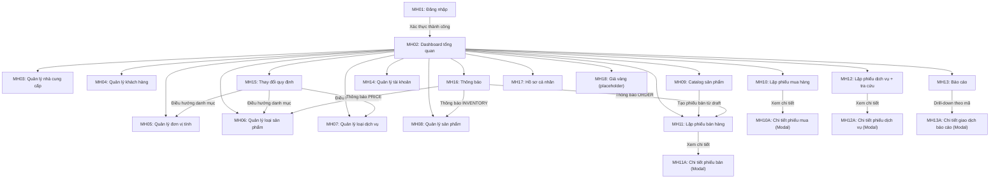

# 5. THIẾT KẾ GIAO DIỆN

Chương này mô tả thiết kế giao diện của hệ thống quản lý cửa hàng vàng dựa trên mã nguồn hiện tại (`frontend/src/app`, `frontend/src/components`) và cấu trúc trình bày tham khảo từ mẫu báo cáo `QLThuVien.pdf`.

## 5.1. Sơ đồ liên kết các màn hình

Hình 5.1. Sơ đồ liên kết các màn hình chính của hệ thống.

## 5.2. Danh sách các màn hình

| STT | Màn hình | Loại màn hình | Chức năng |
|---|---|---|---|
| 1 | MH01 - Đăng nhập | Nhập liệu | Xác thực người dùng bằng username/password, nạp hồ sơ và chuyển vào hệ thống |
| 2 | MH02 - Dashboard tổng quan | Màn hình chính | Hiển thị KPI, biểu đồ doanh thu, timeline hoạt động, thao tác nhanh |
| 3 | MH03 - Quản lý nhà cung cấp | Tra cứu + Nhập liệu | CRUD nhà cung cấp, tìm kiếm, bật/tắt hoạt động, phân trang |
| 4 | MH04 - Quản lý khách hàng | Tra cứu + Nhập liệu | CRUD khách hàng, tìm kiếm, phân trang |
| 5 | MH05 - Quản lý đơn vị tính | Tra cứu + Nhập liệu | CRUD đơn vị tính, hệ số quy đổi, bật/tắt hoạt động |
| 6 | MH06 - Quản lý loại sản phẩm | Tra cứu + Nhập liệu | CRUD loại sản phẩm, tỉ lệ lợi nhuận, gán đơn vị tính |
| 7 | MH07 - Quản lý loại dịch vụ | Tra cứu + Nhập liệu | CRUD loại dịch vụ, đơn giá dịch vụ |
| 8 | MH08 - Quản lý sản phẩm | Tra cứu + Nhập liệu | CRUD sản phẩm, upload ảnh, lọc loại, bật/tắt hoạt động |
| 9 | MH09 - Catalog sản phẩm | Tra cứu | Hiển thị sản phẩm dạng thẻ, lọc/sắp xếp, thêm vào phiếu bán tạm |
| 10 | MH10 - Lập phiếu mua hàng | Nhập liệu + Tra cứu | Lập phiếu mua, tính tổng tiền realtime, xem lịch sử và chi tiết phiếu |
| 11 | MH11 - Lập phiếu bán hàng | Nhập liệu + Tra cứu | Lập phiếu bán theo tồn kho, kiểm tra vượt tồn, xem lịch sử và chi tiết |
| 12 | MH12 - Lập phiếu dịch vụ + Tra cứu | Nhập liệu + Tra cứu | Lập phiếu dịch vụ, kiểm tra trả trước tối thiểu, giao từng phần/toàn bộ |
| 13 | MH13 - Báo cáo | Báo biểu + Tra cứu | Báo cáo tồn kho, doanh thu SP/DV, biểu đồ, xuất Excel, drill-down |
| 14 | MH14 - Quản lý tài khoản / phân quyền | Tra cứu + Nhập liệu | CRUD tài khoản, gán nhóm người dùng, bật/tắt hoạt động |
| 15 | MH15 - Thay đổi quy định | Nhập liệu + Tra cứu | Cập nhật tỉ lệ trả trước dịch vụ, điều hướng sang các danh mục liên quan |
| 16 | MH16 - Thông báo | Tra cứu | Hiển thị thông báo (mock), lọc, đánh dấu đã đọc, điều hướng nhanh |
| 17 | MH17 - Hồ sơ cá nhân | Tra cứu | Hiển thị thông tin người dùng từ auth-store cục bộ |
| 18 | MH18 - Giá vàng | Placeholder | Trang khung chức năng, hiện chưa tích hợp dữ liệu thực |

## 5.3. Mô tả các màn hình

### 5.3.1. Màn hình đăng nhập (MH01)

**a. Giao diện**  
Route: `/login`. Màn hình gồm form đăng nhập, nút hiện/ẩn mật khẩu, tài khoản demo, chuyển ngôn ngữ và theme.  
Hình 5.2. (Chèn ảnh màn hình đăng nhập).

**b. Mô tả các đối tượng trên màn hình**

| STT | Tên | Kiểu | Ràng buộc | Chức năng |
|---|---|---|---|---|
| 1 | `txtUsername` | Input | Bắt buộc | Nhập tên đăng nhập |
| 2 | `txtPassword` | Input (password/text) | Bắt buộc | Nhập mật khẩu |
| 3 | `btnTogglePassword` | Button icon | Không | Hiện/ẩn mật khẩu |
| 4 | `btnLogin` | Button | Disable khi đang submit | Gửi yêu cầu đăng nhập |
| 5 | `btnDemoAdmin`, `btnDemoStaff` | Button | Không | Tự điền nhanh tài khoản demo |
| 6 | `switchLanguage`, `switchTheme` | Control | Không | Đổi ngôn ngữ/đổi giao diện sáng tối |

**c. Danh sách biến cố và xử lý tương ứng**

| STT | Biến cố | Xử lý |
|---|---|---|
| 1 | Bấm `btnLogin` | Gọi `/api/auth/login`, lấy token, gọi `/api/auth/me`, lưu auth-store và chuyển `/dashboard` |
| 2 | Sai tài khoản/mật khẩu | Hiển thị thông báo lỗi ngay trên form |
| 3 | Bấm `btnDemoAdmin`/`btnDemoStaff` | Điền sẵn thông tin đăng nhập mẫu |
| 4 | Mở lại trang khi đã đăng nhập | Tự chuyển thẳng đến dashboard |

### 5.3.2. Màn hình Dashboard tổng quan (MH02)

**a. Giao diện**  
Route: `/dashboard`. Gồm sidebar điều hướng, header, các KPI, biểu đồ doanh thu, nhật ký hoạt động và thao tác nhanh.  
Hình 5.3. (Chèn ảnh dashboard).

**b. Mô tả các đối tượng trên màn hình**

| STT | Tên | Kiểu | Ràng buộc | Chức năng |
|---|---|---|---|---|
| 1 | `sidebarMenu` | Navigation | Theo quyền `ADMIN/STAFF` | Điều hướng các module |
| 2 | `metricCards` | Card group | Dữ liệu API | Hiển thị KPI đơn hàng, tồn kho, doanh thu, phiếu dịch vụ |
| 3 | `revenueChart` | Bar chart | Admin | Biểu đồ doanh thu theo thời gian, đổi mode Sale/Service/Total |
| 4 | `activityTimeline` | Timeline list | Dữ liệu tổng hợp | Nhật ký chứng từ gần đây |
| 5 | `btnViewAllActivities` | Button | Không | Mở modal lịch sử hoạt động đầy đủ |
| 6 | `quickActions` | Button grid | Theo vai trò | Mở nhanh các nghiệp vụ chính |
| 7 | `commandMenu` | Dialog (`Ctrl+K`) | Không | Tìm nhanh và điều hướng màn hình |

**c. Danh sách biến cố và xử lý tương ứng**

| STT | Biến cố | Xử lý |
|---|---|---|
| 1 | Tải dashboard | Gọi đồng thời API sản phẩm, phiếu bán, phiếu mua, phiếu dịch vụ |
| 2 | Đổi bộ lọc thời gian/mode biểu đồ | Tính lại dữ liệu chart và render lại |
| 3 | Bấm “Xem tất cả” ở timeline | Mở modal nhật ký đầy đủ có filter/tab/search |
| 4 | Bấm thao tác nhanh | Điều hướng sang phiếu bán/phiếu dịch vụ/phiếu mua/báo cáo |

### 5.3.3. Nhóm màn hình quản lý danh mục (MH03, MH04, MH05, MH06, MH07)

Áp dụng cho: Nhà cung cấp, Khách hàng, Đơn vị tính, Loại sản phẩm, Loại dịch vụ.

**a. Giao diện**  
Các route: `/dashboard/suppliers`, `/dashboard/customers`, `/dashboard/units`, `/dashboard/product-types`, `/dashboard/service-types`.  
Mẫu UI chung: thanh tìm kiếm + nút thêm, bảng dữ liệu, phân trang, popup thêm/sửa, xác nhận xóa.  
Hình 5.4. (Chèn ảnh một màn hình đại diện, ví dụ nhà cung cấp).

**b. Mô tả các đối tượng trên màn hình**

| STT | Tên | Kiểu | Ràng buộc | Chức năng |
|---|---|---|---|---|
| 1 | `txtKeyword` | Input | Không | Tìm kiếm theo mã/tên/thông tin chính |
| 2 | `btnAdd` | Button | Không | Mở popup thêm mới |
| 3 | `tblDanhMuc` | Data table | Có phân trang | Hiển thị danh sách bản ghi |
| 4 | `btnEdit` | Icon button | Có bản ghi | Mở popup cập nhật |
| 5 | `btnDelete` | Icon button | Admin với hành động phá hủy | Xóa bản ghi sau xác nhận |
| 6 | `switchIsActive` | Toggle | Có ở MH03/MH05/MH06/MH07/MH14 | Bật/tắt trạng thái hoạt động |
| 7 | `modalForm` | Modal form | Validate theo từng module | Nhập thông tin thêm/sửa |
| 8 | `pagination` | Pagination | > 1 trang | Chuyển trang dữ liệu |

**c. Danh sách biến cố và xử lý tương ứng**

| STT | Biến cố | Xử lý |
|---|---|---|
| 1 | Nhập từ khóa tìm kiếm | Lọc dữ liệu client hoặc gọi lại API theo module |
| 2 | Bấm nút Thêm | Reset form, mở popup thêm mới |
| 3 | Bấm nút Sửa | Nạp dữ liệu dòng chọn vào popup cập nhật |
| 4 | Bấm nút Xóa | Mở `ConfirmDialog`, sau đó gọi API xóa |
| 5 | Bấm toggle trạng thái | Gọi API cập nhật `isActive`, refresh dòng |
| 6 | Submit form | Validate bắt buộc, gọi API create/update, refresh danh sách |

### 5.3.4. Màn hình quản lý sản phẩm (MH08)

**a. Giao diện**  
Route: `/dashboard/products`. Hỗ trợ tìm kiếm, lọc loại, phân trang server-side, popup thêm/sửa và upload ảnh sản phẩm.  
Hình 5.5. (Chèn ảnh màn hình quản lý sản phẩm).

**b. Mô tả các đối tượng trên màn hình**

| STT | Tên | Kiểu | Ràng buộc | Chức năng |
|---|---|---|---|---|
| 1 | `txtKeyword`, `selectLoaiSP` | Input + Select | Không | Lọc danh sách theo từ khóa/loại sản phẩm |
| 2 | `tblSanPham` | Data table | Dữ liệu phân trang | Hiển thị mã, ảnh, tên, loại, giá bán, tồn kho, trạng thái |
| 3 | `btnAdd`, `btnEdit`, `btnDelete` | Button/Icon | Theo quyền | Thêm/sửa/xóa sản phẩm |
| 4 | `switchIsActive` | Toggle | Không | Bật/tắt hoạt động sản phẩm |
| 5 | `fileImage` | File input | JPG/PNG/WEBP, <= 5MB | Chọn ảnh sản phẩm |
| 6 | `btnRemoveImage` | Button | Có ảnh | Xóa ảnh hiện tại trong form |
| 7 | `frmSanPham` | Form | Validate bằng Zod | Validate tên, loại, giá mua, tồn kho |

**c. Danh sách biến cố và xử lý tương ứng**

| STT | Biến cố | Xử lý |
|---|---|---|
| 1 | Chọn ảnh mới | Kiểm tra định dạng/kích thước, tạo preview |
| 2 | Submit form thêm/sửa | Nếu có ảnh thì upload ảnh trước, sau đó create/update sản phẩm |
| 3 | Bật/tắt trạng thái | Gọi API update `isActive` cho sản phẩm |
| 4 | Xóa sản phẩm | Hiển thị hộp xác nhận và gọi API delete (Admin) |

### 5.3.5. Màn hình catalog sản phẩm (MH09)

**a. Giao diện**  
Route: `/dashboard/product-catalog`. Hiển thị sản phẩm dạng card, bộ lọc tồn kho, sắp xếp, xem chi tiết, thêm vào phiếu bán tạm.  
Hình 5.6. (Chèn ảnh catalog sản phẩm).

**b. Mô tả các đối tượng trên màn hình**

| STT | Tên | Kiểu | Ràng buộc | Chức năng |
|---|---|---|---|---|
| 1 | `txtKeyword`, `selectLoai`, `selectTonKho`, `selectSort` | Input + Select | Không | Tìm kiếm/lọc/sắp xếp sản phẩm |
| 2 | `cardProductList` | Card grid | Có phân trang | Hiển thị ảnh, giá, tồn kho, trạng thái |
| 3 | `btnDetail` | Button | Không | Mở dialog chi tiết sản phẩm |
| 4 | `btnAddToDraft` | Button | Cần quyền lập phiếu bán + còn tồn | Thêm sản phẩm vào phiếu bán tạm |
| 5 | `sheetDraft` | Sheet panel | Không | Quản lý danh sách sản phẩm tạm chọn |
| 6 | `btnCreateSaleFromDraft` | Button | Draft không rỗng | Chuyển sang màn hình lập phiếu bán |

**c. Danh sách biến cố và xử lý tương ứng**

| STT | Biến cố | Xử lý |
|---|---|---|
| 1 | Chọn bộ lọc/sắp xếp | Gọi API catalog và render lại danh sách |
| 2 | Bấm “Thêm vào phiếu” | Thêm sản phẩm vào `sales-draft-store` |
| 3 | Bấm “Tạo phiếu bán” trong draft | Tạo handoff và điều hướng `/dashboard/orders` |
| 4 | Tăng/giảm số lượng trong draft | Cập nhật số lượng, tính lại tổng tạm tính |

### 5.3.6. Màn hình lập phiếu mua hàng (MH10 và MH10A)

**a. Giao diện**  
Route: `/dashboard/purchase-orders`. Gồm form lập phiếu mua + bảng lịch sử + modal chi tiết chứng từ.  
Hình 5.7. (Chèn ảnh lập phiếu mua).

**b. Mô tả các đối tượng trên màn hình**

| STT | Tên | Kiểu | Ràng buộc | Chức năng |
|---|---|---|---|---|
| 1 | `dateNgayLap`, `cbNhaCungCap` | DatePicker + Combobox | Nhà cung cấp bắt buộc | Khai báo thông tin đầu phiếu |
| 2 | `tblChiTietMua` | Editable table | Tối thiểu 1 dòng | Nhập sản phẩm, loại SP, đơn vị, số lượng, đơn giá |
| 3 | `btnAddRow`, `btnRemoveRow` | Button | Không | Thêm/xóa dòng chi tiết |
| 4 | `quickCreateProduct`, `quickCreateSupplier` | Dialog | Validate tối thiểu | Tạo nhanh sản phẩm/nhà cung cấp ngay trong luồng |
| 5 | `summaryTotal` | Sticky summary | Không | Hiển thị tổng tiền realtime |
| 6 | `btnCreateVoucher` | Button | Dữ liệu hợp lệ | Gửi tạo phiếu mua |
| 7 | `tblHistory`, `btnViewDetail` | Table + Button | Không | Xem lịch sử và mở modal chi tiết phiếu |

**c. Danh sách biến cố và xử lý tương ứng**

| STT | Biến cố | Xử lý |
|---|---|---|
| 1 | Chọn sản phẩm ở một dòng | Tự động điền loại sản phẩm, đơn vị tính, đơn giá mua |
| 2 | Submit phiếu mua | Validate trùng sản phẩm, số lượng > 0, đơn giá >= 0, gửi API tạo phiếu |
| 3 | Bấm “Xem chi tiết” lịch sử | Gọi API chi tiết phiếu, mở `DetailModal` |
| 4 | Bấm `Ctrl+Enter` | Tạo phiếu nhanh bằng phím tắt |

### 5.3.7. Màn hình lập phiếu bán hàng (MH11 và MH11A)

**a. Giao diện**  
Route: `/dashboard/orders`. Gồm form lập phiếu bán + lịch sử phiếu bán + modal chi tiết.  
Hình 5.8. (Chèn ảnh lập phiếu bán).

**b. Mô tả các đối tượng trên màn hình**

| STT | Tên | Kiểu | Ràng buộc | Chức năng |
|---|---|---|---|---|
| 1 | `customerSelect` | Combobox nâng cao | Khách hàng bắt buộc | Tìm theo số điện thoại, có tạo nhanh khách hàng |
| 2 | `tblChiTietBan` | Editable table | Tối thiểu 1 dòng | Chọn sản phẩm, số lượng, theo dõi tồn kho |
| 3 | `lblTonKho`, `lblDonGiaBan`, `lblThanhTien` | Label | Không | Hiển thị tồn kho và thành tiền từng dòng |
| 4 | `summaryEstimatedTotal` | Sticky summary | Không | Tổng tiền dự kiến toàn phiếu |
| 5 | `btnCreateSale` | Button | Dữ liệu hợp lệ | Gửi tạo phiếu bán |
| 6 | `tblSaleHistory` + `btnViewDetail` | Table + Button | Không | Lịch sử và xem chi tiết phiếu bán |

**c. Danh sách biến cố và xử lý tương ứng**

| STT | Biến cố | Xử lý |
|---|---|---|
| 1 | Chọn sản phẩm và số lượng | Kiểm tra không vượt tồn kho thực tế |
| 2 | Submit phiếu bán | Validate trùng sản phẩm, số lượng > 0, đủ tồn kho, gọi API create |
| 3 | Nhận dữ liệu từ catalog | Tự nạp danh sách sản phẩm từ `sales-draft-store` |
| 4 | Bấm “Xem chi tiết” | Mở modal chi tiết chứng từ đã lập |

### 5.3.8. Màn hình lập phiếu dịch vụ và tra cứu (MH12 và MH12A)

**a. Giao diện**  
Route: `/dashboard/service-orders`. Màn hình tích hợp 2 phần: (1) lập phiếu dịch vụ; (2) tra cứu lịch sử, xem chi tiết và bàn giao.  
Hình 5.9. (Chèn ảnh màn hình phiếu dịch vụ).

**b. Mô tả các đối tượng trên màn hình**

| STT | Tên | Kiểu | Ràng buộc | Chức năng |
|---|---|---|---|---|
| 1 | `customerSelect`, `dateNgayLap` | Input + DatePicker | Khách hàng bắt buộc | Thông tin đầu phiếu |
| 2 | `tblChiTietDV` | Editable table | Tối thiểu 1 dòng | Chọn loại dịch vụ, số lượng, đơn giá được tính, ngày giao |
| 3 | `inputTongTraTruoc` | Currency input | >= tỉ lệ tối thiểu | Nhập số tiền trả trước |
| 4 | `summaryTotal/Prepaid/Remaining` | Sticky summary | Không | Hiển thị tổng tiền, trả trước, còn lại |
| 5 | `lookupFilters` | Keyword + status + date range | Không | Tra cứu phiếu dịch vụ theo nhiều tiêu chí |
| 6 | `tblLookupResult` | Table | Phân trang | Hiển thị kết quả tra cứu và trạng thái |
| 7 | `btnDeliverItem`, `btnDeliverAll` | Button | Chỉ phiếu chưa hoàn thành | Bàn giao từng dòng hoặc toàn bộ phiếu |
| 8 | `modalDetail` + `serviceStatusStepper` | Modal + Stepper | Không | Xem tiến độ xử lý, thanh toán, danh sách dịch vụ |

**c. Danh sách biến cố và xử lý tương ứng**

| STT | Biến cố | Xử lý |
|---|---|---|
| 1 | Submit phiếu dịch vụ | Validate trùng loại DV, số lượng > 0, có ngày giao, đủ trả trước tối thiểu |
| 2 | Bấm “Tra cứu” | Gọi API tìm phiếu dịch vụ theo bộ lọc |
| 3 | Bấm “Giao tất cả” | Gọi API `deliver-all`, cập nhật trạng thái và số dư |
| 4 | Bấm “Bàn giao” từng dòng trong modal | Gọi API `deliver-item`, cập nhật trạng thái dòng |

### 5.3.9. Màn hình báo cáo (MH13 và MH13A)

**a. Giao diện**  
Route: `/dashboard/reports` (Admin). Gồm bộ lọc kỳ báo cáo theo tháng, ba khối báo cáo (tồn kho, doanh thu SP, doanh thu DV), biểu đồ, xuất Excel và modal drill-down chi tiết giao dịch.  
Hình 5.10. (Chèn ảnh màn hình báo cáo).

**b. Mô tả các đối tượng trên màn hình**

| STT | Tên | Kiểu | Ràng buộc | Chức năng |
|---|---|---|---|---|
| 1 | `monthPicker` | Month input | Bắt buộc | Chọn tháng/năm báo cáo |
| 2 | `btnRegenerate` | Button | Admin | Tạo/cập nhật lại báo cáo cho kỳ chọn |
| 3 | `cardInventory` | Table card | Có dữ liệu kỳ | Báo cáo tồn kho + phân trang |
| 4 | `cardRevenueProduct` | Chart + Table | Có dữ liệu kỳ | Doanh thu sản phẩm, đổi mode cột/tròn |
| 5 | `cardRevenueService` | Chart + Table | Có dữ liệu kỳ | Doanh thu dịch vụ, đổi mode cột/tròn |
| 6 | `btnExportExcel*` | Button | Có dữ liệu | Xuất Excel từng nhóm báo cáo |
| 7 | `drillDownModal` | Dialog | Theo mã drill-down | Xem chi tiết phát sinh theo chứng từ |

**c. Danh sách biến cố và xử lý tương ứng**

| STT | Biến cố | Xử lý |
|---|---|---|
| 1 | Đổi kỳ báo cáo | Tự gọi generate cho cả 3 báo cáo và render lại |
| 2 | Bấm “Xuất Excel” | Gọi endpoint export và tải file `.xlsx` |
| 3 | Click dòng bảng/điểm biểu đồ | Mở modal drill-down chi tiết giao dịch |
| 4 | Người dùng không phải Admin truy cập | Hiển thị màn hình từ chối quyền truy cập |

### 5.3.10. Màn hình quản lý tài khoản/phân quyền (MH14)

**a. Giao diện**  
Route: `/dashboard/staff`. Quản lý tài khoản người dùng theo nhóm, có tìm kiếm, bật/tắt hoạt động, thêm/sửa/xóa.  
Hình 5.11. (Chèn ảnh màn hình quản lý tài khoản).

**b. Mô tả các đối tượng trên màn hình**

| STT | Tên | Kiểu | Ràng buộc | Chức năng |
|---|---|---|---|---|
| 1 | `txtKeyword` | Input | Không | Tìm theo tên đăng nhập/mã nhóm |
| 2 | `tblUsers` | Table | Không | Hiển thị tài khoản, nhóm, trạng thái |
| 3 | `switchIsActive` | Toggle | Không | Kích hoạt/ngưng kích hoạt tài khoản |
| 4 | `modalUserForm` | Modal form | Username bắt buộc, password bắt buộc khi tạo mới | Tạo hoặc cập nhật tài khoản |
| 5 | `selectGroup` | Select | Bắt buộc | Gán tài khoản vào nhóm người dùng |

**c. Danh sách biến cố và xử lý tương ứng**

| STT | Biến cố | Xử lý |
|---|---|---|
| 1 | Bấm Thêm tài khoản | Mở form tạo mới |
| 2 | Bấm Sửa tài khoản | Mở form cập nhật, username ở chế độ readonly |
| 3 | Bấm toggle trạng thái | Gọi API cập nhật `isActive` |
| 4 | Bấm Xóa | Hiển thị xác nhận và xóa tài khoản |

### 5.3.11. Màn hình thay đổi quy định (MH15)

**a. Giao diện**  
Route: `/dashboard/settings` (Admin). Gồm khối cập nhật tỷ lệ trả trước dịch vụ và khối điều hướng các danh mục quy định.  
Hình 5.12. (Chèn ảnh màn hình thay đổi quy định).

**b. Mô tả các đối tượng trên màn hình**

| STT | Tên | Kiểu | Ràng buộc | Chức năng |
|---|---|---|---|---|
| 1 | `inputPrepaymentRate` | Input number | 0..100 | Cập nhật tỷ lệ trả trước tối thiểu |
| 2 | `btnSaveRate` | Button | Admin | Lưu cấu hình `SERVICE_PREPAYMENT_RATE` |
| 3 | `tblCategorySummary` | Table | Không | Hiển thị số bản ghi các danh mục |
| 4 | `btnOpenCategoryPage` | Link button | Không | Điều hướng sang trang danh mục liên quan |

**c. Danh sách biến cố và xử lý tương ứng**

| STT | Biến cố | Xử lý |
|---|---|---|
| 1 | Bấm Lưu thay đổi | Validate phạm vi 0..100, gọi API update setting |
| 2 | Bấm “Mở trang” ở bảng danh mục | Điều hướng sang loại sản phẩm/đơn vị/loại dịch vụ |

### 5.3.12. Màn hình thông báo (MH16)

**a. Giao diện**  
Route: `/dashboard/notifications`. Dữ liệu hiện tại dùng mock nội bộ. Hỗ trợ bộ lọc, tìm kiếm, đánh dấu đã đọc và xóa thông báo.  
Hình 5.13. (Chèn ảnh màn hình thông báo).

**b. Mô tả các đối tượng trên màn hình**

| STT | Tên | Kiểu | Ràng buộc | Chức năng |
|---|---|---|---|---|
| 1 | `txtSearchNotification` | Input | Không | Tìm theo tiêu đề/nội dung |
| 2 | `tabAllUnread` | Segment | Không | Lọc tất cả/chưa đọc |
| 3 | `selectTypeFilter` | Dropdown | Không | Lọc theo loại ORDER/INVENTORY/PRICE/SYSTEM |
| 4 | `btnMarkAllRead` | Button | Chỉ dùng khi còn thông báo chưa đọc | Đánh dấu toàn bộ đã đọc |
| 5 | `listNotification` | List group by date | Không | Hiển thị thông báo theo ngày |

**c. Danh sách biến cố và xử lý tương ứng**

| STT | Biến cố | Xử lý |
|---|---|---|
| 1 | Bấm một thông báo | Đánh dấu đã đọc và điều hướng theo loại thông báo |
| 2 | Bấm “Đánh dấu tất cả đã đọc” | Chuyển trạng thái unread = false cho toàn bộ |
| 3 | Bấm icon xóa từng thông báo | Loại thông báo khỏi danh sách hiện tại |

### 5.3.13. Màn hình hồ sơ cá nhân (MH17)

**a. Giao diện**  
Route: `/dashboard/profile`. Hiển thị avatar, thông tin tài khoản và vai trò từ auth-store local.  
Hình 5.14. (Chèn ảnh màn hình hồ sơ cá nhân).

**b. Mô tả các đối tượng trên màn hình**

| STT | Tên | Kiểu | Ràng buộc | Chức năng |
|---|---|---|---|---|
| 1 | `avatarProfile` | Avatar | Không | Hiển thị ký tự viết tắt người dùng |
| 2 | `badgeRole` | Badge | Không | Hiển thị vai trò Admin/Nhân viên |
| 3 | `inputFullName`, `inputUsername`, `inputEmail` | Readonly Input | Không | Hiển thị thông tin tài khoản |

**c. Danh sách biến cố và xử lý tương ứng**

| STT | Biến cố | Xử lý |
|---|---|---|
| 1 | Truy cập route profile | Đọc dữ liệu user từ auth-store đã hydrate |
| 2 | Không có user trong store | Không render nội dung (tránh hiển thị sai dữ liệu) |

### 5.3.14. Màn hình giá vàng (MH18)

**a. Giao diện**  
Route: `/dashboard/gold-prices`. Là màn hình placeholder (FeaturePlaceholder) để giữ vị trí tính năng tương lai.  
Hình 5.15. (Chèn ảnh màn hình giá vàng placeholder).

**b. Mô tả các đối tượng trên màn hình**

| STT | Tên | Kiểu | Ràng buộc | Chức năng |
|---|---|---|---|---|
| 1 | `cardPlaceholder` | Card | Không | Hiển thị tên tính năng và mô tả |
| 2 | `textStatus` | Text | Không | Thông báo chức năng đang trong quá trình phát triển |

**c. Danh sách biến cố và xử lý tương ứng**

| STT | Biến cố | Xử lý |
|---|---|---|
| 1 | Người dùng mở màn hình | Hiển thị mô tả placeholder, chưa có xử lý nghiệp vụ |

---

**Ghi chú khi chèn vào báo cáo chính thức**

1. Chèn ảnh thật cho từng “Hình 5.x” theo đúng thứ tự.  
2. Có thể tách mục 5.3.3 thành 5 mục riêng (nhà cung cấp/khách hàng/đơn vị/loại SP/loại DV) nếu cần chi tiết hơn theo yêu cầu giảng viên.  
3. Phần mô tả trong chương này đã bám đúng luồng hiện trạng của mã nguồn hiện tại, bao gồm cả các màn hình mock/placeholder.
