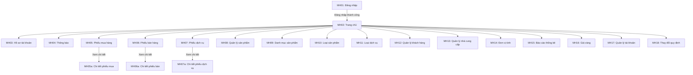

# 5. THIẾT KẾ GIAO DIỆN

## 5.1 Sơ đồ liên kết các màn hình

Hình 5.1: Sơ đồ liên kết các màn hình

## 5.2 Danh sách các màn hình

Bảng 5.1: Danh sách các màn hình

<table>
<tr><td><b>STT</b></td><td><b>Màn hình</b></td><td><b>Loại màn hình</b></td><td><b>Chức năng</b></td></tr>
<tr><td>1</td><td>MH01 - Đăng nhập</td><td>Nhập liệu</td><td>Cho phép người dùng đăng nhập vào hệ thống bằng tên đăng nhập và mật khẩu</td></tr>
<tr><td>2</td><td>MH02 - Trang chủ</td><td>Hiển thị</td><td>Hiển thị tổng quan doanh thu, đơn hàng, biểu đồ thống kê và hoạt động gần đây</td></tr>
<tr><td>3</td><td>MH03 - Hồ sơ tài khoản</td><td>Nhập liệu</td><td>Xem và chỉnh sửa thông tin cá nhân, đổi mật khẩu</td></tr>
<tr><td>4</td><td>MH04 - Thông báo</td><td>Hiển thị</td><td>Hiển thị danh sách thông báo hệ thống</td></tr>
<tr><td>5</td><td>MH05 - Phiếu mua hàng</td><td>Nhập liệu</td><td>Tạo phiếu mua hàng từ nhà cung cấp, quản lý lịch sử mua hàng</td></tr>
<tr><td>6</td><td>MH06 - Phiếu bán hàng</td><td>Nhập liệu</td><td>Tạo phiếu bán hàng cho khách, quản lý lịch sử bán hàng</td></tr>
<tr><td>7</td><td>MH07 - Phiếu dịch vụ</td><td>Nhập liệu</td><td>Tạo phiếu dịch vụ (sửa chữa, gia công), quản lý lịch sử dịch vụ</td></tr>
<tr><td>8</td><td>MH08 - Quản lý sản phẩm</td><td>Nhập liệu</td><td>Thêm, sửa, xóa, tìm kiếm sản phẩm. Quản lý tồn kho và đơn giá</td></tr>
<tr><td>9</td><td>MH09 - Danh mục sản phẩm</td><td>Hiển thị</td><td>Tra cứu sản phẩm theo tên, loại sản phẩm dưới dạng lưới hình ảnh</td></tr>
<tr><td>10</td><td>MH10 - Loại sản phẩm</td><td>Nhập liệu</td><td>Thêm, sửa, xóa loại sản phẩm và thiết lập tỷ lệ lợi nhuận</td></tr>
<tr><td>11</td><td>MH11 - Loại dịch vụ</td><td>Nhập liệu</td><td>Thêm, sửa, xóa loại dịch vụ và thiết lập giá dịch vụ</td></tr>
<tr><td>12</td><td>MH12 - Quản lý khách hàng</td><td>Nhập liệu</td><td>Thêm, sửa, xóa, tìm kiếm thông tin khách hàng</td></tr>
<tr><td>13</td><td>MH13 - Quản lý nhà cung cấp</td><td>Nhập liệu</td><td>Thêm, sửa, xóa, tìm kiếm thông tin nhà cung cấp</td></tr>
<tr><td>14</td><td>MH14 - Đơn vị tính</td><td>Nhập liệu</td><td>Thêm, sửa, xóa đơn vị tính cho sản phẩm</td></tr>
<tr><td>15</td><td>MH15 - Báo cáo thống kê</td><td>Hiển thị</td><td>Hiển thị báo cáo doanh thu theo sản phẩm, dịch vụ. Biểu đồ cột, biểu đồ tròn. Xuất Excel</td></tr>
<tr><td>16</td><td>MH16 - Giá vàng</td><td>Hiển thị</td><td>Hiển thị bảng giá vàng cập nhật từ nguồn bên ngoài</td></tr>
<tr><td>17</td><td>MH17 - Quản lý tài khoản</td><td>Nhập liệu</td><td>Thêm, sửa, xóa tài khoản người dùng. Phân quyền ADMIN/STAFF</td></tr>
<tr><td>18</td><td>MH18 - Thay đổi quy định</td><td>Nhập liệu</td><td>Thay đổi tỷ lệ trả trước dịch vụ, quản lý danh mục loại sản phẩm, đơn vị tính, loại dịch vụ</td></tr>
</table>
