# studeersnel

# Báo cáo đồ án nhập môn Công nghệ phần mềm - Đề tài Quản lý thư viện

Nhập môn Công nghệ Phần mềm (Đại Học Quốc Gia Thành Phố Hồ Chí Minh Trường
Đại Học Công Nghệ Thông Tín)


<details>
<summary>text_image</summary>

QR code image containing encoded data, no visible human-readable text
</details>

Scan to open on Studeersnel

# ĐẠI HỌC QUỐC GIA THÀNH PHỐ HỒ CHÍ MINH TRƯỜNG ĐẠI HỌC CÔNG NGHỆ THÔNG TIN KHOA CÔNG NGHỆ PHẦN MỀM


<details>
<summary>natural_image</summary>

Abstract blue logo design with orbiting spheres and a curved line (no text or symbols)
</details>

ĐỒ ÁN MÔN NHẬP MÔN CÔNG NGHỆ PHẦN MỀM

ĐỀ TÀI QUẢN LÝ THU'VIỆN

Võ Trần Thu Ngân - 21520069

Lê Hoài Thượng - 21520474

Lê Thị Bích Loan - 21521083

Thành phố Hồ Chí Minh, 10/2022

ĐẠI HỌC QUỐC GIA THÀNH PHỐ HỒ CHÍ MINH

TRƯỜNG ĐẠI HỌC CÔNG NGHỆ THÔNG TIN

KHOA CÔNG NGHỆ PHẦN MỀM


<details>
<summary>natural_image</summary>

Abstract blue logo design featuring a globe and orbiting elements (no text or symbols)
</details>

ĐỒ ÁN MÔN NHẬP MÔN CÔNG NGHỆ PHẦN MỀM

ĐỀ TÀI QUẢN LÝ THU'VIỆN

GIẢNG VIÊN HƯỚNG DÃN

Đỗ Thị Thanh Tuyên

SINH VIÊN THỰC HIÊN

Võ Trần Thu Ngân – 21520069

Lê Hoài Thương – 21520474

Lê Thị Bích Loan - 21521083

Thành phố Hồ Chí Minh, 10/2022

# LỜI NÓI ĐẦU

Những năm gần đây, vai trò của công nghệ thông tin trong đời sống con người đã ngày càng trở nên quan trọng. Thực tế đã cho thấy, việc ứng dụng thành tựu công nghệ thông tin vào các công đoạn như sản xuất, quản lý,... đã tạo nên một lợi ích to lớn, dẫn đến cuộc cách mạng số hóa bùng nổ trong thời đại hiện nay. Tuy nhiên, việc ứng dụng công nghệ không phải luôn dễ dàng, đặc biệt là với những nước đang phát triển và thiếu hụt nguồn nhân lực chất lượng trong lĩnh vực công nghệ thông tin như Việt Nam. Điều đó đặt ra yêu cầu các sản phẩm công nghệ phải đề sử dụng, thân thiện với những người không có kiến thức công nghệ thông tin và vẫn đảm bảo tính hiệu quả, đúng dẫn của nó.

Sau khi được học tập và rèn luyện dưới sự hướng dẫn của cô Đỗ Thị Thanh Tuyên tại khoa Công nghệ phần mềm, trường Đại học Công nghệ thông tin – ĐHQGHCM, nhóm sinh viên chúng tôi đã được trang bị những kiến thức cơ bản để có thể phát triển một phần mềm ứng dụng thỏa mãn yêu cầu trên. Vì vậy, chúng tôi lựa chọn thực hiện đồ án môn học “Phần mềm Quản lý Thư viện” để có thêm kinh nghiệm và cái nhìn sâu hơn về nhu cầu của người sử dụng phổ thông cũng như về các giai đoạn phát triển một phần mềm đáp ứng nhu cầu đó.

Chúng em xin chân thành cảm on cô Đỗ Thị Thanh Tuyên đã tận tình truyền dạy những kiến thức cần thiết và hướng dẫn chúng em hoàn thành đồ án này.

Trong quá trình thực hiện đồ án, không thể tránh khởi những sai sót, chúng em mong được nhận sự phần hồi góp ý của cô và mọi người để chúng em rút kinh nghiệm và hoàn thiện hơn.

Trân Trọng Cảm on Cô!

# MỤC LỤC

# Trang phụ bìa 1

# LỜI NÓI ĐẦU 2

# MỤC LỤC 3

# 1. TỔNG QUAN 7

1.1. Giới thiệu bài toán 7   
1.3. Quy trình thực hiện 8

# 2. XÁC ĐỊNH VÀ MÔ HÌNH HÓA YÊU CẦU PHẦN MỀM 9

2.1 Phân loại các yêu cầu phần mềm 9

2.1.1 Yêu cầu nghiệp vụ 9   
2.1.2 Yêu cầu chất lượng 9   
2.1.3 Yêu cầu hệ thống 11

2.2 Băng trách nhiệm cho từng loại yêu cầu 12

2.2.1 Yêu cầu nghiệp vụ 12   
2.2.2 Yêu cầu tiến hoá 13   
2.2.3 Yêu cầu tiện dụng 13   
2.2.4 Yêu cầu tương thích 14   
2.2.5 Yêu cầu hiệu quả 14   
2.2.6 Yêu cầu bảo mật 15   
2.2.7 Yêu cầu an toàn 15

# 2.3 So đồ lường dữ liệu và thuật toán xử lý 15

2.3.1 Yêu cầu lập thể độc giả 15   
2.3.2 Yêu cầu tiếp nhận sách mới 17   
2.3.3 Yêu cầu tra cứu sách 20   
2.3.4 Yêu cầu cho mượn sách 21   
2.3.5 Yêu cầu nhận trả sách 23   
2.3.6 Yêu cầu lập phiếu thu tiền phạt 24   
2.3.7 Yêu cầu lập báo cáo 26   
2.3.8 Yêu cầu thay đổi quy định 29

2.3.9 Yêu cầu phân quyền 30   
3. THIẾT KẾ HỆ THỐNG 33   
3.1. Kiến trúc hệ thống 33   
3.2. Mô tả các thành phần trong hệ thống 33   
4. THIẾT KẾ DŨ LIỆU 34

4.1. Thuật toán lập sơ đồ logic: 34

4.1.1. Bước 1: Xét yêu cầu lập thể độc giả 34   
4.1.2. Bước 2: Xét yêu cầu tiếp nhận sách mới 35   
4.1.3. Bước 3: Xét yêu cầu tra cứu sách 37   
4.1.4. Bước 4: Xét yêu cầu cho mượn sách 38   
4.1.5. Bước 5: Xét yêu cầu nhận trả sách 40   
4.1.6. Bước 6: Xét yêu cầu lập phiếu thu tiền phạt 41   
4.1.7. Bước 7: Xét yêu cầu lập báo cáo 43   
4.1.8. Buóc 8: Xét yêu cầu phân quyền 44

4.2. So đồ logic hoàn chỉnh 45   
4.3. Danh sách các bằng dữ liệu trong sơ đồ 46   
4.4. Mô tả từng bằng dữ liệu 47

4.4.1. Bảng THAMSO 47   
4.4.2. Bång DOCGIA 48   
4.4.3. Bảng LOAIDOCGIA 48   
4.4.4. Bảng TACGIA 48   
4.4.5. Bảng NHOMNGUOIDUNG 49   
4.4.6. Bàng CHUCNANG 49   
4.4.7. Bảng PHANQUYEN 49   
4.4.8. Bảng NGUOIDUNG 49   
4.4.9. Bảng THELOAI 50   
4.4.10. Bàng TUASACH 50   
4.4.11. Bảng CT\_TACGIA 50  
4.4.12. Bång SACH 50   
4.4.13. Bång CUONSACH 51   
4.4.14. Bảng PHIEUNHAPSACH 51

4.4.15. Bảng CT\_PHIEUNHAP 51

4.4.16. Bảng PHIEUMUONTRA 52

4.4.17. Bảng PHIEUTHU 52

4.4.18. Bảng BCLUOTMUONTHEOTLOAI 52

4.4.19. Bảng CT\_BCLUOTMUONTHEOTHELOAI 53

4.4.20. Bảng BCSACHTRATRE 53

# 5. THIẾT KẾ GIAO DIỆN 54

5.1. So đồ liên kết các màn hình 54

5.2. Danh sách các màn hình 54

5.3. Mô tả các màn hình 57

5.3.1. Màn hình đăng nhập 57

5.3.2. Màn hình Trang chủ quản lý 58

5.3.3. Màn hình Thông tin tài khoản 60

5.3.4. Màn hình Đổi mật khẩu 61

5.3.5. Màn hình Quản lý độc giả 63

5.3.6. Màn hình Quản lý loại độc giả 64

5.3.7. Màn hình Thông tin độc giả 65

5.3.8. Màn hình Thêm thể độc giả 66

5.3.9. Màn hình sửa thể độc giả 68

5.3.10. Màn hình Quản lý tựa sách 69

5.3.11. Màn hình Thông tin tựa sách 71

5.3.12. Màn hình Thêm tựa sách 72

5.3.13. Màn hình Sửa thông tin tựa sách 74

5.3.14. Màn hình Quản lý sách 75

5.3.15. Màn hình Thêm phiếu nhập sách mới 77

5.3.16. Màn hình Thêm phiếu nhập sách đã có 79

5.3.17. Màn hình Quản lý cuốn sách 81

5.3.18. Màn hình Quản lý tác giả 82

5.3.19. Màn hình Sửa tác giả 83

5.3.20. Màn hình Quản lý thể loại 84

5.3.21. Màn hình Sửa thể loại 85

5.3.22. Màn hình Quản lý phiếu nhập sách 86

5.3.23. Màn hình Thông tin phiếu nhập sách 88

5.3.24. Màn hình Quản lý phiếu mượn trả 89

5.3.25. Màn hình phiếu mượn trả 90

5.3.26. Màn hình quản lý phiếu thu 91

5.3.27. Màn hình Thêm phiếu thu tiền phạt 93

5.3.28. Màn hình báo cáo lượt mượn theo thể loại 94

5.3.29. Màn hình báo cáo sách trả trễ 95

5.3.30. Màn hình Quản lý người dùng 96

5.3.31. Màn hình thông tin người dùng 98

5.3.32. Màn hình thêm người dùng 99

5.3.33. Màn hình sửa thông tin người dùng 101

5.3.34. Màn hình nhóm người dùng 103

5.3.35. Màn hình thông tin nhóm người dùng 104

5.3.36. Màn hình thêm nhóm người dùng 105

5.3.37. Màn hình sửa nhóm người dùng 107

5.3.38. Màn hình thay đổi quy định 108

5.3.39. Màn hình trang chủ độc giả 109

5.3.39.1. Màn hình thông tin tài khoản độc giả 110

5.3.39.2. Màn hình tra cứu sách cho độc giả 111

6. CÀI ĐẶT VÀ THỦ NGHIỆM 114

6.1. Mức độ hoàn thành các chức năng 114

6.2. Kết luận 114

6.2.1. Uù diêm 114

6.2.2. Khuyết điểm 115

6.2.3. Huống phát triển 115

7. TÀI LIỆU THAM KHẢO 116

8. BẢNG PHÂN CÔNG CÔNG VIỆC 117

# 1. TỔNG QUAN

# 1.1. Giới thiệu bài toán

Đứng trước xã hội đang phát triển với tốc độ chóng mặt ngày nay, cộng với đặc thù ngành học bắt buộc phải liên tục trau dồi kiến thức về công nghệ và kĩ thuật mới, nhu cầu đọc sách của sinh viên UIT ngày càng tăng cao, đời hồi lượng sách nhập về phải được đảm bảo và các đầu sách mới phải thường xuyên được cập nhật. Từ đó, khối lượng công việc của thư viện trường tăng nhiều hơn, này sinh yêu cầu tạo ra một phần mềm Quản lý thư viện đáp ứng đầy đủ các nhu cầu của người quản lý cũng như của sinh viên.

# 1.2. Mục đích và yêu cầu của đề tài

# 1.2.1. Mục đích

- Giảm thiếu khối lượng công việc thủ công, tiết kiệm thời gian   
- Tăng năng suất trong việc nhập liệu, lập báo cáo   
- Tăng tính bảo mật và hiệu quả trong công tác quản lý

# 1.2.2. Đối tượng sử dụng

Phàn mềm này dành cho các cán bộ quản lý, thủ thư và cộng tác viên – những người chịu trách nhiệm quản lý thông tin sách và độc giả của thư viện thư viện trường UIT.

# 1.2.3. Yêu cầu

- Giao diện của chương trình được thiết kế hợp lí, rõ ràng và thuận tiện cho người sử dụng.   
- Tốc độ xử lí của chương trình tốt, đáp ứng được lượng công việc lớn trong một khoảng thời gian chấp nhận được.   
- Các nghiệp vụ phải được chương trình ghi nhận và xử lý đúng đắn.   
- Người sử dụng có thể điều chỉnh, cập nhật thông tin và quy định.

# 1.3. Quy trình thực hiện

Trong khuôn khổ đồ án môn học này, chúng tôi chia quy trình phát triển phần mềm Quản lý thư viện thành các giai đoạn chính như sau:

- Giai đoạn 1: Xác định và mô hình hóa yêu cầu phần mềm.   
- Giai đoạn 2: Phân tích và thiết kế.

○ Giai đoạn 2.1: Phân tích, phác thảo các thành phần của phần mềm.   
○ Giai đoạn 2.2: Thiết kế hệ thống.   
o Giai đoạn 2.3: Thiết kế cơ sở dữ liệu.   
○ Giai đoạn 2.4: Thiết kế giao diện.

- Giai đoạn 3: Cài đặt.   
- Giai đoạn 4: Kiểm thử và sửa lỗi.

# 2. XÁC ĐỊNH VÀ MÔ HÌNH HÓA YÊU CẦU PHẦN MỀM

# 2.1 Phân loại các yêu cầu phần mềm

# 2.1.1 Yêu cầu nghiệp vụ

Bảng 2.1: Yêu cầu nghiệp vụ 

<table><tr><td>STT</td><td>Công việc</td><td>Loại công việc</td><td>Biểu mẫu</td><td>Quy định</td><td>Ghi chú</td></tr><tr><td>1</td><td>Lập thể độc giả</td><td>Lưu trữ</td><td>BM1</td><td>QĐ1</td><td></td></tr><tr><td>2</td><td>Tiếp nhận sách mới</td><td>Lưu trữ</td><td>BM2</td><td>QĐ2</td><td></td></tr><tr><td>3</td><td>Tra cứu sách</td><td>Tra cứu</td><td>BM3</td><td></td><td></td></tr><tr><td>4</td><td>Cho mượn sách</td><td>Lưu trữ</td><td>BM4</td><td>QĐ4</td><td></td></tr><tr><td>5</td><td>Nhận trả sách</td><td>Lưu trữ</td><td>BM4</td><td>QĐ5</td><td></td></tr><tr><td>6</td><td>Lập phiếu thu tiền phạt</td><td>Tính toán</td><td>BM6</td><td>QĐ6</td><td></td></tr><tr><td>7</td><td>Lập báo cáo</td><td>Kết xuất</td><td>BM7.1, BM7.2</td><td></td><td></td></tr></table>

# 2.1.2 Yêu cầu chất lượng

# 2.1.2.1 Yêu cầu tiến hoá

Bảng 2.2: Yêu cầu tiến hóa 

<table><tr><td>STT</td><td>Nội dung</td><td>Mô tả chỉ tiết</td><td>Ghi chú</td></tr><tr><td>1</td><td>Thay đổi quy định số tuổi tối thiểu, tối đa của độc giả.</td><td></td><td></td></tr><tr><td>2</td><td>Thay đổi thời hạn sử dụng của thể độc giả.</td><td></td><td>Người dùng có thể chọn chỉ áp dụng cho những thể độc giả đăng kí từ sau ngày thay đổi, hoặc cho tất cả các thể.</td></tr><tr><td>3</td><td>Thay đổi quy định tính tiền phạt.</td><td>Người dùng có thể thay đổi đơn giá phạt (tính theo ngày).</td><td></td></tr><tr><td>4</td><td>Cập nhật danh sách các thể loại.</td><td>Người dùng có thể thay đổi tên thể loại đã có, thêm hoặc xóa các thể loại.</td><td></td></tr><tr><td>5</td><td>Cập nhật danh sách các loại độc giả.</td><td>Người dùng có thể thay đổi tên loại độc giả đã có, thêm hoặc xóa các loại độc giả.</td><td></td></tr><tr><td>6</td><td>Thay đổi khoảng cách năm xuất bản.</td><td></td><td></td></tr><tr><td>7</td><td>Thay đổi số lượng sách mượn tối đa, số ngày mượn tối đa.</td><td></td><td></td></tr><tr><td>8</td><td>Thay đổi quy định Lập phiếu thu tiền phạt</td><td>Người dùng có thể thay đổi quy định: số tiền thu có được vượt quá số tiền nợ hay không</td><td></td></tr><tr><td>9</td><td>Thay đổi danh sách nhóm người dùng. Thay đổi danh sách các quyền của từng nhóm người dùng</td><td>Có thể thêm, xóa, sửa các nhóm người dùng. Với mỗi nhóm người dùng, có thể thêm, xóa các quyền của nhóm người dùng đó.</td><td></td></tr></table>

# 2.1.2.2 Yêu cầu tiện dụng

Bảng 2.3: Yêu cầu tiện dụng 

<table><tr><td>STT</td><td>Nghiệp vụ</td><td>Mức độ dễ học</td><td>Mức độ dễ sử dụng</td><td>Ghi chú</td></tr><tr><td>1</td><td>Lập thể độc giả</td><td>5 phút hướng dẫn</td><td></td><td></td></tr><tr><td>2</td><td>Lập phiếu thông tin sách mới</td><td>5 phút hướng dẫn</td><td></td><td></td></tr><tr><td>3</td><td>Tra cứu sách</td><td>Không cần hướng dẫn</td><td>Không cần biết nhiều về sách</td><td></td></tr><tr><td>4</td><td>Lập phiếu mượn sách</td><td>5 phút hướng dẫn</td><td></td><td></td></tr><tr><td>5</td><td>Nhận trả sách</td><td>5 phút hướng dẫn</td><td></td><td></td></tr><tr><td>6</td><td>Lập phiếu thu tiền phạt</td><td>5 phút hướng dẫn</td><td></td><td></td></tr><tr><td>7</td><td>Lập bằng báo cáo</td><td>5 phút hướng dẫn</td><td>Không biết nhiều về lập báo cáo</td><td></td></tr><tr><td>8</td><td>Thay đổi quy định</td><td>5 phút hướng dẫn</td><td>Chỉ cần nhập thay đổi và lưu.</td><td></td></tr></table>

# 2.1.2.3 Yêu cầu tương thích

Bảng 2.4: Yêu cầu tương thích 

<table><tr><td>STT</td><td>Nghiệp vụ</td><td>Đối tượng liên quan</td><td>Ghi chú</td></tr><tr><td>1</td><td>Lập phiếu thu tiền phạt</td><td>Xuất ra tập tin PDF, xuất ra máy in</td><td></td></tr><tr><td>2</td><td>Lập báo cáo</td><td>Xuất ra tập tin Excel, xuất ra máy in.</td><td></td></tr><tr><td>3</td><td>Lập thể độc giả</td><td>Xuất ra máy in.</td><td></td></tr></table>

# 2.1.2.4 Yêu cầu hiệu quả

Bảng 2.5: Yêu cầu hiệu quả 

<table><tr><td>STT</td><td>Nghiệp vụ</td><td>Thời gian xử lý của phần mềm</td></tr><tr><td>1</td><td>Lập thể độc giả</td><td>Ngay lập tức</td></tr><tr><td>2</td><td>Lập phiếu thông tin sách</td><td>Dưới 5 giây</td></tr><tr><td>3</td><td>Lập phiếu mượn sách</td><td>Dưới 5 giây</td></tr><tr><td>4</td><td>Lập báo cáo</td><td>Dưới 10 giây</td></tr><tr><td>5</td><td>Lập phiếu thu tiền phạt</td><td>Dưới 5 giây</td></tr><tr><td>6</td><td>Tra cứu sách</td><td>Dưới 10 giây</td></tr></table>

# 2.1.3 Yêu cầu hệ thống

# 2.1.3.1 Yêu cầu bảo mật

Chia người dùng thành 2 nhóm người dùng: quản lý và thủ thư. Môi nhóm người dùng có các quyền như sau:

Bảng 2.6: Yêu cầu bảo mật 

<table><tr><td>STT</td><td>Nghiệp vụ</td><td>Quản lý</td><td>Thử thư</td></tr><tr><td>1</td><td>Phân quyền cho người dùng</td><td>X</td><td></td></tr><tr><td>2</td><td>Quản lý người dùng</td><td>X</td><td></td></tr><tr><td>3</td><td>Thay đổi quy định</td><td>X</td><td></td></tr><tr><td>4</td><td>Quản lý phiếu mượn trả sách</td><td>X</td><td>X</td></tr><tr><td>5</td><td>Lập báo cáo</td><td>X</td><td>X</td></tr><tr><td>7</td><td>Lập phiếu thu tiền phạt</td><td>X</td><td>X</td></tr><tr><td>8</td><td>Quản lý độc giả</td><td>X</td><td>X</td></tr><tr><td>9</td><td>Tra cứu sách</td><td>X</td><td>X</td></tr></table>

# 2.1.3.2 Yêu cầu an toàn

Bảng 2.7: Yêu cầu an toàn 

<table><tr><td>STT</td><td>Nghiệp vụ</td><td>Đối tượng</td><td>Ghi chú</td></tr><tr><td>1</td><td>Xoá</td><td>Độc giả hiện có, đầu sách hiện có</td><td></td></tr><tr><td>2</td><td>Không cho phép xóa độc giả</td><td>Độc giả còn mượn sách hoặc còn nợ tiền</td><td></td></tr><tr><td>3</td><td>Không cho phép xóa đầu sách</td><td>Đầu sách còn đang được mượn</td><td></td></tr><tr><td>4</td><td>Không cho phép xóa quyền Phân quyền và Quản lý người dùng</td><td>Nhóm người dùng Quản lý</td><td></td></tr><tr><td>5</td><td>Không cho phép thêm quyền Phân quyền và Quản lý người dùng</td><td>Các nhóm người dùng không phải nhóm người dùng Quản lý</td><td></td></tr></table>

# 2.2 Bảng trách nhiệm cho từng loại yêu cầu

# 2.2.1 Yêu cầu nghiệp vụ

Bảng 2.8: Bảng trách nhiệm yêu cầu nghiệp vụ 

<table><tr><td>STT</td><td>Nghiệp vụ</td><td>Người dùng</td><td>Phần mềm</td><td>Ghi chú</td></tr><tr><td>1</td><td>Lập thể độc giả</td><td>Cung cấp thông tin độc giả</td><td>Kiểm tra quy định lập thể</td><td></td></tr><tr><td>2</td><td>Xoá một đầu sách</td><td>Cung cấp thông tin đầu sách cần xoá</td><td>Kiểm tra quy định và cập nhật số lượng của đầu sách.</td><td></td></tr><tr><td>4</td><td>Tiếp nhận sách mới</td><td>Cung cấp thông tin đầu sách</td><td>Kiểm tra quy định nhập đầu sách mới</td><td></td></tr><tr><td>5</td><td>Tra cứu sách</td><td>Cung cấp thông tin đầu sách.</td><td>Tìm, xuất thông tin liên quan</td><td></td></tr><tr><td>6</td><td>Cho mượn sách</td><td>Cung cấp thông tin đầu sách.</td><td>Cập nhật trạng thái đã mượn của sách.</td><td></td></tr><tr><td>7</td><td>Nhận trả sách</td><td>Cung cấp thông tin sách.</td><td>Cập nhật trạng thái của sách (chưa được mượn).</td><td></td></tr><tr><td>8</td><td>Lập phiếu thu tiền phạt</td><td>Cung cấp thông tin về phiếu phạt.</td><td>Kiểm tra quy định về tiền thu và tiền nợ, cập nhật số liệu.</td><td></td></tr><tr><td>9</td><td>Lập báo cáo</td><td>Cung cấp thông tin về báo cáo</td><td>Hiền thị số liệu báo cáo tương ứng.</td><td></td></tr></table>

# 2.2.2 Yêu cầu tiến hoá

Bảng 2.9: Bảng trách nhiệm yêu cầu tiến hóa 

<table><tr><td>STT</td><td>Nghiệp vụ</td><td>Người dùng</td><td>Phần mềm</td><td>Ghi chú</td></tr><tr><td>1</td><td>Thay đổi quy định số tuổi tối thiểu, tối đa của độc giả.</td><td>Cho biết số tuổi tối thiểu, tối đa</td><td>Ghi nhận giá trị mới.</td><td></td></tr><tr><td>2</td><td>Thay đổi thời hạn sử dụng của thể độc giả.</td><td>Cho biết thời hạn sử dụng mới của thể độc giả</td><td>Ghi nhận giá trị mới và thay đổi thời hạn sử dụng của các thể hiện tại (nếu được yêu cầu).</td><td></td></tr><tr><td>3</td><td>Thay đổi quy định tính tiền phạt.</td><td>Cho biết số tiền phạt / mỗi ngày trẻ.</td><td>Cập nhật giá trị tiền phạt mới và thay đổi cách tính tiền phạt.</td><td></td></tr><tr><td>4</td><td>Cập nhật danh sách các thể loại.</td><td>Cho biết các thể loại cần được thêm vào/xoá đi.</td><td>Ghi nhận các giá trị mới và cập nhật lại danh sách các thể loại.</td><td></td></tr><tr><td>5</td><td>Cập nhật danh sách các tác giả</td><td>Cho biết các tác giả cần được thêm vào/xóa đi</td><td>Ghi nhận các giá trị mới và cập nhật lại danh sách các tác giả</td><td></td></tr><tr><td>5</td><td>Thay đổi khoảng cách năm xuất bản.</td><td>Cho biết khoảng cách năm xuất bản mới.</td><td>Ghi nhận giá trị mới và thay đổi cách thức kiểm tra.</td><td></td></tr><tr><td>6</td><td>Thay đổi số lượng sách mượn tối đa, số ngày mượn tối đa.</td><td>Cho biết số lượng sách mượn tối đa và số ngày mượn tối đa mới.</td><td>Ghi nhận giá trị mới và thay đổi cách thức kiểm tra sách quá hạn, số lượng sách được mượn.</td><td></td></tr><tr><td>7</td><td>Thay đổi quy định lập phiếu thu tiền phạt</td><td>Cho biết có thể thu nhiều tiền hơn số tiền độc giả đang nợ hay không</td><td>Ghi nhận giá trị mới và thay đổi cách thức kiểm tra số tiền phạt.</td><td></td></tr><tr><td>8</td><td>Thay đổi danh sách nhóm người dùng</td><td>Cho biết các nhóm người dùng cần thêm vào/xóa đi</td><td>Ghi nhận giá trị mới và cập nhật lại danh sách nhóm người dùng</td><td></td></tr><tr><td>9</td><td>Thay đổi danh sách quyền của một nhóm người dùng</td><td>Cho biết nhóm người dùng cần chỉnh sửa, cho biết các quyền cần thêm vào/xóa đi</td><td>Ghi nhận giá trị mới và cập nhật lại danh sách các quyền của nhóm người dùng đó.</td><td></td></tr></table>

# 2.2.3 Yêu cầu tiện dụng

Bảng 2.10: Bảng trách nhiệm yêu cầu tiện dụng 

<table><tr><td>STT</td><td>Nghiệp vụ</td><td>Người dùng</td><td>Phần mềm</td><td>Ghi chu</td></tr><tr><td>1</td><td>Lập thể độc giả</td><td>Đọc tài liệu hướng dẫn sử dụng.</td><td>Thực hiện đúng yêu cầu</td><td></td></tr><tr><td>2</td><td>Lập phiếu thông tin sách mới</td><td>Đọc tài liệu hướng dẫn sử dụng.</td><td>Thực hiện đúng yêu cầu.</td><td></td></tr><tr><td>3</td><td>Tra cứu sách</td><td></td><td>Thực hiện đúng yêu cầu.</td><td></td></tr><tr><td>4</td><td>Lập phiếu mượn sách</td><td>Đọc tài liệu hướng dẫn sử dụng.</td><td>Thực hiện đúng yêu cầu.</td><td></td></tr><tr><td>5</td><td>Lập phiếu thu tiền phạt</td><td>Đọc tài liệu hướng dẫn sử dụng.</td><td>Thực hiện đúng yêu cầu.</td><td></td></tr><tr><td>6</td><td>Lập bằng báo cáo</td><td>Đọc tài liệu hướng dẫn sử dụng.</td><td>Thực hiện đúng yêu cầu.</td><td></td></tr><tr><td>7</td><td>Thay đổi quy định</td><td>Đọc tài liệu hướng dẫn sử dụng.</td><td>Thực hiện đúng yêu cầu.</td><td></td></tr></table>

# 2.2.4 Yêu cầu tương thích

Bảng 2.11: Bảng trách nhiệm yêu cầu tương thích 

<table><tr><td>STT</td><td>Nghiệp vụ</td><td>Người dùng</td><td>Phần mềm</td><td>Ghi chú</td></tr><tr><td>1</td><td>Lập phiếu thu tiền phạt</td><td>Cho biết phiếu thu nào sẽ được in ra. Chuẩn bị máy in.</td><td>Thực hiện theo đúng yêu cầu</td><td></td></tr><tr><td>2</td><td>Lập báo cáo</td><td>Cho biết muốn lập báo cáo nào. Chuẩn bị máy in.</td><td>Thực hiện theo đúng yêu cầu.</td><td></td></tr><tr><td>3</td><td>Lập thể độc giả</td><td>Cho biết thông tin độc giả mới. Chuẩn bị máy in</td><td>Thực hiện theo đúng yêu cầu.</td><td></td></tr></table>

# 2.2.5 Yêu cầu hiệu quả

Bảng 2.12: Bảng trách nhiệm yêu cầu hiệu quả 

<table><tr><td>STT</td><td>Nghiệp vụ</td><td>Người dùng</td><td>Phần mềm</td><td>Ghi chu</td></tr><tr><td>1</td><td>Lập thể độc giả</td><td>Chuẩn bị trước thông tin độc giả</td><td>Thực hiện theo đúng yêu cầu.</td><td></td></tr><tr><td>2</td><td>Lập phiếu thông tin sách</td><td>Chuẩn bị trước thông tin sách</td><td>Thực hiện theo đúng yêu cầu.</td><td></td></tr><tr><td>3</td><td>Lập phiếu mượn sách</td><td>Chuẩn bị trước danh sách phiếu mượn</td><td>Thực hiện theo đúng yêu cầu.</td><td></td></tr><tr><td>4</td><td>Lập báo cáo</td><td></td><td>Thực hiện theo đúng yêu cầu.</td><td></td></tr><tr><td>5</td><td>Lập phiếu trả sách</td><td>Chuẩn bị trước thông tin trả sách.</td><td>Thực hiện theo đúng yêu cầu.</td><td></td></tr><tr><td>6</td><td>Lập phiếu thu tiền phạt</td><td></td><td>Thực hiện theo đúng yêu cầu.</td><td></td></tr><tr><td>7</td><td>Tra cứu sách</td><td></td><td>Thực hiện theo đúng yêu cầu.</td><td></td></tr></table>

# 2.2.6 Yêu cầu bảo mật

Bảng 2.13: Bảng trách nhiệm yêu cầu bảo mật 

<table><tr><td>STT</td><td>Nghiệp vụ</td><td>Người dùng</td><td>Phần mềm</td><td>Ghi chú</td></tr><tr><td>1</td><td>Quản lí</td><td>Cung cấp tên tài khoản và mật khẩu.</td><td>Ghi nhận và thực hiện đúng</td><td></td></tr><tr><td>2</td><td>Thủ thư</td><td>Cung cấp tên tài khoản và mật khẩu</td><td>Ghi nhận và thực hiện đúng</td><td></td></tr><tr><td>3</td><td>Độc giả</td><td>Cung cấp tên tài khoản và mật khẩu.</td><td>Ghi nhận và thực hiện đúng</td><td></td></tr></table>

# 2.2.7 Yêu cầu an toàn

Bảng 2.14: Bảng trách nhiệm yêu cầu an toàn 

<table><tr><td>STT</td><td>Nghiệp vụ</td><td>Người dùng</td><td>Phần mềm</td><td>Ghi chú</td></tr><tr><td>1</td><td>Xóa</td><td>Cho biết độc giả/đầu sách cần xoá.</td><td>Thực hiện đúng yêu cầu</td><td></td></tr><tr><td>2</td><td>Không cho phép xóa độc giả</td><td></td><td>Thực hiện đúng yêu cầu</td><td></td></tr><tr><td>3</td><td>Không cho phép xóa đầu sách</td><td></td><td>Thực hiện đúng yêu cầu</td><td></td></tr><tr><td>4</td><td>Không cho phép xóa quyền Phân quyền và Quản lý người dùng</td><td></td><td>Thực hiện đúng yêu cầu</td><td></td></tr><tr><td>5</td><td>Không cho phép thêm quyền Phân quyền và Quản lý người dùng</td><td></td><td>Thực hiện đúng yêu cầu</td><td></td></tr></table>

# 2.3 So đồ lường dữ liệu và thuật toán xử lý

# 2.3.1 Yêu cầu lập thể độc giả

1. Biểu mẫu 1 và qui định 1

<table><tr><td>BM1:</td><td colspan="3">Thể Độc giả</td></tr><tr><td>Họ và tên: ......</td><td>Loại độc giả: ......</td><td colspan="2">Ngày sinh: ......</td></tr><tr><td>Địa chỉ: ......</td><td>Email: ......</td><td colspan="2">Ngày lập thể: ......</td></tr></table>

QĐ1: Có 2 loại độc giả (X, Y). Tuổi độc giả từ 18 đến 55. Thẻ có giá trị 6 tháng.

2. Sơ đồ luồng dữ liệu


<details>
<summary>flowchart</summary>

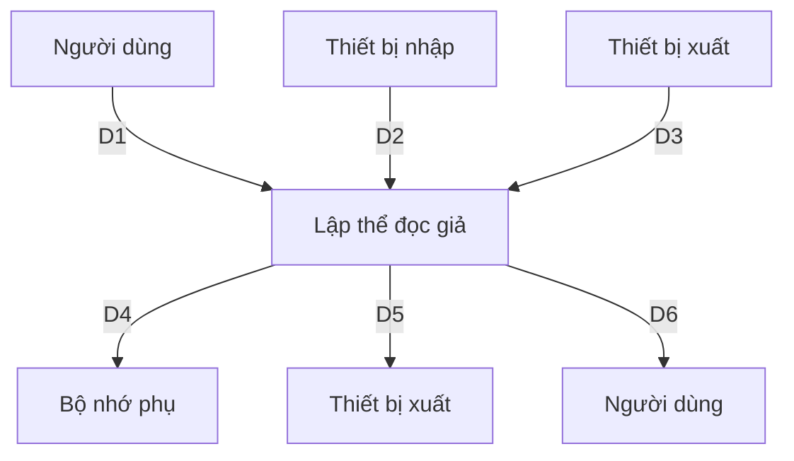
</details>

Hình 2.1: Sở đồ lường dữ liệu công việc Lập thể độc giả

3. Mô tả luồng dữ liệu

- D1: Họ Tên, Loại Độc Giả, Ngày Sinh, Địa Chỉ, Email, Ngày Lập Thẻ.   
- D2: Không có   
- D3: Danh Sách Loại Độc Giả, Tuổi Tối Đa, Tuổi Tối Thiêu, Thời Hạn Sử Dụng.   
- D4: D1 + Ngày Hết Hạn.   
- D5: D4   
- D6: Không có

# 4. Thuật toán xử lý

- B1: Nhận D1 từ người dùng.   
- B2: Kết nối cơ sở dữ liệu.   
- B3: Đọc D3 từ bộ nhớ phụ.   
- B4: Kiểm tra “Loại Độc Giả” (D1) có thuộc “Danh Sách Loại Độc Giả” (D3).   
- B5: Tính tuổi độc giả.   
- B6: Kiểm tra qui định tuổi tối thiểu.   
- B7: Kiểm tra qui định tuổi tối đa.   
- B8: Nếu không thỏa một trong các qui định trên thì tới Bước 13.   
- B9: Tính Ngày Hết Hạn.   
- B10: Lưu D4 xuống bộ nhớ phụ.   
- B11: Xuất D5 ra máy in (nếu có yêu cầu).   
- B12: Đóng kết nối cơ sở dữ liệu.   
- B13: Kết thúc.

# 2.3.2 Yêu cầu tiếp nhận sách mới

# 1. Biểu mẫu 2 và qui định 2

<table><tr><td>BM2:</td><td colspan="3">Thông Tin Sách</td></tr><tr><td colspan="2">Tên sách: ......</td><td>Thể loại: ......</td><td>Tác giả: ......</td></tr><tr><td colspan="2">Năm xuất bản: ......</td><td>Nhà xuất bản: ......</td><td>Ngày nhập: ......</td></tr><tr><td colspan="2">Trị giá:......</td><td>Số lượng nhập: ......</td><td>Thành tiền:</td></tr></table>

QĐ2: Có 3 thể loại (A, B, C). Có 100 tác giả. Chỉ nhận các sách xuất bản trong vòng 8 năm.

# 2. Sơ đồ luồng dữ liệu


<details>
<summary>flowchart</summary>

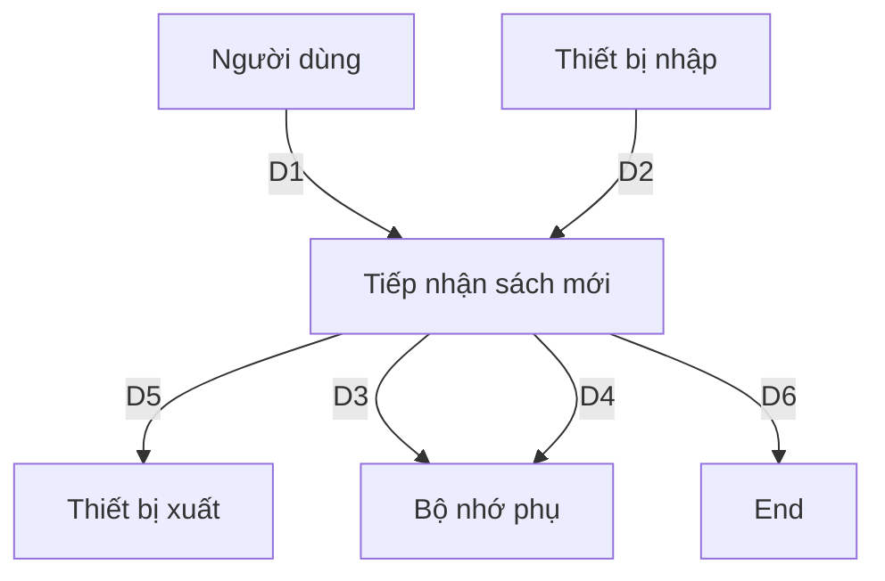
</details>

Hình 2.2: Sơ đồ luồng dữ liệu công việc Tiếp nhận sách mới

3. Mô tả luồng dữ liệu

- D1: Thông tin về sách cần nhập: Tên sách, Thể loại, Tác giả, Năm xuất bản, Nhà xuất bản, Ngày nhập, Trị giá, Số lượng nhập   
- D2: Không có   
- D3: Danh sách thể loại, Danh sách tác giả, Khoảng cách năm xuất bản tối đa.   
- D4: D1   
- D5: D4   
- D6: Không có

4. Thuật toán xử lý

- B1: Nhận D1 từ người dùng.   
- B2: Kết nối cơ sở dữ liệu.   
- B3: Đọc D3 từ bộ nhớ phụ.   
- B4: Kiểm tra “Tác giả” (D1) có thuộc “Danh sách tác giả” (D3).   
- B5: Kiểm tra “Thể loại” (D1) có thuộc “Danh sách thể loại” (D3).   
- B6: Tính khoảng cách năm xuất bản.   
- B7: Kiểm tra qui định khoảng cách năm xuất bản.

- B8: Nếu không thỏa một trong các quy định trên thì tới Bước 12.   
- B9: Lưu D4 xuống bộ nhớ phụ.   
- B10: Xuất D5 ra máy in (nếu có yêu cầu).   
- B11: Đóng kết nối cơ sở dữ liệu.   
- B12: Kết thúc.

# 2.3.3 Yêu câu tra cứu sách

# 1. Biểu mẫu 3

<table><tr><td>BM3:</td><td colspan="5">Danh Sách Tựa Sách</td></tr><tr><td>STT</td><td>Mã Tựa Sách</td><td>Tên Tựa Sách</td><td>Thế Loại</td><td>Tác Giả</td><td>SL còn lại</td></tr><tr><td>1</td><td></td><td></td><td></td><td></td><td></td></tr><tr><td>2</td><td></td><td></td><td></td><td></td><td></td></tr></table>

# 2. Sơ đồ luồng dữ liệu


<details>
<summary>flowchart</summary>

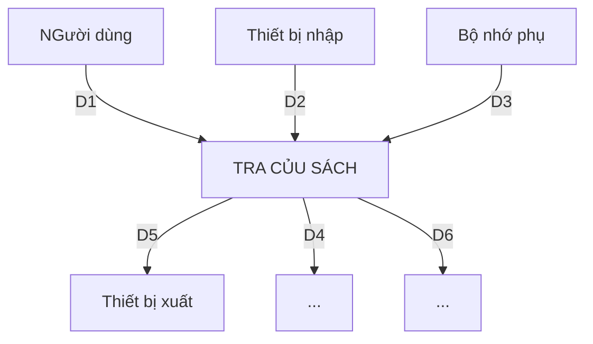
</details>

Hình 2.3: Sở đồ lường dữ liệu công việc Tra cứu sách

# 3. Mô tả luồng dữ liệu

- D1: Tiêu chuẩn tra cứu (tên sách, mã tựa sách, thể loại, tác giả,...).   
- D2: Không có.   
- D3: Danh sách các sách (Bao gồm mã tựa sách, tên sách, thể loại, tác giả, số lượng còn lại).   
- D4: Không có.   
- D5: Danh sách các sách (Bao gồm mã tựa sách, tên sách, thể loại, tác giả, số lượng còn lại) thỏa tiêu chuẩn D1.   
- D6: D5.

# 4. Thuật toán xử lí

- B1: Nhận D1 từ người dùng   
- B2: Kết nối cơ sở dữ liệu   
- B3: Đọc D3 từ bộ nhớ phụ   
- B4: Xuất D5 ra máy in   
- B5: Trả D6 cho người dùng   
- B6: Đóng kết nối cơ sở dữ liệu   
- B7: Kết thúc

# 2.3.4 Yêu cầu cho mượn sách

# 1. Biểu mẫu 4 và quy định 4

<table><tr><td>BM4:</td><td colspan="2">Phiếu Mượn Sách</td></tr><tr><td colspan="2">Mã độc giả:......</td><td>Tên độc giả:</td></tr><tr><td colspan="2">Mã sách:......</td><td>Tên sách:Tác giả:Thể loại:</td></tr><tr><td colspan="2">Ngày mượn:......</td><td>Ngày phải trả:</td></tr><tr><td colspan="2">Ngày trả:......</td><td>Số ngày trả trễ:</td></tr><tr><td colspan="2">Số tiền phạt:</td><td>Tổng nợ của độc giả:</td></tr></table>

QĐ4: Chỉ cho mượn với thể còn hạn, không có sách mượn quá hạn, và sách không có người đang mượn. Mỗi độc giả mượn tối đa 5 quyền sách trong 4 ngày.

# 2. So đồ lường dữ liệu


<details>
<summary>flowchart</summary>

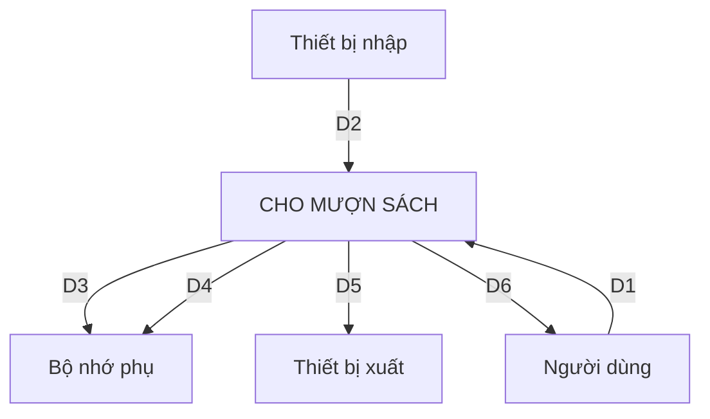
</details>

Hình 2.4: Sở đồ lường dữ liệu công việc Cho mượn sách

3. Mô tả luồng dữ liệu

- D1: Mã độc giả, mã sách, ngày mượn   
- D2: Không có   
- D3: Thông tin sách ứng với mã sách, thông tin độc giả ứng với mã độc giả (họ tên, thời hạn thể, danh sách các phiếu mượn của các sách đang mượn), số sách tối đa có thể mượn.   
- D4: Phiếu mượn mới (gồm D1 + tên sách, tác giả, thể loại + tên độc giả + ngày phải trả).   
- D5: D4   
- D6: Không có

4. Thuật toán xử lý

- B1: Nhận D1 từ người dùng   
- B2: Kết nối cơ sở dữ liệu   
- B3: Đọc D3 từ bộ nhớ phụ   
- B4: Kiểm tra các điều kiện sau, nếu không thỏa mãn bất kì điều kiện nào thì đến B12.   
- B5: Kiểm tra sách có đang chưa được mượn không.

- B6: Kiểm tra thể độc giả có còn hạn hay không.   
- B7: Kiểm tra số sách đang mượn của độc giả có nhỏ hơn số sách được mượn tối đa (D3) hay không.   
- B8: Kiểm tra có sách đang mượn (D3) nào quá hạn mượn hay không.   
- B9: Tính ngày phải trả   
- B10: Lưu D4 xuống bộ nhớ phụ.   
- B11: Xuất D5 ra máy in   
- B12: Đóng kết nối cơ sở dữ liệu   
- B13: Kết thúc.

# 2.3.5 Yêu cầu nhận trả sách

# 1. Quy định 5

QĐ5: Môi ngày trả trễ phạt 1.000 đồng/ngày.

# 2. Sơ đồ luồng dữ liệu


<details>
<summary>flowchart</summary>

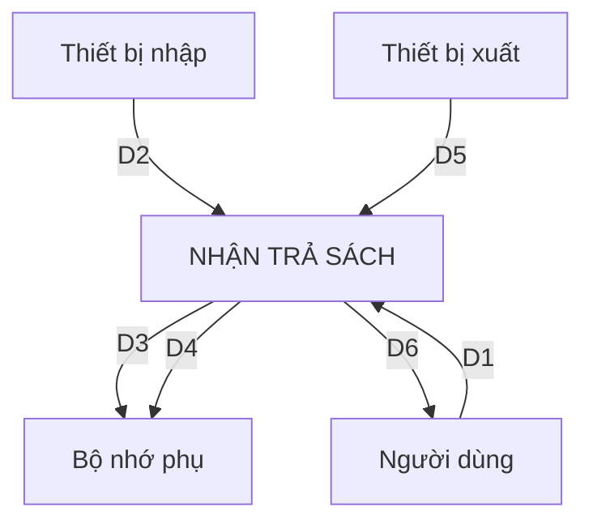
</details>

Hình 2.5: Sở đồ lường dữ liệu công việc Nhận trả sách

# 3. Mô tả luồng dữ liệu

- D1: Mã sách được trả, ngày trả sách.   
- D2: Không có.

- D3: Thông tin phiếu mượn mới nhất ứng với mã sách được trả và tổng nợ cũ của độc giả.   
- D4: D1 + D3 + Số ngày trễ + Tiền phạt + Tổng nợ mới của độc giả.   
- D5: D4   
- D6: Không có

# 4. Thuật toán xử lý

- B1: Nhận D1 từ người dùng.   
- B2: Kết nối cơ sở dữ liệu.   
- B3: Đọc D3 từ bộ nhớ phụ.   
- B4: Tính số ngày trả trễ, tính số tiền phạt, tính tổng nợ mới của độc giả.   
- B5: Lưu D4 xuống bộ nhớ phụ.   
- B6: Xuất D5 ra máy in.   
- B7: Đóng kết nối cơ sở dữ liệu.   
- B8: Kết thúc.

# 2.3.6 Yêu cầu lập phiếu thu tiền phạt

# 1. Biểu mẫu 6 và quy định 6

<table><tr><td>BM6:</td><td>Phiếu Thu Tiền Phật</td></tr><tr><td colspan="2">Mã độc giả: ......</td></tr><tr><td colspan="2">Họ tên độc giả:</td></tr><tr><td colspan="2">Tổng nợ:</td></tr><tr><td colspan="2">Số tiền thu: ......</td></tr><tr><td colspan="2">Còn lại:</td></tr></table>

QĐ6: Số tiền thu không vượt quá số tiền độc giả đang nợ.

# 2. Sơ đồ luồng dữ liệu


<details>
<summary>flowchart</summary>

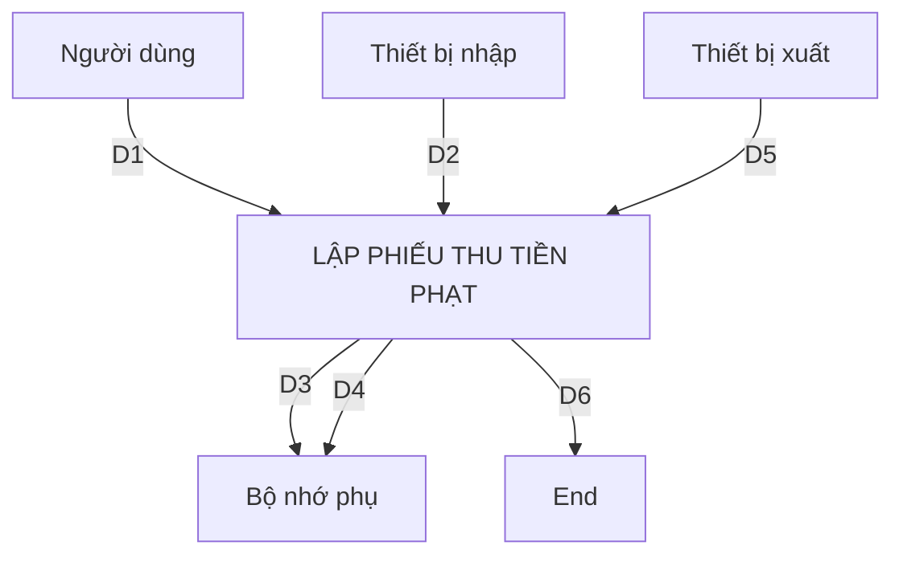
</details>

Hình 2.6: Sơ đồ lường dữ liệu công việc Lập phiếu thu tiền phạt

3. Mô tả luồng dữ liệu

- D1: Mã độc giả, số tiền thu   
- D2: Không có   
- D3: Thông tin độc giả (Họ tên, tổng nợ hiện tại)   
- D4: D1 + Họ tên độc giả + Tổng nợ còn lại   
- D5: D4   
- D6: Không có

4. Thuật toán xử lý

- B1: Nhận D1 từ người dùng   
- B2: Kết nối cơ sở dữ liệu   
- B3: Đọc D3 từ bộ nhớ phụ   
- B4: Nếu số tiền thu lớn hơn số tiền nợ hiện tại (D3), đến B8   
- B5: Tính tổng nợ còn lại   
- B6: Lưu D4 vào bộ nhớ phụ   
- B7: Xuất D5 ra máy in   
- B8: Đóng kết nối cơ sở dữ liệu   
- B9: Kết thúc

# 2.3.7 Yêu cầu lập báo cáo

# 1. Biểu mẫu 7

<table><tr><td colspan="2">BM7.1</td><td colspan="3">Báo Cáo Thông Kế Tỉnh Hình Mượn Sách Theo Thể Loại</td></tr><tr><td colspan="5">Tháng:...... Năm:......</td></tr><tr><td>STT</td><td colspan="2">Tên Thể Loại</td><td>Số Lượt Mượn</td><td>Tỉ Lệ</td></tr><tr><td>1</td><td colspan="2"></td><td></td><td></td></tr><tr><td>2</td><td colspan="2"></td><td></td><td></td></tr><tr><td colspan="5">Tổng số lượt mượn:</td></tr></table>

<table><tr><td colspan="2">BM7.2</td><td colspan="3">Báo Cáo Thống Kê Sách Trả Trễ</td></tr><tr><td colspan="5">Ngày: ......</td></tr><tr><td>STT</td><td colspan="2">Tên Sách</td><td>Ngày Mượn</td><td>Số Ngày Trả Trễ</td></tr><tr><td>1</td><td colspan="2"></td><td></td><td></td></tr><tr><td>2</td><td colspan="2"></td><td></td><td></td></tr></table>

# 2. Sơ đồ lường dữ liệu


<details>
<summary>flowchart</summary>

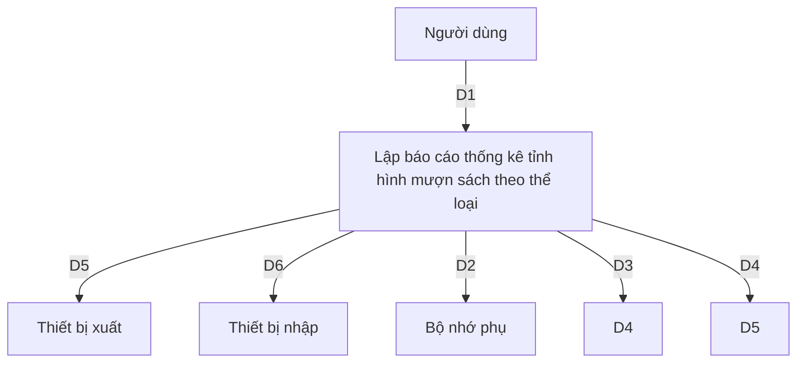
</details>

Hình 2.7: Sơ đồ lường dữ liệu công việc Lập báo cáo tình hình mượn sách theo thể loại


<details>
<summary>flowchart</summary>

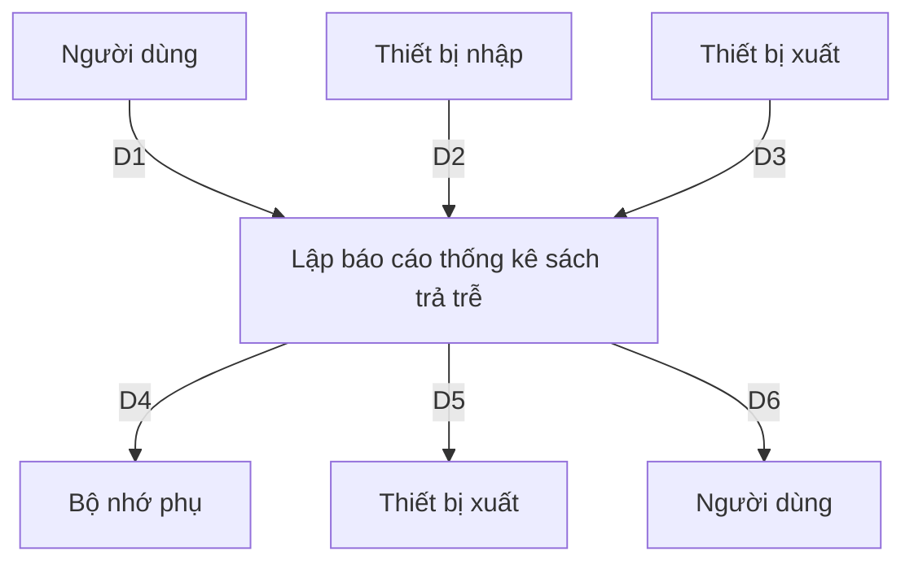
</details>

Hình 2.8: Sở đồ luồng dữ liệu công việc Lập báo cáo thống kê sách trả trễ

# 3. Mô tả luồng dữ liệu

\- Mô tả luồng dữ liệu báo cáo thống kê tình hình mượn sách theo thể loại:

- D1: Tháng + Năm   
- D2: Không có   
- D3: Danh sách các phiếu mượn có ngày mượn trong tháng (D1)   
- D4: D1 + thông tin thống kê theo từng thể loại có lượt mượn trong tháng (tên thể loại, số lượt mượn, tỉ lệ mượn) + tổng số lượt mượn.   
- D5: D4   
- D6: D5

\- Mô tả luồng dữ liệu báo cáo thống kê sách trả trễ

- D1: Ngày báo cáo   
- D2: Không có   
- D3: Danh sách các phiếu mượn có ngày trả là NULL và ngày phải trả lớn hơn ngày báo cáo (D1)

- D4: D1 + thông tin thống kê tổng số lượng sách trả trễ (Tên sách, Ngày mượn, Số ngày trả trễ).   
- D5: D4   
- D6: D5

# 4. Thuật toán xử lý

\- Thuật toán xử lý lập báo cáo thống kê tình hình mượn sách theo thể loại:

- B1: Nhận D1 từ người dùng   
- B2: Kết nối cơ sở dữ liệu   
- B3: Đọc D3 từ bộ nhớ phụ   
- B4: Đếm số lượt mượn theo từng thể loại từ danh sách các phiếu mượn trong tháng (từ D3).   
- B5: Tính tổng số lượt mượn của tất cả các thể loại (≠ số phiếu mượn).   
- B6: Tính tỉ lệ mượn theo từng thể loại dựa vào số lượt mượn của từng thể loại và tổng số lượt mượn của tất cả các thể loại.   
- B7: Lưu D4 xuống bộ nhớ phụ   
- B8: Xuất D5 ra máy in   
- B9: Trả D6 cho người dùng   
- B10: Đóng kết nối cơ sở dữ liệu   
- B11: Kết thúc

\- Thuật toán xử lý lập báo cáo thống kê sách trả trễ:

- B1: Nhận D1 từ người dùng   
- B2: Kết nói cơ sở dữ liệu   
- B3: Đọc D3 từ bộ nhớ phụ   
- B4: Tìm các sách trả trễ (từ D3).   
- B5: Lưu D4 xuống bộ nhớ phụ   
- B6: Xuất D5 ra máy in

- B7: Trả D6 cho người dùng   
- B8: Đóng kết nối cơ sở dữ liệu   
- B9: Kết thúc

# 2.3.8 Yêu cầu thay đổi quy định

# 1. Quy định 8

QĐ8: Người dùng có thể thay đổi các qui định như sau:   
+ QĐ1: Thay đổi về tuổi tối thiểu, tuổi tối đa, thời hạn có giá trị của thể.   
+ QĐ2: Thay đổi số lượng và tên các thể loại. Thay đổi khoảng cách năm xuất bản.   
+ QĐ3: Thay đổi số lượng sách mượn tối đa, số ngày mượn tối đa. Thay đổi đơn giá phạt   
+ QĐ4: Thay đổi quy định kiểm tra số tiền thu   
+ QĐ5: Thay đổi danh sách nhóm người dùng

# 2. Sơ đồ luồng dữ liệu


<details>
<summary>flowchart</summary>

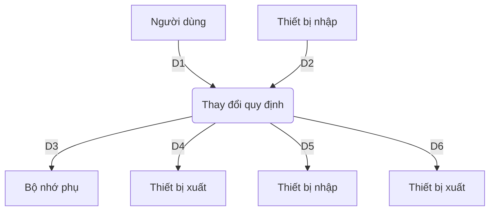
</details>

Hình 2.9: Sơ đồ dữ liệu công việc Thay đổi quy định

# 3. Mô tả luồng dữ liệu

- D1: Thông tin cần thay đổi và giá trị mới của nó.   
- D2: Không có

- D3: Thông tin được thay đổi.   
- D4: D1   
- D5: Không có   
- D6: Không có

# 4. Thuật toán

- B1: Nhận D1 từ người dùng   
- B2: Kết nói cơ sở dữ liệu   
- B3: Lưu D4 xuống bộ nhớ phụ   
- B4: Đóng kết nối cơ sở dữ liệu   
- B5: Kết thúc

# 2.3.9 Yêu cầu phân quyền

# 1. Quy định 9

QĐ9: Người dùng thuộc nhóm người dùng Quản lý có thể thêm, xóa chức năng cho phép của các nhóm người dùng

# 2. Sơ đồ luồng dữ liệu


<details>
<summary>flowchart</summary>

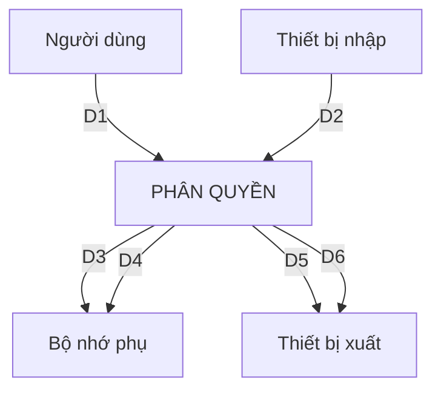
</details>

Hình 2.10: Sở đồ lường dữ liệu công việc Phân quyền

3. Mô tả luồng dữ liệu

- D1: Nhóm người dùng cần chỉnh sửa quyền, các chức năng được thêm/xóa   
- D2: Không có   
- D3: Danh sách các nhóm người dùng, danh sách các chức năng   
- D4: D1   
- D5: Không có   
- D6: Không có

4. Thuật toán xử lý

- B1: Nhận D1 từ người dùng   
- B2: Mở kết nối cơ sở dữ liệu   
- B3: Đọc D3 từ bộ nhớ phụ   
- B4: Kiểm tra nhóm người dùng (D1) có thuộc danh sách các nhóm người dùng (D3) hay không. Nếu không, đến B7.   
- B5: Kiểm tra các chức năng được thêm/xóa (D1) có nằm trong danh sách các chức năng (D3) hay không. Nếu không đến B7.   
- B6: Lưu D4 xuống bộ nhớ phụ   
- B7: Đóng kết nối cơ sở dữ liệu

\- B8: Kết thúc

# 3. THIẾT KẾ HỆ THỐNG

# 3.1. Kiến trúc hệ thống

\- Sử dụng kiến trúc 3 lớp (Three-layer). Úng dụng được phân chia thành 3 phần chính như sau:

○ Lớp Presentation (GUI): Đây là lớp trên nhất, làm nhiệm vụ tương tác trực tiếp với người dùng, nhận vào yêu cầu người dùng và sử dụng phần hồi từ lớp BUS để hiển thị kết quả cho người dùng.   
○ Lớp Business Logic (BUS): Đây là lớp sử dụng kết quả trả về từ lớp DAL để xử lý và phần hồi các yêu cầu thao tác dữ liệu từ lớp GUI.   
o Lóp Data Access (DAL): Đây là lớp dưới nhất, trực tiếp thao tác với hệ CSDL.

\- Nguyên tắc của kiến trúc 3 lớp: Một lớp chỉ được tương tác với lớp ngay dưới nó. Không được tương tác “vượt tầng”.

# 3.2. Mô tả các thành phần trong hệ thống

<table><tr><td>STT</td><td>Thành phần</td><td>Diễn giải</td></tr><tr><td>1</td><td>Lớp GUI</td><td>Lớp này thực hiện các công việc như nhận yêu cầu của người dùng, nhập liệu, hiển thị dữ liệu, kiểm tra tính đúng đấn của dữ liệu trước khi gọi lớp bên dưới là lớp Business Logic,...</td></tr><tr><td>2</td><td>Lớp BUS</td><td>Lớp này có nhiệm vụ kiểm tra các ràng buộc, tính đúng đấn và toàn vẹn của dữ liệu, dùng nguồn dữ liệu truy vấn từ lớp Data Access để thực hiện tính toán và xử lý các yêu cầu nghiệp vụ rời trả kết quả về cho lớp GUI.</td></tr><tr><td>3</td><td>Lớp DAL</td><td>Lớp này thực hiện các công việc như truy vấn (tìm kiểm, thêm, xóa, sửa, ...) và lưu trữ.</td></tr><tr><td>4</td><td>Lớp DTO</td><td>(Data Tranfer Object) Lớp này làm nhiệm vụ đóng gói data (từ dạng data set, data table thành một class) để chuyển giữa client và server.</td></tr></table>

# 4. THIÊT KẾ DŨ LIÊU

# 4.1. Thuật toán lập sơ đồ logic:

# 4.1.1. Bước 1: Xét yêu cầu lập thể độc giả

▶ Thiết kế dữ liệu với tính đúng đắn:

- Biểu mẫu liên quan: BM1   
- Sơ đồ luồng dữ liệu: Hình 2.1   
- Các thuộc tính mới: TenDocGia, MaLoaiDocGia, NgaySinh, DiaChi, Email, NgayLapThe.   
- Thiết kế dữ liệu: Table DOCGIA.   
- Các thuộc tính trừ tượng: MaDocGia   
- So đồ logic:

# DOCGIA

# MaDocGia

TenDocGia

LoaiDocGia

NgaySinh

DiaChi

Email

NgayLapThe

▶ Thiết kế dữ liệu với tính tiến hoá:

- Quy định liên quan: QĐ1   
- Sơ đồ luồng dữ liệu: Hình 2.9: Sơ đồ dữ liệu công việc Thay đổi quy định.   
- Các thuộc tính mới: TenLoaiDocGia, TuoiToiDa, TuoiToiThieu, ThoiHanThe, NgayHetHan.   
- Thiết kế dữ liệu: Table LOAIDOCGIA, Table THAMSO   
- Các thuộc tính trừu tượng: MaLoaiDocGia   
- So đồ logic:


<details>
<summary>flowchart</summary>

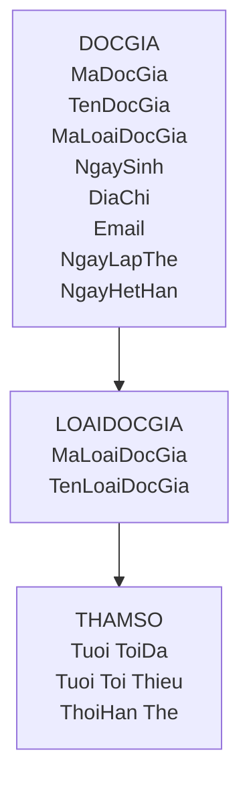
</details>

# 4.1.2. Bước 2: Xét yêu cầu tiếp nhận sách mới

▶ Thiết kế dữ liệu với tính đúng đắn:

- Biểu mẫu liên quan: BM2   
- Sơ đồ luồng dữ liệu: Hình 2.2: Sơ đồ luồng dữ liệu công việc Tiếp nhận sách mới   
- Các thuộc tính mới: NhaXB, DonGia, NgayNhap, SoLuong, TenTuaSach, NamXB, TacGia, TheLoai, SoLuongNhap, ThanhTien, TongTien   
- Thiết kế dữ liệu: Table PHIEUNHAPSACH, CT\_PHIEUNHAP, TUASACH, SACH   
- Các thuộc tính trừ tượng: SoPhieuNhap, MaSach, MaTuaSach.   
- So đồ logic:


<details>
<summary>flowchart</summary>

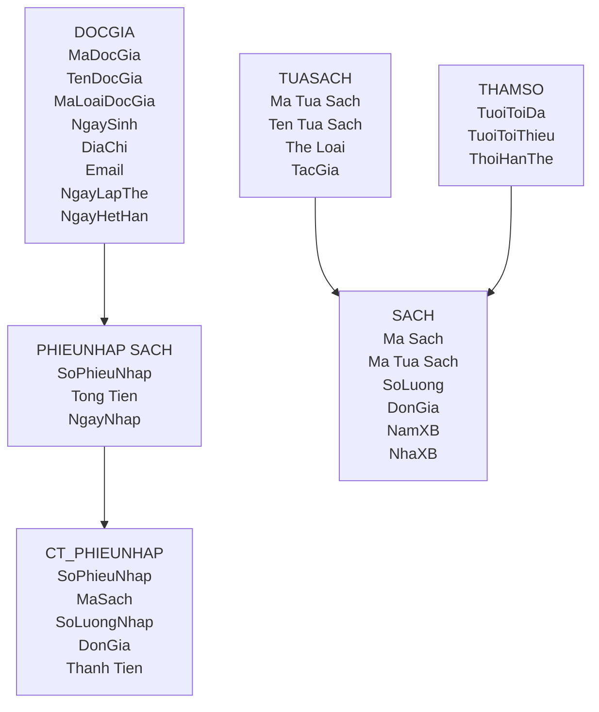
</details>

▶ Thiết kế dữ liệu với tính tiến hoá:

- Quy định liên quan: QĐ2   
- Sơ đồ luồng dữ liệu: Hình 2.9: Sơ đồ dữ liệu công việc Thay đổi quy định   
- Các thuộc tính mới: TenTheLoai, TenTacGia, ThoiHanNhanSach   
- Thiết kế dữ liệu: Table TACGIA, Table THELOAI, Table CT\_TACGIA, Table THAMSO   
- Các thuộc tính trừ tượng: MaTacGia, MaTheLoai   
- So òô logic:


<details>
<summary>flowchart</summary>

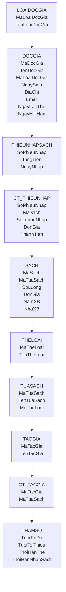
</details>

# 4.1.3. Bước 3: Xét yêu cầu tra cứu sách

▶ Thiết kế dữ liệu với tính đúng đắn:

- Biểu mẫu liên quan: BM3   
- Sơ đồ luồng dữ liệu: Hình 2.3: Sơ đồ luồng dữ liệu công việc Tra cứu sách   
- Các thuộc tính mới: SoLuongConLai   
- Thiết kế dữ liệu: Table SACH   
- Các thuộc tính trừu tượng:   
- So đồ logic:


<details>
<summary>flowchart</summary>

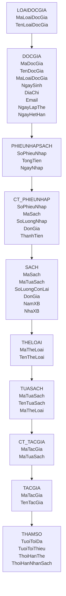
</details>

# 4.1.4. Bước 4: Xét yêu cầu cho mượn sách

▶ Thiết kế dữ liệu với tính đúng đắn:

- Biểu mẫu liên quan: BM4   
- Sơ đồ luồng dữ liệu: Hình 2.4: Sơ đồ luồng dữ liệu công việc Cho mượn sách   
- Các thuộc tính mới: NgayMuon, HanTra, TongNo, SoTienPhat, NgayTra, TinhTrang   
- Thiết kế dữ liệu: Table PHIEUMUONTRA, Table DOCGIA, Table CUONSACH   
- Các thuộc tính trừ tượng: SoPhieuMuonTra, MaCuonSach   
- So òô logic:


<details>
<summary>flowchart</summary>

```mermaid
graph TD
    A["THAMSO\nTuoiToiDa\nTuoiToiThieu\nThoiHanThe\nThoiHanNhanSach"] --> B["PHIEUMUONTRA\nSoPhieuMuonTra\nMaDocGia\nMaCuonSach\nNgayMuon\nHanTra\nNgayTra\nSoTienPhat"]
    B --> C["DOCGIA\nMaDocGia\nTenDocGia\nMaLoaiDocGia\nNgaySinh\nDiaChi\nEmail\nNgayLapThe\nNgayHetHan\nTongNo"]
    C --> D["LOAIDOCGIA\nMaLoaiDocGia\nTenLoaiDocGia"]
    D --> E["PHIEUNHAPSACH\nSoPhieuNhap\nTongTien\nNgayNhap"]
    E --> F["SACH\nMaSach\nMaTuaSach\nSoLuong\nSoLuongConLai\nDonGia\nNamXB\nNhaXB"]
    F --> G["TUASACH\nMaTuaSach\nTenTuaSach\nMaTheLoai"]
    G --> H["THELOAI\nMaTheLoai\nTenTheLoai"]
    H --> I["TACGIA\nMaTacGia\nTenTacGia"]
    I --> J["CT_TACGIA\nMaTacGia\nMaTuaSach"]
    J --> K["THAMSO\nTuoiToiDa\nTuoiToiThieu\nThoiHanThe\nThoiHanNhanSach"]
    K --> L["PHIEUNHAPSACH"]
    L --> M["SACH"]
    M --> N["TUASACH"]
    N --> O["THELOAI"]
    O --> P["TACGIA"]
```
</details>

▶ Thiết kế dữ liệu với tính tiến hoá:

- Quy định liên quan: QĐ4   
- Sơ đồ luồng dữ liệu: Hình 2.9: Sơ đồ dữ liệu công việc Thay đổi quy định   
- Các thuộc tính mới: SoSachMuonToiDa, SoNgayMuonToiDa   
- Thiết kế dữ liệu: Table THAMSO   
- Các thuộc tính trừu tương:   
- So đồ dữ liệu:


<details>
<summary>flowchart</summary>

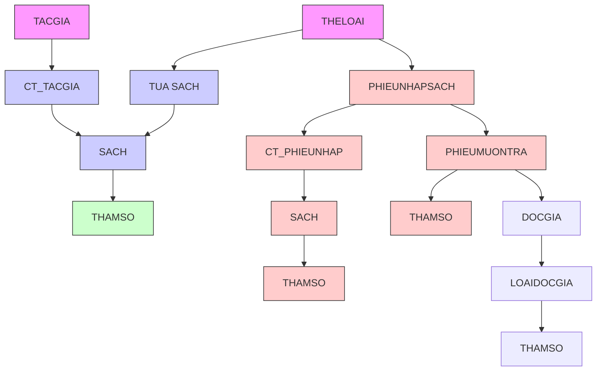
</details>

# 4.1.5. Bước 5: Xét yêu cầu nhận trả sách

Thiết kê dữ liệu với tính tiến hoá:

- Quy định liên quan: QĐ5   
- Sơ đồ luồng dữ liệu: Hình 2.9: Sơ đồ dữ liệu công việc Thay đổi quy định   
- Các thuộc tính mới: DonGiaPhat   
- Thiết kế dữ liệu: Table THAMSO   
- So đồ logic:


<details>
<summary>flowchart</summary>

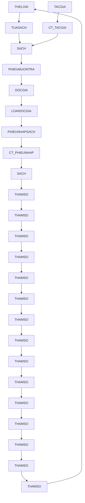
</details>

# 4.1.6. Bước 6: Xét yêu cầu lập phiếu thu tiền phạt

▶ Thiết kế dữ liệu với tính đúng đắn:

- Biểu mẫu liên quan: BM6   
- Sơ đồ luồng dữ liệu: Hình 2.6: Sơ đồ luồng dữ liệu công việc Lập phiếu thu tiền phạt   
- Các thuộc tính mới: SoTienThu, NgayLap   
- Thiết kế dữ liệu: Table PHIEUTHU   
- Các thuộc tính trừ tượng: SoPhieuThu   
- So òô logic:


<details>
<summary>flowchart</summary>

```mermaid
graph TD
    A["LOAIDOCGIA\nMaLoaiDocGia\nTenLoaiDocGia"] --> B["DOCGIA\nMaDocGia\nTenDocGia\nMaLoaiDocGia\nNgaySinh\nDiaChi\nEmail\nNgayLapThe\nNgayHetHan\nTongNo"]
    B --> C["PHIEUNHAPSACH\nSoPhieuNhap\nTongTien\nNgayNhap"]
    C --> D["CT_PHIEUNHAP\nSoPhieuNhap\nMaSach\nSoLuongNhap\nDonGia\nThanhTien"]
    D --> E["SACH\nMaSach\nMaTuaSach\nSoLuong\nSoLuongConLai\nDonGia\nNamXB\nNhaXB"]
    E --> F["THELOAI\nMaTheLoai\nTenTheLoai"]
    F --> G["TUASACH\nMaTuaSach\nTenTuaSach\nMaTheLoai"]
    G --> H["TACGIA\nMaTacGia\nTenTacGia"]
    H --> I["CT_TACGIA\nMaTacGia\nMaTuaSach"]
    I --> J["CUONSACH\nMaCuonSach\nMaSach\nTinhTrang"]
    J --> K["THAMSO\nTuoiToiDa\nTuoiToiThieu\nThoiHanThe\nThoiHanNhanSach\nSoSachMuonToiDa\nSoNgayMuonToiDa\nDonGiaPhat"]
    K --> L["PHIEUMUONTRA\nSoPhieuMuonTra\nMaDocGia\nMaCuonSach\nNgayMuon\nHanTra\nNgayTra\nSoTienPhat"]
    L --> M["PHIEUTHU\nSoPhieuThu\nMaDocGia\nSoTienThu\nNgayLap"]
```
</details>

▶ Thiết kế dữ liệu với tính tiến hoá:

- Quy định liên quan: QĐ6   
- Sơ đồ luồng dữ liệu: Hình 2.9: Sơ đồ dữ liệu công việc Thay đổi quy định   
- Các thuộc tính mới: AD\_QDKiemTraSoTienThu   
- Thiết kế dữ liệu: Table THAMSO   
- So đồ logic:


<details>
<summary>flowchart</summary>

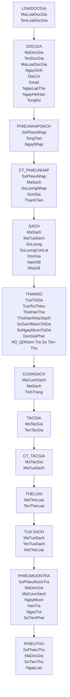
</details>

# 4.1.7. Bước 7: Xét yêu cầu lập báo cáo

▶ Thiết kế dữ liệu với tính đúng đắn:

- Biểu mẫu liên quan: BM7.1, BM7.2   
- Sơ đồ luồng dữ liệu: Sơ đồ cộng việc lập báo cáo   
- Các thuộc tính mới: SoLuotMuon, TiLe, Ngay, NgayMuon, SoNgayTraTre, Thang, Nam, TongSoLuotMuon.   
- Thiết kế dữ liệu: Table BCLUOTMUONTHEOTHELOAI, CT\_BCLUOTMUONTHEOTHELOAI, BCSACHTRATRE   
- So đồ logic:


<details>
<summary>flowchart</summary>

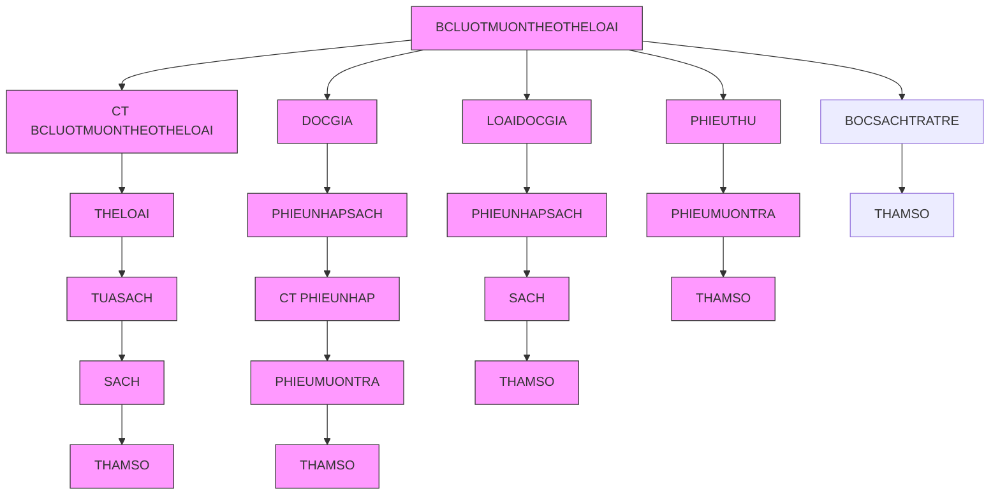
</details>

# 4.1.8. Bước 8: Xét yêu cầu phân quyền

▶ Thiết kế dữ liệu với tính bảo mật:

- Quy định liên quan: QĐ9   
- Sơ đồ luồng dữ liệu: Hình 2.10: Sơ đồ luồng dữ liệu công việc Phân quyền   
- Các thuộc tính mới: TenNguoiDung, NgaySinh, ChucVu, TenDangNhap, MatKhau, MaNhomNguoiDung, TenNhomNguoiDung, TenChucNang, TenManHinh

\- Thiết kế dữ liệu: Table PHANQUYEN, Table CHUCNANG, Table NGUOIDUNG, Table NHOMNGUOIDUNG

- Các thuộc tính trừ tượng: MaNhomNguoiDung, MaNguoiDung, MaChucNang   
- So đồ logic:


<details>
<summary>flowchart</summary>

```mermaid
graph TD
    A["CHUCNANG\nMaChucNang\nTenChucNang\nTenManHinh"] <--> B["PHANQUYEN\nMaNhomNguoiDung\nMaChucNang"]
    B --> C["NHOMNGUOIDUNG\nMaNhomNguoiDung\nTenNhomNguoiDung"]
    C --> D["NGUOIDUNG\nMaNguoiDung\nTenNguoiDung\nNgaySinh\nChucVu\nTenDangNhap\nMatKhau\nMaNhom"]
    D --> E["CT BCLUOTMUONTHEOTHELOAI\nMaBaoCao\nThang\nNam\nTongSoLuotMuon"]
    E --> F["THELOAI\nMaTheLoai\nTenTheLoai"]
    F --> G["TUASACH\nMaTuaSach\nTenTuaSach\nMaTheLoai"]
    G --> H["SACH\nMaSach\nMaTuaSach\nSoLuong\nSoLuongConLai\nDonGia\nNamXB\nNhaXB"]
    H --> I["CUONSACH\nMaCuonSach\nMaSach\nTinhTrang"]
    I --> J["BCSACHTRATRE\nNgay\nMaCuonSach\nNgayMuon\nSoNgayTre"]
    J --> K["THAMSO\nTuoIToiDa\nTuoIToiThieu\nThoiHanThe\nThoiHanNhanSach\nSoSachMuonToiDa\nSoNgayMuonToiDa\nDonGiaPhat\nAD_QDKiemTraSoTienThu"]
    K --> L["PHIEUMUONTRA\nSoPhieuMuanTra\nMaDocGia\nMaCuonSach\nNgayMuon\nHanTra\nNgayTra\nSoTienPhat"]
    L --> M["CT PHIEUNHAP\nSoPhieuNhap\nMaSach\nSoLuongNhap\nDonGia\nThanhTien"]
    M --> N["DOCGIA\nMaDocGia\nTenDocGia\nMaLoaiDocGia\nNgaySinh\nDiaChi\nEmail\nNgayLapThe\nNgayHetHan\nTongNo"]
    N --> O["LOAIDOCGIA\nMaLoaiDocGia\nTenLoaiDocGia"]
    O --> P["PHIEUNHAPSACH\nSoPhieuNhap\nTongTien\nNgayNhap"]
    P --> Q["CT PHIEUNHAP"]
    Q --> R["PHIEUTHU\nSoPhieuThu\nMaDocGia\nSoTienThu\ngayLap"]
```
</details>

# 4.2. So đồ logic hoàn chính


<details>
<summary>flowchart</summary>

```mermaid
graph TD
    A["CHUCNANG"] -->|MaChucNang\nTenChucNang\nTenManHinh| B["PHANQUYEN"]
    B -->|MaNhomNguoiDung\nMaChucNang| C["NHOMNGUOIDUNG"]
    C -->|MaNhomNguoiDung\nTenNhomNguoiDung| D["NGUOIDUNG"]
    D -->|MaNguoiDung\nTenNguoiDung\nNgaySinh\nChucVu\nTenDangNhap\nMatKhau\nMaNhom| E["CT BCLUOTMUONTHELOAI"]
    E -->|MaBaoCao\nThang\nNam\nTongSoLuotMuon| F["BCLUOTMUONTHEOTHELOAI"]
    F --> G["CT BCLUOTMUONTHEOTHELOAI"]
    G --> H["THELOAI"]
    H --> I["TUASACH"]
    I --> J["TACGIA"]
    J --> K["CT TACGIA"]
    K --> L["BUOICUO"]
    L --> M["DOCGIA"]
    M --> N["PHIEUNHAPSACH"]
    N --> O["CT PHIEUNHAP"]
    O --> P["SACH"]
    P --> Q["CUONSACH"]
    Q --> R["BCSACHTRATRE"]
    R --> S["THAMSO"]
    S --> T["PHIEUMUONTRA"]
    T --> U["PHIEUTHU"]
    U --> V["DOCGIA"]
    V --> W["PHIEUNHAPSACH"]
    W --> X["CT PHIEUNHAP"]
    X --> Y["SACH"]
    Y --> Z["CUONSACH"]
    Z --> AA["BCSACHTRATRE"]
    AA --> AB["THAMSO"]
```
</details>

# 4.3. Danh sách các bằng dữ liệu trong sơ đồ

<table><tr><td>STT</td><td>Tên bằng dữ liệu</td><td>Diễn giải</td></tr><tr><td>1</td><td>THAMSO</td><td>Bằng chứa các tham số</td></tr><tr><td>2</td><td>DOCGIA</td><td>Chứa thông tin độc giả.</td></tr><tr><td>3</td><td>LOAIDOCGIA</td><td>Chứa thông tin các loại độc giả.</td></tr><tr><td>4</td><td>NHOMNGUOIDUNG</td><td>Chứa thông tin các nhóm người dùng.</td></tr><tr><td>5</td><td>CHUCNANG</td><td>Chứa thông tin các chức năng.</td></tr><tr><td>6</td><td>QUYEN</td><td>Mỗi bộ thuộc bằng QUYEN chứa thông tin về một nhóm người dùng được sử dụng một chức năng nào đó</td></tr><tr><td>7</td><td>NGUOIDUNG</td><td>Chứa thông tin người dùng.</td></tr><tr><td>8</td><td>THELOAI</td><td>Chứa thông tin thể loại sách.</td></tr><tr><td>9</td><td>TUASACH</td><td>Một bộ thuộc bằng TUASACH chứa thông tin về một tựa sách.</td></tr><tr><td>10</td><td>SACH</td><td>Một bộ thuộc bằng SACH chứa thông tin về một tựa sách trong một lần xuất bản cụ thể.</td></tr><tr><td>11</td><td>CUONSACH</td><td>Một bộ thuộc bằng CUONSACH chứa thông tin về một cuốn sách.</td></tr><tr><td>12</td><td>PHIEUNHAPSACH</td><td>Chứa thông tin các đợt nhập sách.</td></tr><tr><td>13</td><td>CT_PHIEUNHAP</td><td>Chứa thông tin chi tiết của phiếu nhập sách</td></tr><tr><td>14</td><td>TACGIA</td><td>Chứa thông tin các tác giả.</td></tr><tr><td>15</td><td>PHIEUMUONTRA</td><td>Một bộ thuộc PHIEUMUONTRA chứa thông tin một phiếu mượn trả của một cuốn sách.</td></tr><tr><td>16</td><td>PHIEUTHU</td><td>Chứa thông tin các phiếu thu.</td></tr><tr><td>17</td><td>CT_TACGIA</td><td>Một bộ thuộc CT_TACGIA chứa thông tin một tác giả của một tựa sách</td></tr><tr><td>18</td><td>BCLMUONTHEOTLOAI</td><td>Chứa thông tin các báo cáo lượt mượn theo thể loại trong tháng.</td></tr><tr><td>19</td><td>CT_BCLMUONTHEOTLOAI</td><td>Chứa thông tin chi tiết các báo cáo lượt mượn theo thể loại trong tháng</td></tr><tr><td>20</td><td>BCSACHTRATRE</td><td>Chứa thông tin chi tiết các sách trả trễ theo ngày</td></tr></table>

# 4.4. Mô tả từng bằng dữ liệu

# 4.4.1. Bảng THAMSO

<table><tr><td colspan="3">THAMSO</td></tr><tr><td>Tên thuộc tính</td><td>Giá trị</td><td>Diễn giải</td></tr><tr><td>TuoiToiThieu</td><td>18</td><td>Độ tuổi thấp nhất của độc giả</td></tr><tr><td>TuoiToiDa</td><td>55</td><td>Độ tuổi cao nhất của độc giả</td></tr><tr><td>ThoiHanThe</td><td>6</td><td>Thời hạn sử dụng của thể (tính bằng tháng)</td></tr><tr><td>KhoangCachXuatBan</td><td>8</td><td>Nhận các sách xuất bản trong vòng KhoangCachXuatBan năm</td></tr><tr><td>SoSachMuonToiDa</td><td>5</td><td>Số sách tối đa được mượn</td></tr><tr><td>SoNgayMuonToiDa</td><td>4</td><td>Số ngày mượn sách tối đa</td></tr><tr><td>DonGiaPhat</td><td>1000</td><td>Đơn giá tiền phạt trả trễ/1 ngày</td></tr><tr><td>AD_QDKTTienThu</td><td>1</td><td>Có áp dụng quy định kiểm tra số tiền thu không quá số tiền nợ hay không (0: không, 1: có)</td></tr></table>

# 4.4.2. Bảng DOCGIA

<table><tr><td>Tên thuộc tính</td><td>Kiểu dữ liệu</td><td>Ràng buộc</td><td>Diễn giải</td></tr><tr><td>MaDocGia</td><td>Int</td><td>Khoá chính</td><td>Mã độc giả</td></tr><tr><td>TenDocGia</td><td>NVarchar</td><td></td><td>Tên độc giả</td></tr><tr><td>NgaySinh</td><td>Datetime</td><td></td><td>Ngày sinh độc giả</td></tr><tr><td>DiaChi</td><td>NVarchar</td><td></td><td>Địa chỉ độc giả</td></tr><tr><td>Email</td><td>Varchar</td><td></td><td>Email độc giả</td></tr><tr><td>NgayLapThe</td><td>Datetime</td><td></td><td>Ngày lập thể độc giả</td></tr><tr><td>NgayHetHan</td><td>Datetime</td><td></td><td>Ngày hết hạn thể độc giả</td></tr><tr><td>MaLoaiDocGia</td><td>Int</td><td>Khoá ngoại bằng LOAIDOCGIA</td><td>Mã loại độc giả</td></tr><tr><td>TongNoHienTai</td><td>Int</td><td></td><td>Tổng nợ hiện tại của độc giả</td></tr></table>

# 4.4.3. Bảng LOAIDOCGIA

<table><tr><td>Tên thuộc tính</td><td>Kiểu dữ liệu</td><td>Ràng buộc</td><td>Diễn giải</td></tr><tr><td>MaLoaiDocGia</td><td>Int</td><td>Khoá chính</td><td>Mã loại độc giả</td></tr><tr><td>TenLoaiDocGia</td><td>NVarchar</td><td></td><td>Tên loại độc giả</td></tr></table>

# 4.4.4. Bảng TACGIA

<table><tr><td>Tên thuộc tính</td><td>Kiểu dữ liệu</td><td>Ràng buộc</td><td>Diễn giải</td></tr><tr><td>MaTacGia</td><td>Int</td><td>Khoá chính</td><td>Mã tác giả</td></tr><tr><td>TenTacGia</td><td>NVarchar</td><td></td><td>Tên tác giả</td></tr></table>

# 4.4.5. Bång NHOMNGUOIDUNG

<table><tr><td>Tên thuộc tính</td><td>Kiểu dữ liệu</td><td>Ràng buộc</td><td>Diễn giải</td></tr><tr><td>MaNhomNguoiDung</td><td>Int</td><td>Khoá chính</td><td>Mã nhóm người dùng</td></tr><tr><td>TenNhomNguoiDung</td><td>NVarchar</td><td></td><td>Tên nhóm người dùng</td></tr></table>

# 4.4.6. Bảng CHUCNANG

<table><tr><td>Tên thuộc tính</td><td>Kiểu dữ liệu</td><td>Ràng buộc</td><td>Diễn giải</td></tr><tr><td>MaChucNang</td><td>Int</td><td>Khoá chính</td><td>Mã chức năng</td></tr><tr><td>TenChucNang</td><td>NVarchar</td><td></td><td>Tên chức năng</td></tr><tr><td>TenManHinh</td><td>NVarchar</td><td></td><td>Tên màn hình được load</td></tr></table>

# 4.4.7. Bảng PHANQUYEN

<table><tr><td>Tên thuộc tính</td><td>Kiểu dữ liệu</td><td>Ràng buộc</td><td>Diễn giải</td></tr><tr><td>MaNhomNguoiDung</td><td>Int</td><td>Khoá chínhKhoá ngoại bằngNHOMNGUOIDUNG</td><td>Mã nhóm người dùng</td></tr><tr><td>MaChucNang</td><td>Int</td><td>Khoá chínhKhoá ngoại bằngCHUCNANG</td><td>Mã chức năng cho phép nhóm người dùng sử dụng</td></tr></table>

# 4.4.8. Bång NGUOIDUNG

<table><tr><td>Tên thuộc tính</td><td>Kiểu dữ liệu</td><td>Ràng buộc</td><td>Diễn giải</td></tr><tr><td>MaNguoiDung</td><td>Int</td><td>Khoá chính</td><td>Mã người dùng</td></tr><tr><td>TenNguoiDung</td><td>NVarchar</td><td></td><td>Tên người dùng</td></tr><tr><td>NgaySinh</td><td>datetime</td><td></td><td>Ngày sinh</td></tr><tr><td>ChucVu</td><td>NVarchar</td><td></td><td>Chức vụ</td></tr><tr><td>TenDangNhap</td><td>varchar</td><td></td><td>Tên đăng nhập tài khoản người dùng</td></tr><tr><td>MatKhau</td><td>Varchar</td><td></td><td>Mật khẩu của người dùng</td></tr><tr><td>MaNhom</td><td>Int</td><td>Khoá ngoại bằng NHOMNGUOIDUNG</td><td>Mã nhóm người dùng</td></tr></table>

# 4.4.9. Bảng THELOAI

Chúa danh sách các thể loại.

<table><tr><td>Tên thuộc tính</td><td>Kiểu dữ liệu</td><td>Ràng buộc</td><td>Diễn giải</td></tr><tr><td>MaTheLoai</td><td>Int</td><td>Khoá chính</td><td>Mã thể loại</td></tr><tr><td>TenTheLoai</td><td>NVarchar</td><td></td><td>Tên thể loại</td></tr></table>

# 4.4.10.Bảng TUASACH

<table><tr><td>Tên thuộc tính</td><td>Kiểu dữ liệu</td><td>Ràng buộc</td><td>Diễn giải</td></tr><tr><td>MaTuaSach</td><td>Int</td><td>Khoá chính</td><td>Mã tựa sách</td></tr><tr><td>TenTuaSach</td><td>NVarchar</td><td></td><td>Tên tựa sách</td></tr><tr><td>MaTheLoai</td><td>Int</td><td>Khoá ngoại bằng THELOAI</td><td>Mã thể loại</td></tr></table>

# 4.4.11.Bảng CT\_TACGIA

<table><tr><td>Tên thuộc tính</td><td>Kiểu dữ liệu</td><td>Ràng buộc</td><td>Diễn giải</td></tr><tr><td>MaTacGia</td><td>Int</td><td>Khoá chínhKhoá ngoại bằngTACGIA</td><td>Mã tác giả</td></tr><tr><td>MaTuaSach</td><td>int</td><td>Khoá chínhKhoá ngoại bằngTUASACH</td><td>Mã tựa sách</td></tr></table>

# 4.4.12.Bảng SACH

<table><tr><td>Tên thuộc tính</td><td>Kiểu dữ liệu</td><td>Ràng buộc</td><td>Diễn giải</td></tr><tr><td>MaSach</td><td>Int</td><td>Khoá chính</td><td>Mã sách</td></tr><tr><td>MaTuaSach</td><td>int</td><td>Khoá ngoại bằng TUASACH</td><td>Mã tựa sách</td></tr><tr><td>SoLuong</td><td>Int</td><td></td><td>Số lượng</td></tr><tr><td>SoLuongConLai</td><td>Int</td><td></td><td>Số lượng cuốn chưa được mượn</td></tr><tr><td>DonGia</td><td>Int</td><td></td><td>Giá của một cuốn sách</td></tr><tr><td>NamXB</td><td>Int</td><td></td><td>Năm xuất bản</td></tr><tr><td>NhaXB</td><td>NVarchar</td><td></td><td>Tên nhà xuất bản</td></tr></table>

# 4.4.13.Bảng CUONSACH

<table><tr><td>Tên thuộc tính</td><td>Kiểu dữ liệu</td><td>Ràng buộc</td><td>Diễn giải</td></tr><tr><td>MaCuonSach</td><td>Int</td><td>Khóa chính</td><td>Mã cuốn sách</td></tr><tr><td>MaSach</td><td>Int</td><td>Khóa ngoại bằng SACH</td><td>Mã sách</td></tr><tr><td>TinhTrang</td><td>int</td><td></td><td>Tình trạng quyền sách (Đã được mượn: 1, Chưa được mượn: 0)</td></tr></table>

# 4.4.14.Bảng PHIEUNHAPSACH

<table><tr><td>Tên thuộc tính</td><td>Kiểu dữ liệu</td><td>Ràng buộc</td><td>Diễn giải</td></tr><tr><td>SoPhieuNhap</td><td>Int</td><td>Khoá chính</td><td>Số phiếu nhập sách</td></tr><tr><td>TongTien</td><td>Int</td><td></td><td>Tổng tiền nhập sách</td></tr><tr><td>NgayNhap</td><td>Datetime</td><td></td><td>Ngày nhập sách</td></tr></table>

# 4.4.15.Bảng CT\_PHIEUNHAP

<table><tr><td>Tên thuộc tính</td><td>Kiểu dữ liệu</td><td>Ràng buộc</td><td>Diễn giải</td></tr><tr><td>SoPhieuNhap</td><td>Int</td><td>Khóa chínhKhoá ngoại bằngPHIEUNHAPSACH</td><td>Số phiếu nhậpsách</td></tr><tr><td>MaSach</td><td>Int</td><td>Khóa chính</td><td>Mã sách</td></tr><tr><td>SoLuongNhap</td><td>Int</td><td></td><td>Số lượng sách nhập</td></tr><tr><td>DonGia</td><td>Int</td><td></td><td>Đơn giá mộtcuốn sách</td></tr><tr><td>ThanhTien</td><td>Int</td><td></td><td>Thành tiền</td></tr></table>

# 4.4.16.Bảng PHIEUMUONTRA

<table><tr><td>Tên thuộc tính</td><td>Kiểu dữ liệu</td><td>Ràng buộc</td><td>Diễn giải</td></tr><tr><td>SoPhieuMuonTra</td><td>Int</td><td>Khoá chính</td><td>Số phiếu mượn trả</td></tr><tr><td>MaDocGia</td><td>int</td><td>Khoá ngoại bằng DOCGIA</td><td>Mã độc giả</td></tr><tr><td>MaCuonSach</td><td>int</td><td>Khoá ngoại bằng CUONSACH</td><td>Mã cuốn sách</td></tr><tr><td>NgayMuon</td><td>Datetime</td><td></td><td>Ngày mượn sách</td></tr><tr><td>NgayPhaiTra</td><td>Datetime</td><td>Không nhỏ hơn NGAYMUON</td><td>Ngày phải trả sách</td></tr><tr><td>NgayTra</td><td>datetime</td><td>Không nhỏ hơn NGAYMUON</td><td>Ngày thực trả</td></tr><tr><td>SoTienPhat</td><td>Int</td><td>Không âm</td><td>Số tiền phạt trả trễ</td></tr></table>

# 4.4.17.Bảng PHIEUTHU

<table><tr><td>Tên thuộc tính</td><td>Kiểu dữ liệu</td><td>Ràng buộc</td><td>Diễn giải</td></tr><tr><td>SoPhieuThu</td><td>Int</td><td>Khoá chính</td><td>Số phiếu thu</td></tr><tr><td>MaDocGia</td><td>Int</td><td>Khoá ngoại bằng DOCGIA</td><td>Mã độc giả</td></tr><tr><td>SoTienThu</td><td>Int</td><td></td><td>Số tiền thu</td></tr><tr><td>NgayLap</td><td>Datetime</td><td></td><td>Ngày lập phiếu</td></tr></table>

# 4.4.18. Bảng BCLUOTMUONTHEOTLOAI

<table><tr><td>Tên thuộc tính</td><td>Kiểu dữ liệu</td><td>Ràng buộc</td><td>Điễn giả</td></tr><tr><td>MaBaoCao</td><td>Int</td><td>Khóa chính</td><td>Mã báo cáo</td></tr><tr><td>Thang</td><td>Int</td><td></td><td>Tháng cần lập báo cáo</td></tr><tr><td>Nam</td><td>Int</td><td></td><td>Năm cần lập báo cáo</td></tr><tr><td>TongSoLuotMuon</td><td>Int</td><td></td><td>Tổng số lượt mượn trong tháng, năm ở trên</td></tr></table>

4.4.19.Bảng CT\_BCLUOTMUONTHEOTHELOAI 

<table><tr><td>Tên thuộc tính</td><td>Kiểu dữ liệu</td><td>Ràng buộc</td><td>Diễn giả</td></tr><tr><td>MaBaoCao</td><td>Int</td><td>Khóa chính</td><td>Mã báo cáo</td></tr><tr><td>MaTheLoai</td><td>Int</td><td>Khóa chínhKhoá ngoạibảng THELOAI</td><td>Mã thể loại sách</td></tr><tr><td>SoLuotMuon</td><td>Int</td><td></td><td>Số lượt mượn sáchtheo thể loại</td></tr><tr><td>TiLe</td><td>Numeric (4, 2)</td><td></td><td>Tỉ lệ sách mượntheo thể loại này</td></tr></table>

4.4.20.Bảng BCSACHTRATRE 

<table><tr><td>Tên thuộc tính</td><td>Kiểu dữ liệu</td><td>Ràng buộc</td><td>Diễn giả</td></tr><tr><td>Ngay</td><td>Datetime</td><td>Khóa chính</td><td>Ngày lập báo cáo</td></tr><tr><td>MaCuonSach</td><td>Int</td><td>Khóa chínhKhoá ngoại bằngCUONSACH</td><td>Mã cuốn sách</td></tr><tr><td>NgayMuon</td><td>Datetime</td><td></td><td>Ngày mượn sách</td></tr><tr><td>SoNgayTre</td><td>Int</td><td></td><td>Số ngày đã trễ</td></tr></table>

# 5. THIẾT KẾ GIAO DIỆN

# 5.1. Sơ đồ liên kết các màn hình


<details>
<summary>flowchart</summary>

```mermaid
graph TD
    A["Mản hình đăng nhập"] --> B["Mản hình trang chủ Quản lý"]
    A --> C["Mản hình trang chủ độc giả"]
    B --> D["Mản hình quản lý tài khoản"]
    B --> E["Mản hình quản lý độc giả"]
    B --> F["Mản hình quản lý sách"]
    D --> G["Mản hình đổi mắt khấu"]
    D --> H["Mản hình độc giả"]
    D --> I["Mản hình loại độc giả"]
    E --> J["Mản hình tựa sách"]
    E --> K["Mản hình sách"]
    E --> L["Mản hình cuốn sách"]
    E --> M["Mản hình tác giả"]
    E --> N["Mản hình thế loại"]
    E --> O["Mản hình phiếu nhập sách"]
    F --> P["Mản hình                                                                                  phieu mượn trả"]
    F --> Q["Mản hình                                                                                  phieu mượn trả"]
    F --> R["Mản hình                                                                                  phieu mượn trả"]
    G --> S["Mản hình thông tin độc giả"]
    G --> T["Mản hình thêm thể độc giả"]
    G --> U["Mản hình sửa thể độc giả"]
    H --> V["Mản hình thông tin tựa sách"]
    H --> W["Mản hình thêm tựa sách"]
    H --> X["Mản hình sửa thông tin tựa sách"]
    I --> Y["Mản hình phieu nhập mới"]
    I --> Z["Mản hình phieu nhập đã có"]
    I --> AA["Mản hình sửa tác giả"]
    I --> AB["Mản hình sửa thế loại"]
    C --> AC["Mản hình quản lý phiếu mượn trả"]
    C --> AD["Mản hình quản lý phiếu thu"]
    C --> AE["Mản hình quản lý bảo cáo thống kê"]
    C --> AF["Mản hình quản lý người dùng"]
    C --> AG["Mản hình quan lý qui định"]
    C --> AH["Mản hình thông tin tài khoản độc giả"]
    C --> AI["Mản hình tra cứu sách độc giả"]
    C --> AJ["Mản hình trang chủ Quản lý"]
```
</details>

# 5.2. Danh sách các màn hình

<table><tr><td>STT</td><td>Màn hình</td><td>Loại màn hình</td><td>Chức năng</td></tr><tr><td>1</td><td>Màn hình đăng nhập</td><td>Nhập liệu</td><td>Đăng nhập vào phần mềm</td></tr><tr><td>2</td><td>Màn hình đổi mật khẩu</td><td>Nhập liệu</td><td>Cho phép người dùng đổi mật khẩu</td></tr><tr><td>3</td><td>Màn hình Trang chủ Quản lý</td><td>Màn hình chính</td><td>Cho phép người dùng thao tác các công việc quản lý</td></tr><tr><td>4</td><td>Màn hình Thông tin tài khoản</td><td>Tra cứu</td><td>Hiển thị thông tin tài khoản</td></tr><tr><td>5</td><td>Màn hình Quản lý độc giả</td><td>Tra cứu</td><td>Hiển thị danh sách độc giả, cho phép tìm kiếm độc giả và truy cập các tính năng thêm, sửa độc giả</td></tr><tr><td>6</td><td>Màn hình Thông tin độc giả</td><td>Tra cứu</td><td>Hiển thị thông tin độc giả và các sách đã mượn</td></tr><tr><td>7</td><td>Màn hình Thêm thể độc giả</td><td>Nhập liệu</td><td>Thêm độc giả mới</td></tr><tr><td>8</td><td>Màn hình Sửa thể độc giả</td><td>Nhập liệu</td><td>Xem và thay đổi thông tin độc giả</td></tr><tr><td>9</td><td>Màn hình Quản lý loại độc giả</td><td>Tra cứu, Nhập liệu</td><td>Hiển thị danh sách loại độc giả, cho phép thêm, sửa loại độc giả</td></tr><tr><td>10</td><td>Màn hình Quản lý tựa sách</td><td>Tra cứu</td><td>Hiển thị danh sách các tựa sách, cho phép tra cứu tựa sách và truy cập các tính năng thêm, sửa, ăn tựa sách</td></tr><tr><td>11</td><td>Màn hình Thông tin tựa sách</td><td>Tra cứu</td><td>Hiển thị thông tin tựa sách và danh sách các sách thuộc tựa sách</td></tr><tr><td>12</td><td>Màn hình Thêm tựa sách</td><td>Nhập liệu</td><td>Thêm tựa sách mới</td></tr><tr><td>13</td><td>Màn hình Sửa thông tin tựa sách</td><td>Nhập liệu</td><td>Thay đổi thông tin tựa sách</td></tr><tr><td>14</td><td>Màn hình Quản lý sách</td><td>Tra cứu</td><td>Hiển thị danh sách các sách, cho phép tìm kiếm sách và truy cập vào các chức năng nhập sách, ăn sách</td></tr><tr><td>15</td><td>Màn hình Thêm phiếu nhập sách mới</td><td>Nhập liệu</td><td>Thêm một sách mới và nhập sách mới</td></tr><tr><td>16</td><td>Màn hình Thêm phiếu nhập sách đã có</td><td>Nhập liệu</td><td>Thêm phiếu nhập các sách đã có</td></tr><tr><td>17</td><td>Màn hình Quản lý cuốn sách</td><td>Tra cứu</td><td>Hiển thị danh sách cuốn sách, cho phép tìm kiếm và ấn cuốn sách</td></tr><tr><td>18</td><td>Màn hình Quản lý tác giả</td><td>Tra cứu, Nhập liệu</td><td>Hiển thị danh sách tác giả, cho phép thêm và truy cập chức năng sửa tác giả</td></tr><tr><td>19</td><td>Màn hình Sửa tác giả</td><td>Nhập liệu</td><td>Hiển thị thông tin và cho phép sửa thông tin tác giả</td></tr><tr><td>20</td><td>Màn hình Quản lý thể loại</td><td>Tra cứu, Nhập liệu</td><td>Hiển thị danh sách thể loại, cho phép thêm thể loại mới và truy cập chức năng sửa thể loại</td></tr><tr><td>21</td><td>Màn hình Sửa thể loại</td><td>Nhập liệu</td><td>Hiển thị thông tin và cho phép sửa thông tin thể loại</td></tr><tr><td>22</td><td>Màn hình Quản lý phiếu nhập sách</td><td>Tra cứu</td><td>Hiển thị danh sách các phiếu nhập sách</td></tr><tr><td>23</td><td>Màn hình Thông tin phiếu nhập sách</td><td>Tra cứu</td><td>Hiển thị thông tin và chi tiết phiếu nhập</td></tr><tr><td>24</td><td>Màn hình Quản lý phiếu mượn trả</td><td>Tra cứu</td><td>Hiển thị danh sách phiếu mượn trả, cho phép chọn chức năng thêm phiếu mượn trả</td></tr><tr><td>25</td><td>Màn hình Thông tin phiếu mượn trả</td><td>Tra cứu, Nhập liệu</td><td>Hiển thị chi tiết thông tin phiếu mượn trả, cho phép đánh dấu đã trả</td></tr><tr><td>26</td><td>Màn hình Quản lý phiếu thu tiền phạt</td><td>Tra cứu</td><td>Hiển thị danh sách phiếu thu, cho phép tìm kiếm và truy cập chức năng thêm phiếu thu</td></tr><tr><td>27</td><td>Màn hình Thêm phiếu thu tiền phạt</td><td>Nhập liệu</td><td>Tạo phiếu thu tiền phạt mới</td></tr><tr><td>28</td><td>Màn hình Báo cáo lượt mượn theo thể loại theo tháng</td><td>Báo biểu, Nhập liệu</td><td>Cho phép tạo báo cáo mới, xóa báo cáo và hiển thị chi tiết báo cáo</td></tr><tr><td>29</td><td>Màn hình Báo cáo sách trả trễ theo ngày</td><td>Báo biểu, Nhập liệu</td><td>Cho phép tạo báo cáo mới và hiển thị chi tiết báo cáo</td></tr><tr><td>30</td><td>Màn hình Quản lý người dùng</td><td>Tra cứu</td><td>Hiển thị danh sách người dùng, cho phép tìm kiếm người dùng và truy cập các chức năng thêm, xóa, sửa người dùng.</td></tr><tr><td>31</td><td>Màn hình Thông tin người dùng</td><td>Tra cứu</td><td>Hiển thị thông tin người dùng</td></tr><tr><td>32</td><td>Màn hình Thêm người dùng</td><td>Nhập liệu</td><td>Thêm người dùng mới</td></tr><tr><td>33</td><td>Màn hình Sửa thông tin người dùng</td><td>Nhập liệu</td><td>Thay đổi thông tin người dùng</td></tr><tr><td>34</td><td>Màn hình Quản lý nhóm người dùng</td><td>Tra cứu</td><td>Hiển thị danh sách nhóm người dùng, cho phép chọn chức năng thêm, sửa và xóa nhóm người dùng</td></tr><tr><td>35</td><td>Màn hình Thông tin nhóm người dùng</td><td>Tra cứu</td><td>Hiển thị chi tiết thông tin nhóm người dùng</td></tr><tr><td>36</td><td>Màn hình Thêm nhóm người dùng</td><td>Nhập liệu</td><td>Thêm nhóm người dùng mới</td></tr><tr><td>37</td><td>Màn hình sửa nhóm người dùng</td><td>Nhập liệu</td><td>Thay đổi thông tin nhóm người dùng</td></tr><tr><td>38</td><td>Màn hình Thay đổi quy định</td><td>Tra cứu, Nhập liệu</td><td>Hiển thị các quy định và cho phép thay đổi các quy định đó</td></tr><tr><td>39</td><td>Màn hình Trang chủ độc giả</td><td>Màn hình chính</td><td></td></tr><tr><td>40</td><td>Màn hình thông tin tài khoản độc giả</td><td>Tra cứu</td><td>Hiển thị thông tin độc giả, thông tin các sách đã mượn và cho phép thay đổi mật khẩu</td></tr><tr><td>41</td><td>Màn hình tra cứu sách cho độc giả</td><td>Tra cứu</td><td>Hiển thị danh sách các sách, cho phép tìm kiếm sách.</td></tr></table>

# 5.3. Mô tả các màn hình

# 5.3.1. Màn hình đăng nhập

a. Giao diện

UIT LIBRARY

\- ×


<details>
<summary>flowchart</summary>

```mermaid
graph TD
    A["1"] --> B["2"]
    B --> C["login"]
    D["password"] --> E["username"]
```
</details>

b. Mô tả các đối tượng trên màn hình:

<table><tr><td>STT</td><td>Tên</td><td>Kiểu</td><td>Ràng buộc</td><td>Chức năng</td></tr><tr><td>1</td><td>butLogin</td><td>Button</td><td></td><td>Đăng nhập vào phần mềm</td></tr><tr><td>2</td><td>txtUsername</td><td>Textbox</td><td></td><td>Nhập vào tên đăng nhập</td></tr><tr><td>3</td><td>txtUserpwd</td><td>Textbox</td><td></td><td>Nhập vào mật khẩu</td></tr></table>

c. Danh sách các biến cố và xử lý tương ứng trên màn hình:

<table><tr><td>STT</td><td>Biến cố</td><td>Xử lý</td></tr><tr><td>1</td><td>Khi bấm vào butLogin</td><td>Cho phép đăng nhập vào tài khoản người dùng với tên đăng nhập và mật khẩu đã nhập</td></tr><tr><td>2</td><td>Khi bấm vào txtUsername</td><td>Cho phép người dùng nhập vào tên đăng nhập</td></tr><tr><td>3</td><td>Khi bấm vào txtUserpwd</td><td>Cho phép người dùng nhập vào mật khẩu</td></tr></table>

# 5.3.2. Màn hình Trang chủ quản lý

a. Giao diện   


<details>
<summary>text_image</summary>

UIT LIBRARY
2
Tài khoản
3
Độc giả
4
Sách
5
Phiếu mượn trả
6
Phiếu thu
7
Bảo cáo thống kê
8
Người dùng
9
Thay đổi quy định
1
Quản Lý
Admin Hệ Thống
Chi tiết người dùng
Mã người dùng: ND0001
Ngày sinh:
Chức vụ:
Tên đăng nhập: admin
Các chức năng
Quản Lý Độc Già
Quản Lý Sách
Quản Lý Phiếu Mượn Trà
Quản Lý Phiếu Thu
Bảo Cáo Thông Kế
Quản Lý Người Dùng
Thay Đối Quy Định
Dối mật khấu
</details>

b. Mô tả các đối tượng trên màn hình:

<table><tr><td>STT</td><td>Tên</td><td>Kiểu</td><td>Ràng buộc</td><td>Chức năng</td></tr><tr><td>1</td><td>tabControl</td><td>TabControl</td><td></td><td>Hiền thị menu các màn hình chức năng</td></tr><tr><td>2</td><td>tabAccount</td><td>TabPage</td><td></td><td>Thông tin người dùng và quản lý tài khoản</td></tr><tr><td>3</td><td>tabQLDG</td><td>TabPage</td><td></td><td>Hiền thị màn hình quản lý độc giả</td></tr><tr><td>4</td><td>tabQLS</td><td>TabPage</td><td></td><td>Hiền thị màn hình quản lý sách</td></tr><tr><td>5</td><td>tabQLMT</td><td>TabPage</td><td></td><td>Hiền thị màn hình quản lý phiếu mượn trả</td></tr><tr><td>6</td><td>tabQLPT</td><td>TabPage</td><td></td><td>Hiền thị màn hình quản lý phiếu thu</td></tr><tr><td>7</td><td>tabBC</td><td>TabPage</td><td></td><td>Hiền thị màn hình báo cáo thống kê</td></tr><tr><td>8</td><td>tabQLND</td><td>TabPage</td><td></td><td>Hiền thị màn hình quản lý người dùng</td></tr><tr><td>9</td><td>tabTDQD</td><td>TabPage</td><td></td><td>Hiền thị màn hình thay đổi quy định</td></tr></table>

c. Danh sách các biến cố và xử lý tương ứng trên màn hình:

<table><tr><td>STT</td><td>Biến cố</td><td>Xử lý</td></tr><tr><td>1</td><td>Khi bấm vào tabAccount</td><td>Hiển thị màn hình Thông tin tài khoản</td></tr><tr><td>2</td><td>Khi bấm vào tabQLDG</td><td>Hiển thị màn hình Quản lý độc giả</td></tr><tr><td>3</td><td>Khi bấm vào tabQLS</td><td>Hiển thị màn hình Quản lý sách</td></tr><tr><td>4</td><td>Khi bấm vào tabQLMT</td><td>Hiển thị màn hình Quản lý phiếu mượn trả</td></tr><tr><td>5</td><td>Khi bấm vào tabQLPT</td><td>Hiển thị màn hình Quản lý phiếu thu</td></tr><tr><td>6</td><td>Khi bấm vào tabBC</td><td>Hiển thị màn hình báo cáo thống kê</td></tr><tr><td>7</td><td>Khi bấm vào tabQLND</td><td>Hiển thị màn hình quản lý người dùng</td></tr><tr><td>8</td><td>Khi bấm vào tabTDQD</td><td>Hiển thị màn hình thay đổi quy định</td></tr></table>

# 5.3.3. Màn hình Thông tin tài khoản

a. Giao diện


<details>
<summary>text_image</summary>

3
Quán Lý
Admin Hệ Thống
4
Chi tiết người dùng
Mã người dùng: ND0001
Ngày sinh:
Chức vụ:
Tên đăng nhập: admin
5
1
Đổi mặt knâu
Các chức năng
Quán Lý Độc Giá
Quán Lý Sách
Quán Lý Phiếu Mượn Trà
Quàn Lý Phiếu Thu
Báo Cáo Thống Kê
Quàn Lý Người Dùng
Thay Đối Quy Định
2
</details>

b. Mô tả các đối tượng trên màn hình:

<table><tr><td>STT</td><td>Tên</td><td>Kiểu</td><td>Ràng buộc</td><td>Chức năng</td></tr><tr><td>1</td><td>butChangePass</td><td>Button</td><td></td><td>Thay đổi mật khẩu</td></tr><tr><td>2</td><td>listViewCN</td><td>ListView</td><td></td><td>Hiền thị danh sách các chức năng người dùng được phép sử dụng</td></tr><tr><td>3</td><td>labelRole</td><td>Label</td><td></td><td>Hiền thị nhóm người dùng của người dùng</td></tr><tr><td>4</td><td>labelName</td><td>Label</td><td></td><td>Hiền thị họ tên người dùng</td></tr><tr><td>5</td><td>botTable</td><td>TablePanel</td><td></td><td>Hiền thị thông tin người dùng</td></tr></table>

c. Danh sách các biến cố và xử lý tương ứng trên màn hình:

<table><tr><td>STT</td><td>Biến cố</td><td>Xử lý</td></tr><tr><td>1</td><td>Khi bấm vào butChangePass</td><td>Hiền thị màn hình đổi mật khẩu</td></tr></table>

# 5.3.4. Màn hình Đối mật khẩu

a. Giao diện

# Đổi mật khẩu


<details>
<summary>text_image</summary>

1
Nhập mật khẩu hiện tại*
Mật khẩu hiện tại
2
Nhập và xác nhận mật khẩu mới*
Mật khẩu mới
3
Yác nhận mật khẩu mới
4
Lưu
</details>

b. Mô tả các đối tượng trên màn hình:

<table><tr><td>STT</td><td>Tên</td><td>Kiểu</td><td>Ràng buộc</td><td>Chức năng</td></tr><tr><td>1</td><td>txtMKHT</td><td>Textbox</td><td></td><td>Nhập mật khẩu hiện tại</td></tr><tr><td>2</td><td>txtMKM</td><td>Textbox</td><td></td><td>Nhập mật khẩu mới</td></tr><tr><td>3</td><td>txtRMKM</td><td>Textbox</td><td></td><td>Xác nhận mật khẩu mới</td></tr><tr><td>4</td><td>butSave</td><td>Button</td><td></td><td>Lưu thay đổi</td></tr></table>

c. Danh sách các biến cố và xử lý tương ứng trên màn hình

<table><tr><td>STT</td><td>Biến cố</td><td>Xử lý</td></tr><tr><td>1</td><td>Khi bấm vào butSave</td><td>Lưu thay đổi của người dùng</td></tr><tr><td>2</td><td>Khi bấm vào txtMKHT</td><td>Người dùng nhập vào mật khẩu hiện tại</td></tr><tr><td>3</td><td>Khi bấm vào txtMKM</td><td>Người dùng nhập vào mật khẩu mới</td></tr><tr><td>4</td><td>Khi bấm vào txtRMKM</td><td>Người dùng nhập lại mật khẩu mới</td></tr></table>

# 5.3.5. Màn hình Quản lý độc giả

a. Giao diện   


<details>
<summary>text_image</summary>

UIT LIBRARY
Tài khoản
Độc giá
Loại độc giá
Độc giả
Thêm Độc Giá
5
Mã độc giá
Mã độc giá
Loại độc giá
Sách đang mượn
Ngày hết hạn
Tổng nợ
4
3
Tìm kiếm
Sách
Phiêu mượn trả
Phiêu thu
Bảo cáo thống kê
Người dùng
Thay đổi quy định
1
2
3
6
</details>

b. Mô tả các đối tượng trên màn hình: 

<table><tr><td>STT</td><td>Tên</td><td>Kiểu</td><td>Ràng buộc</td><td>Chức năng</td></tr><tr><td>1</td><td>butAdd</td><td>Button</td><td></td><td>Thêm độc giả</td></tr><tr><td>2</td><td>butRefresh</td><td>Button</td><td></td><td>Làm mới danh sách độc giả</td></tr><tr><td>3</td><td>butFind</td><td>Button</td><td></td><td>Tìm kiểm độc giả</td></tr><tr><td>4</td><td>DocGiaGrid</td><td>Datagird</td><td></td><td>Hiển thị danh sách độc giả</td></tr><tr><td>5</td><td>txtFind</td><td>Textbox</td><td></td><td>Nhập thông tin tìm kiếm</td></tr><tr><td>6</td><td>butEdit</td><td>Button</td><td></td><td>Thay đổi thông tin độc giả</td></tr></table>

c. Danh sách các biến cố và xử lý tương ứng trên màn hình 

<table><tr><td>STT</td><td>Biến cố</td><td>Xử lý</td></tr><tr><td>1</td><td>Khi bấm vào butAdd</td><td>Hiền thị màn hình thêm độc giả</td></tr><tr><td>2</td><td>Khi bấm vào butRefresh</td><td>Tải lại danh sách độc giả sau khi đã thao tác</td></tr><tr><td>3</td><td>Khi bấm vào butFind</td><td>Cho phép người dùng tìm kiếm theo thông tin độc giả</td></tr><tr><td>4</td><td>Khi bấm vào txtFind</td><td>Nhập thông tin độc giả cần tìm kiếm</td></tr><tr><td>5</td><td>Khi bấm một dòng trong DocGiaGrid</td><td>Hiền thị màn hình thông tin độc giả ứng với dòng được chọn</td></tr><tr><td>6</td><td>Khi bấm vào butEdit</td><td>Hiền thị màn hình sửa thể độc giả ứng với dòng được chọn</td></tr></table>

# 5.3.6. Màn hình Quản lý loại độc giả

# a. Giao diện


<details>
<summary>text_image</summary>

UIT LIBRARY
Tài khoản
Độc giả
2
Độc giả
Loại độc giả
1
Tên loại Độc Ciá
Thêm Loại Độc Ciá
3
Mã loại độc giả
Tên loại độc giả
LDG001
Giảng viên
LDG002
Sinh viên
LDG003
Khác
4
Phiếu mượn trả
Phiếu thu
Báo cáo thông kê
Người dùng
Thay đổi quy định
</details>

# b. Mô tả các đối tượng trên màn hình

<table><tr><td>STT</td><td>Tên</td><td>Kiểu</td><td>Ràng buộc</td><td>Chức năng</td></tr><tr><td>1</td><td>butAdd</td><td>Button</td><td></td><td>Thêm loại độc giả</td></tr><tr><td>2</td><td>txtTenLoaiDG</td><td>Textbox</td><td></td><td>Nhập tên loại độc giả mới</td></tr><tr><td>3</td><td>butRefresh</td><td>Button</td><td></td><td>Làm mới danh sách loại độc giả</td></tr><tr><td>4</td><td>LoaiDocGiaGrid</td><td>Datagird</td><td></td><td>Hiền thị danh sách loại độc giả</td></tr></table>

# c. Danh sách các biến cố và xử lý tương ứng trên màn hình

<table><tr><td>STT</td><td>Biến cố</td><td>Xử lý</td></tr><tr><td>1</td><td>Khi bấm vào butAdd</td><td>Thêm loại độc giả với tên được nhập trong txtLDG</td></tr><tr><td>2</td><td>Khi bấm vào txtTenLoaiDG</td><td>Nhập vào tên loại độc giả mới</td></tr><tr><td>3</td><td>Khi bấm vào butRefresh</td><td>Cập nhật danh sách loại độc giả sau khi thao tác</td></tr></table>

# 5.3.7. Màn hình Thông tin độc giả

a. Giao diện


<details>
<summary>text_image</summary>

THÔNG TIN ĐỘC GIẢ
Mã Độc Giá	DG0001
Loại Độc Giá	Sinh viên
HọTen	Nguyễn Mai Anh
Ngày Sinh	6/11/2003
Địa Chí	3
Email
Ngày Lập Thế	9/26/2022
Ngày Hết Hạn	3/26/2023
Tổng Nợ Hiện Tại	0
CÁC SÁCH ĐÃ MƯỢN
Số phiếu mượn	Mã cuốn sách	Tên sách Ngày mượn	Hạn trả Ngày trả	Tี่ền phạt
1
Sửa thông tin
2
</details>

b. Mô tả các đối tượng trên màn hình:

<table><tr><td>STT</td><td>Tên</td><td>Kiểu</td><td>Ràng buộc</td><td>Chức năng</td></tr><tr><td>1</td><td>butChange</td><td>Button</td><td></td><td>Thay đổi thông tin độc giả</td></tr><tr><td>2</td><td>PhieuMuonGrid</td><td>Datagird</td><td></td><td>Hiền thị danh sách các phiếu mượn của độc giả</td></tr><tr><td>3</td><td>tableInfo</td><td>TablePanel</td><td></td><td>Hiền thị thông tin độc giả</td></tr></table>

c. Danh sách các biến cố và xử lý tương ứng trên màn hình

<table><tr><td>STT</td><td>Biến cố</td><td>Xử lý</td></tr><tr><td>1</td><td>Khi bấm vào butChange</td><td>Hiền thị màn hình sửa thể độc giả</td></tr><tr><td>2</td><td>Khi bấm vào một dòng trong PhieuMuonGrid</td><td>Hiền thị màn hình sửa phiếu mượn tương ứng với dòng được chọn</td></tr></table>

# 5.3.8. Màn hình Thêm thể độc giả

a. Giao diện


<details>
<summary>text_image</summary>

THÊM THỂ ĐỘC GIẢ
1
Họ Tên*
2
Ngày Sinh*
12/16/2022
Loại Độc Giả*
Giàng viên
3
4
Địa Chỉ
5
Email
6
Tên Đăng Nhập*
7
Mật Khẩu*
8
Chức Vụ
Nhóm Người Dùng
Độc Giả
9
10
Ngày Lập Thẻ*
12/31/2022
Ngày Hết Hạn
6/30/2023
11
Thêm
</details>

b. Mô tả các đối tượng trên màn hình:

<table><tr><td>STT</td><td>Tên</td><td>Kiểu</td><td>Ràng buộc</td><td>Chức năng</td></tr><tr><td>1</td><td>txtHoten</td><td>Textbox</td><td></td><td>Nhập vào họ tên độc giả</td></tr><tr><td>2</td><td>dateNgaySinh</td><td>Datetimepicker</td><td></td><td>Ngày sinh độc giả</td></tr><tr><td>3</td><td>comboLoaiDG</td><td>Combobox</td><td></td><td>Danh sách loại độc giả</td></tr><tr><td>4</td><td>txtDiaChi</td><td>Textbox</td><td></td><td>Nhập vào địa chỉ độc giả</td></tr><tr><td>5</td><td>txtEmail</td><td>Textbox</td><td></td><td>Nhập vào email độc giả</td></tr><tr><td>6</td><td>txtUsername</td><td>Textbox</td><td></td><td>Nhập vào username của độc giả</td></tr><tr><td>7</td><td>txtUserpwd</td><td>Textbox</td><td></td><td>Nhập vào mật khẩu của độc giả</td></tr><tr><td>8</td><td>txtChucVu</td><td>Textbox</td><td></td><td>Nhập vào chức vụ của độc giả</td></tr><tr><td>9</td><td>comboNND</td><td>Combobox</td><td></td><td>Hiền thị danh sách nhóm người dùng/chọn nhóm người dùng</td></tr><tr><td>10</td><td>dateNgayLap</td><td>Datetimepicker</td><td></td><td>Chọn ngày lập thể độc giả</td></tr><tr><td>11</td><td>dateNgayHetHan</td><td>Label</td><td></td><td>Ngày hết hạn của thể độc giả</td></tr><tr><td>12</td><td>butOK</td><td>Button</td><td></td><td>Thêm độc giả vừa nhập</td></tr></table>

c. Danh sách các biến cố và xử lý tương ứng trên màn hình

<table><tr><td>STT</td><td>Biến cố</td><td>Xử lý</td></tr><tr><td>1</td><td>Khi bấm vào txtHoTen</td><td>Người dùng nhập vào họ tên độc giả</td></tr><tr><td>2</td><td>Khi bấm vào dateNgaySinh</td><td>Người dùng chọn ngày sinh độc giả</td></tr><tr><td>3</td><td>Khi bấm vào comboLoaiDG</td><td>Người dùng chọn loại độc giả</td></tr><tr><td>4</td><td>Khi bấm vào txtDiaChi</td><td>Người dùng nhập vào địa chỉ độc giả</td></tr><tr><td>5</td><td>Khi bấm vào txtEmail</td><td>Người dùng nhập vào email độc giả</td></tr><tr><td>6</td><td>Khi bấm vào txtUsername</td><td>Người dùng nhập vào username của độc giả</td></tr><tr><td>7</td><td>Khi bấm vào txtUserpwd</td><td>Người dùng nhập vào password của độc giả</td></tr><tr><td>8</td><td>Khi bấm vào txtChucVu</td><td>Người dùng nhập vào chức vụ của độc giả</td></tr><tr><td>9</td><td>Khi bấm vào comboNND</td><td>Người dùng chọn nhóm người dùng</td></tr><tr><td>10</td><td>Khi bấm vào dateNgayLap</td><td>Người dùng chọn ngày lập thể độc giả</td></tr><tr><td>11</td><td>Khi bấm vào butOK</td><td>Lưu thông tin độc giả mới</td></tr></table>

# 5.3.9. Màn hình sửa thể độc giả

a. Giao diện


<details>
<summary>text_image</summary>

SỦA THÊ ĐỘC GIẢ
Mã Độc Giả: DG0001
Họ Tên
Nguyễn Mai Anh
Ngày Sinh
6/11/2003
Loại Độc Giả
Sinh viên
Địa Chỉ
Email
Ngày Lập Thẻ
9/26/2022
Ngày Hết Hạn
3/26/2023
7
Lưu
8
</details>

b. Mô tả các đối tượng trên màn hình

<table><tr><td>STT</td><td>Tên</td><td>Kiểu</td><td>Ràng buộc</td><td>Chức năng</td></tr><tr><td>1</td><td>txtHoten</td><td>TextBox</td><td></td><td>Họ tên độc giả</td></tr><tr><td>2</td><td>dateNgaySinh</td><td>Datetimepicker</td><td></td><td>Ngày sinh độc giả</td></tr><tr><td>3</td><td>comboLoaiDG</td><td>Combobox</td><td></td><td>Danh sách loại độc giả</td></tr><tr><td>4</td><td>txtDiaChi</td><td>TextBox</td><td></td><td>Địa chỉ độc giả</td></tr><tr><td>5</td><td>txtEmail</td><td>TextBox</td><td></td><td>Email độc giả</td></tr><tr><td>6</td><td>labelNgayLap</td><td>Label</td><td></td><td>Ngày lập thể độc giả</td></tr><tr><td>7</td><td>labelHan</td><td>Label</td><td></td><td>Ngày hết hạn của thể độc giả</td></tr><tr><td>8</td><td>butOK</td><td>Button</td><td></td><td>Lưu thông tin độc giả sau khi chỉnh sửa</td></tr></table>

c. Danh sách các biến cố và xử lý tương ứng trên màn hình

<table><tr><td>STT</td><td>Biến cố</td><td>Xử lý</td></tr><tr><td>1</td><td>Khi bấm vào txtHoTen</td><td>Thay đổi họ tên độc giả</td></tr><tr><td>2</td><td>Khi bấm vào dateNgaySinh</td><td>Thay đổi ngày sinh độc giả</td></tr><tr><td>3</td><td>Khi bấm vào comboLoaiDG</td><td>Thay đổi loại độc giả</td></tr><tr><td>4</td><td>Khi bấm vào txtDiaChi</td><td>Thay đổi địa chỉ độc giả</td></tr><tr><td>5</td><td>Khi bấm vào txtEmail</td><td>Thay đổi email độc giả</td></tr><tr><td>6</td><td>Khi bấm vào butOK</td><td>Lưu thông tin độc giả sau khi thay đổi</td></tr></table>

# 5.3.10.Màn hình Quản lý tựa sách

a. Giao diện


<details>
<summary>text_image</summary>

UIT LIBRARY
Tài khoản
Độc giả
Sách
Tựa sách
Sách
Cuốn sách
Tác Già
7
Thế Loại
Phiếu Nhập Sách
2
3
Thém Tựa sách
Án Tựa sách
Hiện Tựa sách
Mã tua sách
Tên tua sách
Thế loại
Tác giả
Đã ăn
8
Tế c Gìã 1
0
TS0001
Túa sách 1
Thế loại X
Tác Ciã 2
0
TS0002
Túa sách 2
Thế loại Y
Tác Ciã 2
0
TS0003
Cơ sở dữ liệu nâng cao
Tải liệu tham khảo
Nguyên Gía Tuân Anh
0
TS0004
Thực hành Hệ điều hành
Giáo trình
Phan Đình Duy
0
TS0005
Các kỳ thuật trong xử lý ngôn ... 
Giáo trình
Nguyên Tuân Đăng
0
TS0006
Các hệ cơ sở tri thúc
Giáo trình
Đô Văn Nhơn
0
TS0007
Các hệ suy điện mở
Giáo trình
Trương Hải Băng
0
TS0008
Khái phá đủ liệu (Data Mining)
Tải liệu tham khảo
Đô Phúc
0
TS0009
Phân tích mạng xả hội và ứng d... 
Tải liệu tham khảo
Đô Phúc
0
TS0010
Hường dẫn giải bài tập xác suất...
Tải liệu tham khảo
Dương Tôn Đảm
0
TS0011
Xử lý ngôn ngữ tự nhiên
Giáo trình
Nguyên Tuân Đăng
0
TS0012
Giết Con Chìm Nhai
Văn học
Happier Lee
0
TS0013
Ông Trảm Tuổi Trẻo Qua Cửa S... 
Văn học
Jonas Jonasson
TS0014
5 Centimet Trên Giấy
Văn học
Shinkai Makoto
0
TS0015
Ông Giã Và Biến Cá
Văn học
Ernest Hemingway
0
TS0016
Điều Kỳ Diệu Của Tiệm Tạp Hóa... 
Văn học
Namiya
TS0017
Không Gia Đình
Văn học
Hector Malet
0
TS0018
Bất Trê Đông Xanh
Văn học
J. D. Salinger
0
</details>

b. Mô tả các đối tượng trên màn hình

<table><tr><td>STT</td><td>Tên</td><td>Kiểu</td><td>Ràng buộc</td><td>Chức năng</td></tr><tr><td>1</td><td>butAdd</td><td>Button</td><td></td><td>Thêm tựa sách</td></tr><tr><td>2</td><td>butAn</td><td>Button</td><td></td><td>Ăn tựa sách</td></tr><tr><td>3</td><td>butHien</td><td>Button</td><td></td><td>Hiện tựa sách</td></tr><tr><td>4</td><td>butRefresh</td><td>Button</td><td></td><td>Cập nhật danh sách tựa sách</td></tr><tr><td>5</td><td>butFind</td><td>Button</td><td></td><td>Tìm kiểm tựa sách theo mã tựa sách, tên tựa sách, tác giả</td></tr><tr><td>6</td><td>butFil</td><td>Button</td><td></td><td>Lọc tựa sách theo thể loại</td></tr><tr><td>7</td><td>txtFind</td><td>Textbox</td><td></td><td>Nhập vào thông tin cần tìm kiếm</td></tr><tr><td>8</td><td>comboTheLoai</td><td>Combobox</td><td></td><td>Danh sách thể loại</td></tr><tr><td>9</td><td>TuaSachGrid</td><td>Datagird</td><td></td><td>Hiền thị danh sách tựa sách</td></tr><tr><td>10</td><td>checkTuaSach</td><td>Checkbox</td><td></td><td>Chọn một tựa sách trong danh sách</td></tr><tr><td>11</td><td>butEdit</td><td>Button</td><td></td><td>Thay đổi thông tin tựa sách</td></tr></table>

c. Danh sách các biến cố và xử lý tương ứng trên màn hình

<table><tr><td>STT</td><td>Biến cố</td><td>Xử lý</td></tr><tr><td>1</td><td>Khi bấm vào butAdd</td><td>Hiền thị màn hình thêm tựa sách</td></tr><tr><td>2</td><td>Khi bấm vào butDel</td><td>Ăn tựa sách đã chọn</td></tr><tr><td>3</td><td>Khi bấm vào butRefresh</td><td>Cập nhật danh sách tựa sách sau khi thao tác</td></tr><tr><td>4</td><td>Khi bấm vào txtFind</td><td>Người dùng nhập vào thông tin cần tìm kiếm</td></tr><tr><td>5</td><td>Khi bấm vào butFind</td><td>Cho phép người dùng tìm kiếm theo thông tin nhập vào</td></tr><tr><td>6</td><td>Khi bấm vào comboTheLoai</td><td>Chọn thể loại muốn lọc</td></tr><tr><td>7</td><td>Khi bấm vào butFil</td><td>Lọc tựa sách theo thể loại</td></tr><tr><td>8</td><td>Khi bấm vào checkTuaSach</td><td>Chọn một tựa sách trong danh sách</td></tr><tr><td>9</td><td>Khi bấm vào một dòng trong TuaSachGrid</td><td>Hiền thị màn hình thông tin tựa sách ứng với dòng được chọn</td></tr><tr><td>10</td><td>Khi bấm vào butEdit</td><td>Hiền thị màn hình sửa thông tin tựa sách</td></tr><tr><td>11</td><td>Khi bấm vào butHien</td><td>Hiện tựa sách đã chọn</td></tr></table>

# 5.3.11.Màn hình Thông tin tựa sách

a. Giao diện


<details>
<summary>text_image</summary>

THÔNG TIN TỰA SÁCH
Mã Tụa Sách	TS0001
Tên Tụa Sách	Tụa sách 1
Thế Loại	Thế loại X	1
Danh Sách Tác Giả	Tác Giả 1
2	Sửa thông tin
DANH SÁCH CÁC SÁCH
Mã sách	Số lượng	Còn lại	Đơn giá	Năm XB	NXB
</details>


b. Mô tả các đối tượng trên màn hình

<table><tr><td>STT</td><td>Tên</td><td>Kiểu</td><td>Ràng buộc</td><td>Chức năng</td></tr><tr><td>1</td><td>tableInfo</td><td>Tablepanel</td><td></td><td>Hiền thị thông tin tựa sách</td></tr><tr><td>2</td><td>butChange</td><td>Button</td><td></td><td>Thay đổi thông tin tựa sách</td></tr><tr><td>3</td><td>SachGrid</td><td>Datagird</td><td></td><td>Hiền thị danh sách các sách thuộc tựa sách</td></tr></table>

c. Danh sách các biến cố và xử lý tương ứng trên màn hình

<table><tr><td>STT</td><td>Biến cố</td><td>Xử lý</td></tr><tr><td>1</td><td>Khi bấm vào butChange</td><td>Hiền thị màn hình sửa thông tin tựa sách</td></tr></table>

# 5.3.12.Màn hình Thêm tựa sách

a. Giao diện


<details>
<summary>text_image</summary>

THÊM TỰA SÁCH
1
Tên Tụa Sách*
2
Thể Loại*
Thể loại X
Danh Sách Tác Giả
3
*Chọn và nhẫn phím Delete để xoá tác giả khởi danh sách
4
Tác Giả 1
Thêm tác giả
5
6
Thêm
</details>

b. Mô tả các đối tượng trên màn hình

<table><tr><td>STT</td><td>Tên</td><td>Kiểu</td><td>Ràng buộc</td><td>Chức năng</td></tr><tr><td>1</td><td>txtTenTuaSach</td><td>Textbox</td><td></td><td>Nhập vào tên tựa sách mới</td></tr><tr><td>2</td><td>comboTheLoai</td><td>Combobox</td><td></td><td>Danh sách thể loại</td></tr><tr><td>3</td><td>TacGiaGrid</td><td>Datagird</td><td></td><td>Hiển thị danh sách tác giả của tựa sách</td></tr><tr><td>4</td><td>comboTacGia</td><td>Combobox</td><td></td><td>Danh sách tác giả</td></tr><tr><td>5</td><td>butAddTacGia</td><td>Button</td><td></td><td>Thêm tác giả cho tựa sách</td></tr><tr><td>6</td><td>butOK</td><td>Button</td><td></td><td>Thêm tựa sách mới</td></tr></table>

c. Danh sách các biến cố và xử lý tương ứng trên màn hình

<table><tr><td>STT</td><td>Biến cố</td><td>Xử lý</td></tr><tr><td>1</td><td>Khi bấm vào txtTenTuaSach</td><td>Người dùng nhập tên tựa sách mới</td></tr><tr><td>2</td><td>Khi bấm vào comboTheLoai</td><td>Chọn thể loại của tựa sách</td></tr><tr><td>3</td><td>Khi bấm vào comboTacGia</td><td>Chọn tác giả cần thêm</td></tr><tr><td>4</td><td>Khi bấm vào butAddTacGia</td><td>Thêm tác giả vào danh sách tác giả</td></tr><tr><td>5</td><td>Khi bấm vào butOK</td><td>Thêm tựa sách mới</td></tr><tr><td>6</td><td>Khi bấm vào một dòng trong TacGiaGrid và nhân Delete</td><td>Xóa dòng tác giả được chọn</td></tr></table>

# 5.3.13.Màn hình Sửa thông tin tựa sách

a. Giao diện


<details>
<summary>text_image</summary>

SỦA THÔNG TIN TỰA SÁCH
Mã Tụa Sách: TS0001
1
Tên Tụa Sách
Tụa sách 1
2
Thế Loại
Thế loại X
Danh Sách Tác Giả
3
Tác Giả 1
4
Tác Giả 1
Thêm tác giả
5
6
Lưu thay đổi
</details>

b. Mô tả các đối tượng trên màn hình

<table><tr><td>STT</td><td>Tên</td><td>Kiểu</td><td>Ràng buộc</td><td>Chức năng</td></tr><tr><td>1</td><td>txtTenTuaSach</td><td>TextBox</td><td></td><td>Thay đổi tên tựa sách</td></tr><tr><td>2</td><td>comboTheLoai</td><td>Combobox</td><td></td><td>Danh sách thể loại</td></tr><tr><td>3</td><td>TacGiaGrid</td><td>Datagird</td><td></td><td>Hiền thị danh sách tác giả của tựa sách</td></tr><tr><td>4</td><td>comboTacGia</td><td>Combobox</td><td></td><td>Danh sách tác giả</td></tr><tr><td>5</td><td>butAddTacGia</td><td>Button</td><td></td><td>Thêm tác giả cho tựa sách</td></tr><tr><td>6</td><td>butOK</td><td>Button</td><td></td><td>Lưu thông tin tựa sách sau khi chính sửa</td></tr></table>

c. Danh sách các biến cố và xử lý tương ứng trên màn hình

<table><tr><td>STT</td><td>Biến cố</td><td>Xử lý</td></tr><tr><td>1</td><td>Khi bấm vào txtTenTuaSach</td><td>Thay đổi tên tựa sách</td></tr><tr><td>2</td><td>Khi bấm vào comboTheLoai</td><td>Thay đổi thể loại</td></tr><tr><td>3</td><td>Khi bấm vào comboTacGia</td><td>Chọn tên tác giả</td></tr><tr><td>4</td><td>Khi bấm vào butAddTacGia</td><td>Thêm tác giả mới cho tựa sách</td></tr><tr><td>5</td><td>Khi bấm vào butOK</td><td>Lưu thay đổi thông tin tựa sách</td></tr><tr><td>6</td><td>Khi bấm vào một dòng trong TacGiaGrid và nhân Delete</td><td>Xóa dòng tác giả được chọn</td></tr></table>

# 5.3.14.Màn hình Quản lý sách

a. Giao diện


<details>
<summary>text_image</summary>

UIT LIBRARY
Tài khoản
Dộc giả
Sách
4
1
8
Phiếu mưu tra
Phiếu thu
Bảo cáo thống kê
Người dùng
Thay đổi quy định
Tựa sách
Sách
2
Cựơn sách
3
Tác Gia
10
Thế Loại
Phiếu Nhập Sách
5
Mã sách
Tìm kiểm
Loc tinh trạng
Mã sách
Mã tự sách
Tựa sách
Năm XB
NXB
Số lượng
Còn lại
Đá án
S00001
TS0001
Tựa sách 1
2022
NXB Ia
3
1
0
S00002
TS0008
Khải phá đủ siêu (D...)
2021
UIT
5
4
0
S00003
TS0016
Đêu Kỳ Điều Của Tỉ... 2021
sdf
234
234
6
4
0
</details>

b. Mô tả các đối tượng trên màn hình

<table><tr><td>STT</td><td>Tên</td><td>Kiểu</td><td>Ràng buộc</td><td>Chức năng</td></tr><tr><td>1</td><td>butAdd</td><td>Button</td><td></td><td>Nhập sách mới</td></tr><tr><td>2</td><td>butAddOld</td><td>Button</td><td></td><td>Nhập sách đã có</td></tr><tr><td>3</td><td>butDel</td><td>Button</td><td></td><td>Ăn sách đã chọn</td></tr><tr><td>4</td><td>butRefresh</td><td>Button</td><td></td><td>Làm mới danh sách các sách</td></tr><tr><td>5</td><td>txtMaSach</td><td>Textbox</td><td></td><td>Hiển thị/ nhập mã sách cần tìm</td></tr><tr><td>6</td><td>comboTinhTrang</td><td>Combobox</td><td></td><td>Chọn tình trạng sách</td></tr><tr><td>7</td><td>butFind</td><td>Button</td><td></td><td>Tìm kiểm theo mã sách</td></tr><tr><td>8</td><td>butFil</td><td>Button</td><td></td><td>Lọc theo tình trạng</td></tr><tr><td>9</td><td>SachGrid</td><td>Datagird</td><td></td><td>Hiển thị danh sách các sách</td></tr><tr><td>10</td><td>butHien</td><td>Button</td><td></td><td>Hiện các sách đã chọn</td></tr><tr><td>11</td><td>checkSach</td><td>Button</td><td></td><td>Chọn một sách trong danh sách</td></tr></table>

c. Danh sách các biến cố và xử lý tương ứng trên màn hình

<table><tr><td>STT</td><td>Biến cố</td><td>Xử lý</td></tr><tr><td>1</td><td>Khi bấm vào butAdd</td><td>Hiền thị màn hình nhập sách mới</td></tr><tr><td>2</td><td>Khi bấm vào butAddOld</td><td>Hiên thị màn hình nhập sách đã có</td></tr><tr><td>3</td><td>Khi bấm vào butDel</td><td>Ăn các sách đã chọn</td></tr><tr><td>4</td><td>Khi bấm vào butRefresh</td><td>Cập nhật danh sách các sách sau khi thao tác</td></tr><tr><td>5</td><td>Khi bấm vào txtMaSach</td><td>Người dùng nhập vào mã sách cần tìm kiếm</td></tr><tr><td>6</td><td>Khi bấm vào comboTinhTrang</td><td>Chọn tình trạng sách cần lọc</td></tr><tr><td>7</td><td>Khi bấm vào butFind</td><td>Tìm kiếm theo mã sách, tên sách , NXB đã nhập</td></tr><tr><td>8</td><td>Khi bấm vào butFil</td><td>Lọc theo tình trạng sách đã chọn</td></tr><tr><td>9</td><td>Khi bấm vào checkSach</td><td>Chọn một sách trong danh sách</td></tr><tr><td>10</td><td>Khi bấm vào butHien</td><td>Hiện sách đã chọn</td></tr></table>

# 5.3.15.Màn hình Thêm phiếu nhập sách mới

a. Giao diện

PHIẾU NHẬP SÁCH   


<details>
<summary>text_image</summary>

Thông Tin Sách
Tụa Sách*
Tụa sách 1 (TS0001)
Năm Xuất Bản*
2022
1
3
Nhà Xuất Bản*
NXB 1
Đơn giá*
100
Đơn vị: VND
4
5
Thông Tin Nhập
Ngày Nhập*
12/31/2022
Số Lượng Nhập*
3
6
8
Thành tiền: 300
7
Lưu
</details>

b. Mô tả các đối tượng trên màn hình 

<table><tr><td>STT</td><td>Tên</td><td>Kiểu</td><td>Ràng buộc</td><td>Chức năng</td></tr><tr><td>1</td><td>comboTuaSach</td><td>Combobox</td><td></td><td>Hiền thị danh sách tựa sách/ chọn tựa sách</td></tr><tr><td>2</td><td>txtNamXB</td><td>Textbox</td><td></td><td>Hiền thị/ nhập năm xuất bản</td></tr><tr><td>3</td><td>txtNhaXB</td><td>Textbox</td><td></td><td>Hiền thị/ nhập nhà xuất bản</td></tr><tr><td>4</td><td>txtDonGia</td><td>Textbox</td><td></td><td>Hiền thị/ nhập đơn giá</td></tr><tr><td>5</td><td>dateNgayNhap</td><td>Datetimepicker</td><td></td><td>Hiền thị/ chọn ngày nhập sách</td></tr><tr><td>6</td><td>txtSoLuongNhap</td><td>Textbox</td><td></td><td>Hiền thị/ nhập số lượng sách nhập</td></tr><tr><td>7</td><td>butOK</td><td>Button</td><td></td><td>Lưu thông tin nhập sách</td></tr><tr><td>8</td><td>labelThanhTien</td><td>Label</td><td></td><td>Hiền thị thành tiền của phiếu nhập</td></tr></table>

c. Danh sách các biến cố và xử lý tương ứng trên màn hình

<table><tr><td>STT</td><td>Biến cố</td><td>Xử lý</td></tr><tr><td>1</td><td>Khi bấm vào comboTuaSach</td><td>Chọn tựa sách trong danh sách</td></tr><tr><td>2</td><td>Khi bấm vào txtNamXB</td><td>Người dùng nhập vào năm xuất bản</td></tr><tr><td>3</td><td>Khi bấm vào txtNhaXB</td><td>Người dùng nhập vào nhà xuất bản</td></tr><tr><td>4</td><td>Khi bấm vào txtDonGia</td><td>Người dùng nhập vào đơn giá</td></tr><tr><td>5</td><td>Khi bấm vào dateNgayNhap</td><td>Chọn ngày nhập sách</td></tr><tr><td>6</td><td>Khi bấm vào txtSoLuongNhap</td><td>Người dùng nhập vào số lượng sách</td></tr><tr><td>7</td><td>Khi bấm vào butOK</td><td>Lưu thông tin nhập sách</td></tr></table>

# 5.3.16.Màn hình Thêm phiếu nhập sách đã có

a. Giao diện


<details>
<summary>text_image</summary>

PHIỂU NHẬP SÁCH
Ngày Nhập 12/16/2022
*Chọn và nhận phẩm Delete để xoá sách khởi danh sách
Mã Sách    Tên Sách    Đơn Giá    Số Lượng Nhập    Thành tiền
2
3
Sách Nhập
Tụa sách 1(S00001)
4
Số Lượng Nhập
Thêm
Lưu
6
Tổng tiền:
5
</details>

b. Mô tả các đối tượng trên màn hình

<table><tr><td>STT</td><td>Tên</td><td>Kiểu</td><td>Ràng buộc</td><td>Chức năng</td></tr><tr><td>1</td><td>dateNgayNhap</td><td>Datetimepicker</td><td></td><td>Hiển thị/ chọn ngày nhập sách</td></tr><tr><td>2</td><td>SachGrid</td><td>Datagird</td><td></td><td>Hiển thị danh sách các sách được nhập</td></tr><tr><td>3</td><td>comboSach</td><td>Combobox</td><td></td><td>Hiển thị/ chọn tựa sách</td></tr><tr><td>4</td><td>txtSoLuongNhap</td><td>TextBox</td><td></td><td>Hiển thị/ nhập số lượng sách</td></tr><tr><td>5</td><td>butAdd</td><td>Button</td><td></td><td>Thêm sách vào danh sách nhập</td></tr><tr><td>6</td><td>butOK</td><td>Button</td><td></td><td>Lưu thông tin phiếu nhập sách</td></tr></table>

c. Danh sách các biến cố và xử lý tương ứng trên màn hình

<table><tr><td>STT</td><td>Biến cố</td><td>Xử lý</td></tr><tr><td>1</td><td>Khi bấm vào dateNgayNhap</td><td>Chọn ngày nhập sách</td></tr><tr><td>2</td><td>Khi bấm vào comboSach</td><td>Chọn tên tựa sách</td></tr><tr><td>3</td><td>Khi bấm vào txtSoLuongNhap</td><td>Người dùng nhập vào số lượng sách</td></tr><tr><td>4</td><td>Khi bấm vào butAdd</td><td>Thêm thông tin sách vào danh sách các sách được nhập</td></tr><tr><td>5</td><td>Khi bấm vào butOK</td><td>Lưu thông tin phiếu nhập</td></tr><tr><td>6</td><td>Khi bấm vào một dòng trong SachGrid và bấm phím Delete</td><td>Xóa sách được chọn khởi danh sách</td></tr></table>

# 5.3.17.Màn hình Quản lý cuốn sách

a. Giao diện


<details>
<summary>text_image</summary>

UIT LIBRARY
Tài khoản
Độc giá
Sách
An Cuôn sách
Hiện Cuôn sách
Tục Giả
Bás được muộn
Lộc tính trạng
Thế loại
8
Phiếu Nhập Sách
9
4
5
6
7
3
1
Phiếu mượn trả
Phiếu thu
Bảo cáo thống kê
Người dùng
Thay đổi quy định
</details>

b. Mô tả các đối tượng trên màn hình

<table><tr><td>STT</td><td>Tên</td><td>Kiểu</td><td>Ràng buộc</td><td>Chức năng</td></tr><tr><td>1</td><td>butAn</td><td>Button</td><td></td><td>Ăn các cuốn sách đã chọn</td></tr><tr><td>2</td><td>butHien</td><td>Button</td><td></td><td>Hiện các cuốn sách đã chọn</td></tr><tr><td>3</td><td>butRefresh</td><td>Button</td><td></td><td>Làm mới danh sách cuốn sách</td></tr><tr><td>4</td><td>txtMaSach</td><td>Textbox</td><td></td><td>Hiển thị/nhập mã sách cần tìm</td></tr><tr><td>5</td><td>butTim</td><td>Button</td><td></td><td>Tìm kiểm theo mã sách</td></tr><tr><td>6</td><td>CuonSachGrid</td><td>Datagird</td><td></td><td>Hiển thị danh sách cuốn sách</td></tr><tr><td>7</td><td>checkCuonSach</td><td>Checkbox</td><td></td><td>Chọn cuốn sách trong danh sách</td></tr><tr><td>8</td><td>comboTinhTrang</td><td>Combobox</td><td></td><td>Hiển thị danh sách tình trạng/ chọn tình trạng cuốn sách</td></tr><tr><td>9</td><td>butTinhTrang</td><td>Button</td><td></td><td>Lọc theo tình trạng cuốn sách</td></tr></table>

c. Danh sách các biến cố và xử lý tương ứng trên màn hình

<table><tr><td>STT</td><td>Biến cố</td><td>Xử lý</td></tr><tr><td>1</td><td>Khi bấm vào butDel</td><td>Ăn cuốn sách đã chọn</td></tr><tr><td>2</td><td>Khi bấm vào butRefresh</td><td>Cập nhật lại danh sách sau khi thao tác</td></tr><tr><td>3</td><td>Khi bấm vào txtMaSach</td><td>Người dùng nhập vào mã sách cần tìm kiếm</td></tr><tr><td>4</td><td>Khi bấm vào butMaSach</td><td>Tìm kiếm mã sách vừa nhập</td></tr><tr><td>5</td><td>Khi bấm vào checkCuonSach</td><td>Chọn cuốn sách trong danh sách</td></tr><tr><td>6</td><td>Khi bấm vào butHien</td><td>Hiện cuốn sách đã chọn</td></tr><tr><td>7</td><td>Khi bấm vào comboTinhTrang</td><td>Chọn tình trạng sách cần lọc</td></tr><tr><td>8</td><td>Khi bấm vào butTinhTrang</td><td>Lọc cuốn sách theo tình trạng</td></tr></table>

# 5.3.18.Màn hình Quản lý tác giả

a. Giao diện


<details>
<summary>text_image</summary>

UIT LIBRARY
Tài khoản
Độc giả
Sách
Mã tác giả
TG0001
TG0002
TG0003
TG0004
TG0005
TG0006
TG0007
TG0008
TG0009
TG0010
TG0011
TG0012
TG0013
TG0014
TG0015
TG0016
TG0017
Sách
Tựa sách 1
Sách 2
Cuốn sách 3
Thẻ Tác Già
Thẻ Loại
Phiếu Nhập Sách
Mã tác giả
Tên tác giả
Tác Già 1
Tác Già 2
Nguyễn Gia Tuân Anh
Phan Đình Đuy
Nguyễn Tuân Đăng
Đỗ Văn Nhơn
Trương Hải Băng
Đỗ Phúc
Dương Tôn Đảm
Nguyễn Tuân Đăng
Happer Lee
Jonas Jonasson
Shinkai Makoto
Ernest Hemingway
Namiya
Hector Malot
J. D. Salinger
</details>

b. Mô tả các đối tượng trên màn hình

<table><tr><td>STT</td><td>Tên</td><td>Kiểu</td><td>Ràng buộc</td><td>Chức năng</td></tr><tr><td>1</td><td>txtHoTen</td><td>Textbox</td><td></td><td>Hiền thị/ nhập tên tác giả</td></tr><tr><td>2</td><td>butAdd</td><td>Button</td><td></td><td>Thêm tác giả mới</td></tr><tr><td>3</td><td>butRefresh</td><td>Button</td><td></td><td>Cập nhật lại danh sách tác giả</td></tr><tr><td>4</td><td>TacGiaGrid</td><td>Datagird</td><td></td><td>Hiền thị danh sách tác giả</td></tr></table>

c. Danh sách các biến cố và xử lý tương ứng trên màn hình

<table><tr><td>STT</td><td>Biến cố</td><td>Xử lý</td></tr><tr><td>1</td><td>Khi bấm vào txtHoTen</td><td>Người dùng nhập vào tên tác giả mới</td></tr><tr><td>2</td><td>Khi bấm vào butAdd</td><td>Thêm tác giả mới</td></tr><tr><td>3</td><td>Khi bấm vào butRefresh</td><td>Cập nhật danh sách tác giả sau khi thao tác</td></tr><tr><td>4</td><td>Khi bấm vào một dòng trong TacGiaGird</td><td>Hiển thị màn hình sửa tác giả ứng với dòng đã chọn</td></tr></table>

# 5.3.19.Màn hình Sửa tác giả

a. Giao diện


<details>
<summary>text_image</summary>

SỦA TÁC GIẢ
Mã Tác giả: TG0003
Tên Tác giả
Nguyễn Gia Tuân Anh
1
2
Lưu
</details>

b. Mô tả các đối tượng trên màn hình

<table><tr><td>STT</td><td>Tên</td><td>Kiểu</td><td>Ràng buộc</td><td>Chức năng</td></tr><tr><td>1</td><td>butOK</td><td>Button</td><td></td><td>Lưu thông tin tác giả</td></tr><tr><td>2</td><td>txtTen</td><td>Textbox</td><td></td><td>Hiển thị/ nhập tên tác giả</td></tr></table>

c. Danh sách các biến cố và xử lý tương ứng trên màn hình

<table><tr><td>STT</td><td>Biến cố</td><td>Xử lý</td></tr><tr><td>1</td><td>Khi bấm vào txtTen</td><td>Người dùng thay đổi tên tác giả mới</td></tr><tr><td>2</td><td>Khi bấm vào butOK</td><td>Lưu thông tin tác giả sau khi thay đổi</td></tr></table>

# 5.3.20.Màn hình Quản lý thể loại

a. Giao diện


<details>
<summary>text_image</summary>

UIT LIBRARY
Tài khoản
Độc già
Sách
Tỷa sách
1
Sách
2
Cuốn sách
3
Tác Giá
Thế Loại
Phiếu Nhập Sách
Tên Thế Loại
Thèm Thế Loại
Mã thế loại
Tên thế loại
Số lượng
TL0001
j Thế loại X
1
TL0002
Thế loại Y
1
TL0003
Giáo trình
5
TL0004
Tải liệu tham khảo
4
TL0005
Văn học
7
TL0006
Khác
0
Phiếu muốn trả
Phiếu thu
Báo cáo thông kê
Người dùng
Thay đổi quy định
4
</details>

b. Mô tả các đối tượng trên màn hình

<table><tr><td>STT</td><td>Tên</td><td>Kiểu</td><td>Ràng buộc</td><td>Chức năng</td></tr><tr><td>1</td><td>txtTenTL</td><td>Textbox</td><td></td><td>Hiền thị/ nhập tên thể loại</td></tr><tr><td>2</td><td>butAdd</td><td>Button</td><td></td><td>Thêm thể loại mới vào danh sách</td></tr><tr><td>3</td><td>butRefresh</td><td>Button</td><td></td><td>Cập nhật lại danh sách thể loại</td></tr><tr><td>4</td><td>TheLoaiGrid</td><td>Datagird</td><td></td><td>Hiền thị danh sách thể loại</td></tr></table>

c. Danh sách các biến cố và xử lý tương ứng trên màn hình

<table><tr><td>STT</td><td>Biến cố</td><td>Xử lý</td></tr><tr><td>1</td><td>Khi bấm vào txtTenTL</td><td>Người dùng nhập vào tên thể loại mới</td></tr><tr><td>2</td><td>Khi bấm vào butAdd</td><td>Thêm thể loại mới</td></tr><tr><td>3</td><td>Khi bấm vào butRefresh</td><td>Cập nhật lại danh sách sau khi thao tác</td></tr><tr><td>4</td><td>Khi bấm vào một dòng trong TheLoaiGird</td><td>Hiền thị màn hình sửa thể loại ứng với dòng đó</td></tr></table>

# 5.3.21.Màn hình Sửa thể loại

a. Giao diện:


<details>
<summary>text_image</summary>

SỦA THỂ LOẠI
Mã Thẻ loại: TL0002
Tên Thẻ loại:
Thẻ loại Y
2
1
Lưu
</details>

b. Mô tả các đối tượng trên màn hình

<table><tr><td>STT</td><td>Tên</td><td>Kiểu</td><td>Ràng buộc</td><td>Chức năng</td></tr><tr><td>1</td><td>butOK</td><td>Button</td><td></td><td>Lưu thông tin thể loại</td></tr><tr><td>2</td><td>txtTen</td><td>Textbox</td><td></td><td>Hiền thị/ nhập tên thể loại</td></tr></table>

c. Danh sách các biến cố và xử lý tương ứng trên màn hình

<table><tr><td>STT</td><td>Biến cố</td><td>Xử lý</td></tr><tr><td>1</td><td>Khi bấm vào txtTen</td><td>Người dùng thay đổi tên thể loại mới</td></tr><tr><td>2</td><td>Khi bấm vào butOK</td><td>Lưu thông tin thể loại sau khi thay đổi</td></tr></table>

5.3.22.Màn hình Quản lý phiếu nhập sách

a. Giao diện   


<details>
<summary>text_image</summary>

UIT LIBRARY
Tài khoản
Đóc giả
Sách
Tựa sách
Sách
Cucın sách
Tác Giá
Thế Loại
Phiếu Nhập Sách
1
3
Số phiếu
Số phiếu
Ngày
Thùng
Năm
Q. Tìm kiểm
Q. Lộc ngày nhập
8
6
Số phiếu nhập
Tổng tiễn
Ngày nhập
1
369
12/31/2022
2
25
12/31/2022
3
75816
12/31/2022
2
Phiêu muốn trả
Phiêu thu
Bảo cáo thống kê
Người dùng
Thay đổi quy định
</details>

b. Mô tả các đối tượng trên màn hình 

<table><tr><td>STT</td><td>Tên</td><td>Kiểu</td><td>Ràng buộc</td><td>Chức năng</td></tr><tr><td>1</td><td>butRefresh</td><td>Button</td><td></td><td>Cập nhật danh sách phiếu nhập</td></tr><tr><td>2</td><td>PhieuNhapgrid</td><td>Datagird</td><td></td><td>Hiển thị danh sách phiếu nhập</td></tr><tr><td>3</td><td>txtNgay</td><td>Textbox</td><td></td><td>Hiển thị/ nhập ngày cần tìm</td></tr><tr><td>4</td><td>txtThang</td><td>Textbox</td><td></td><td>Hiển thị/ nhập tháng cần tìm</td></tr><tr><td>5</td><td>txtNam</td><td>Textbox</td><td></td><td>Hiển thị/ nhập năm cần tìm</td></tr><tr><td>6</td><td>butFil</td><td>Button</td><td></td><td>Tìm kiểm theo ngày, tháng/năm đã nhập</td></tr><tr><td>7</td><td>txtFind</td><td>Textbox</td><td></td><td>Hiển thị/ nhập số phiếu nhập cần tìm</td></tr><tr><td>8</td><td>butFind</td><td>Button</td><td></td><td>Tìm kiểm theo số phiếu nhập</td></tr></table>


<details>
<summary>text_image</summary>

UIT LIBRARY
Tài khoản
Độc giả
Sách
1
Sách
Cuộn sách
7
Tác Giá
3
Thế Loại
Phiếu Nhập Sách
8
Q. Tìm kiểm
Q. Lộc ngày nhập
6
Số phiếu nhập
Tổng tiễn
Ngày nhập
1
369
12/31/2022
2
25
12/31/2022
3
75816
12/31/2022
2
Phiếu mượn trả
Phiếu thu
Bảo cáo thống kê
Người dùng
Thay đổi quy định
</details>

c. Danh sách các biến cố và xử lý tương ứng trên màn hình 

<table><tr><td>STT</td><td>Biến cố</td><td>Xử lý</td></tr><tr><td>1</td><td>Khi bấm vào butRefresh</td><td>Cập nhật lại danh sách phiếu nhập sau khi thao tác</td></tr><tr><td>2</td><td>Khi bấm vào một dòng trong PhieuNhapgrid</td><td>Hiền thị màn hình thông tin phiếu nhập ứng với dòng được chọn</td></tr><tr><td>3</td><td>Khi bấm vào txtNgay</td><td>Nhập ngày cần tìm</td></tr><tr><td>4</td><td>Khi bấm vào txtThang</td><td>Nhập tháng cần tìm</td></tr><tr><td>5</td><td>Khi bấm vào txtNam</td><td>Nhập năm cần tìm</td></tr><tr><td>6</td><td>Khi bấm vào butFil</td><td>Tìm kiểm theo ngày, tháng/ năm đã nhập</td></tr><tr><td>7</td><td>Khi bấm vào txtFind</td><td>Nhập số phiếu nhập cần tìm</td></tr><tr><td>8</td><td>Khi bấm vào butFind</td><td>Tìm kiểm theo số phiếu nhập</td></tr></table>

# 5.3.23.Màn hình Thông tin phiếu nhập sách

a. Giao diện

<table><tr><td>Số Phiếu Nhập</td><td>1</td><td></td><td></td><td></td></tr><tr><td>Ngày Nhập</td><td>27/12/2022</td><td></td><td></td><td></td></tr><tr><td>Tổng Tiền</td><td>425000</td><td></td><td></td><td></td></tr><tr><td colspan="4">CHI TIẾT PHIẾU NHẬP</td><td></td></tr><tr><td>Mã Sách</td><td>Tên Tụa Sách</td><td>Đơn Giá</td><td>Số Lượng Nhập</td><td>Thành Tiên</td></tr><tr><td>S00002</td><td>Tua sach 2</td><td>20000</td><td>15</td><td>300000</td></tr><tr><td>S00001</td><td>Tua sach 1</td><td>25000</td><td>5</td><td>125000</td></tr></table>

b. Mô tả các đối tượng trên màn hình

<table><tr><td>STT</td><td>Tên</td><td>Kiểu</td><td>Ràng buộc</td><td>Chức năng</td></tr><tr><td>1</td><td>tableInfo</td><td>Tablepanel</td><td></td><td>Hiền thị thông tin phiếu nhập</td></tr><tr><td>2</td><td>CTPhieuGrid</td><td>Datagird</td><td></td><td>Hiền thị chi tiết phiếu nhập</td></tr></table>

c. Danh sách các biến cố và xử lý tương ứng trên màn hình

<table><tr><td>STT</td><td>Biến cố</td><td>Xử lý</td></tr></table>

# 5.3.24.Màn hình Quản lý phiếu mượn trả

a. Giao diện


<details>
<summary>text_image</summary>

UIT LIBRARY
Tài khoản
Dộc giả
Sách
Phiêu mượn trả
Phiêu thu
Báo cáo thống kê
Người dùng
Thay đổi quy định
Số phiếu mượn
Mã cuôn sách
Tên sách
Mã độc giả
Ngày mượn
Hạn trả
Ngày trả
Số tiân phạt
1
CS0003
Tụa sách 1
DG0027
12/31/2022
1/4/2023
Chưa trả
2
CS0001
Tụa sách 1
DG0001
12/31/2022
1/4/2023
Chưa trả
3
CS0025
Điều Kỳ Diệu Cua Tỉ... DG0007
12/31/2022
1/4/2023
12/31/2022
0
6
Tìm kiếm
Chưa trả
4
Loc tính trạng
5
3
</details>

b. Mô tả các đối tượng trên màn hình

<table><tr><td>STT</td><td>Tên</td><td>Kiểu</td><td>Ràng buộc</td><td>Chức năng</td></tr><tr><td>1</td><td>butAdd</td><td>Button</td><td></td><td>Thêm phiếu mượn trả mới</td></tr><tr><td>2</td><td>butRefresh</td><td>Button</td><td></td><td>Cập nhật danh sách phiếu mượn trả</td></tr><tr><td>3</td><td>PhieuMuonGrid</td><td>Datagird</td><td></td><td>Hiển thị danh sách phiếu mượn trả</td></tr><tr><td>4</td><td>comboTinhTrang</td><td>Combobox</td><td></td><td>Hiển thị danh sách tình trạng/ chọn tình trạng</td></tr><tr><td>5</td><td>butFil</td><td>Button</td><td></td><td>Lọc theo tình trạng</td></tr><tr><td>6</td><td>txtFind</td><td>Textbox</td><td></td><td>Hiển thị/ nhập thông tin cần tìm</td></tr><tr><td>7</td><td>butFind</td><td>Button</td><td></td><td>Tìm kiểm theo thông tin đã nhập</td></tr></table>

c. Danh sách các biến cố và xử lý tương ứng trên màn hình

<table><tr><td>STT</td><td>Biến cố</td><td>Xử lý</td></tr><tr><td>1</td><td>Khi bấm vào butAdd</td><td>Hiền thị màn hình phiếu mượn trả</td></tr><tr><td>2</td><td>Khi bấm vào butRefresh</td><td>Cập nhật lại danh sách phiếu mượn trả sau khi thao tác</td></tr><tr><td>3</td><td>Khi bấm vào một dòng trong PhieuMuonGrid</td><td>Hiền thị màn hình phiếu mượn trả ứng với dòng được chọn</td></tr><tr><td>4</td><td>Khi bấm vào comboTinhTrang</td><td>Chọn tình trạng</td></tr><tr><td>5</td><td>Khi bấm vào butFil</td><td>Lọc theo tình trạng</td></tr><tr><td>6</td><td>Khi bấm vào txtFind</td><td>Nhập thông tin cần tìm</td></tr><tr><td>7</td><td>Khi bấm vào butFind</td><td>Tìm kiểm theo thông tin đã nhập</td></tr></table>

# 5.3.25.Màn hình phiếu mượn trả

a. Giao diện


<details>
<summary>text_image</summary>

PHIÊU MƯỢN TRẢ
Thông tin cuốn sách
Mã Cuốn Sách
CS0002
Tên: Tựa sách 1
Thẻ loại: Thẻ loại X
Thông tin độc giả
Độc Già
DG0001
Họ tên: Nguyễn Mai Anh
Tổng nợ hiện tại: 0
2
3
Ngày Mượn
12/31/2022
Hạn Trả
1/4/2023
4
Số Ngày Trả Trễ:
Đơn Giá Phật:
Tiền Phật:
Tổng Nợ Mới:
5
Lưu
</details>

b. Mô tả các đối tượng trên màn hình

<table><tr><td>STT</td><td>Tên</td><td>Kiểu</td><td>Ràng buộc</td><td>Chức năng</td></tr><tr><td>1</td><td>comboCuonSach</td><td>Combobox</td><td></td><td>Hiền thị/ chọn mã cuốn sách</td></tr><tr><td>2</td><td>comboDocGia</td><td>Combobox</td><td></td><td>Hiền thị/ chọn mã độc giả</td></tr><tr><td>3</td><td>dateNgayMuon</td><td>Datetimepicker</td><td></td><td>Hiền thị/ chọn ngày mượn</td></tr><tr><td>4</td><td>labelHanTra</td><td>Label</td><td></td><td>Hiền thị hạn trả sách</td></tr><tr><td>5</td><td>butSave</td><td>Button</td><td></td><td>Lưu thông tin phiếu mượn trả</td></tr></table>

c. Danh sách các biến cố và xử lý tương ứng trên màn hình

<table><tr><td>STT</td><td>Biến cố</td><td>Xử lý</td></tr><tr><td>1</td><td>Khi bấm vào comboCuonSach</td><td>Chọn mã cuốn sách</td></tr><tr><td>2</td><td>Khi bấm vào comboDocGia</td><td>Chọn mã độc giả</td></tr><tr><td>3</td><td>Khi bấm vào dateNgayMuon</td><td>Chọn ngày mượn sách</td></tr><tr><td>4</td><td>Khi bấm vào butSave</td><td>Lưu thông tin phiếu mượn trả</td></tr><tr><td>5</td><td>Khi giá trị của dateNgayMuon thay đổi</td><td>Tính toán hạn trả mới và hiển thị bằng labelHanTra</td></tr></table>

# 5.3.26.Màn hình quản lý phiếu thu

a. Giao diện


<details>
<summary>text_image</summary>

UIT LIBRARY
2
1
8
9
4
Số phiếu, mã đợ giá
Tìm kiểm
Nợay
Thống
Năm
Lọc ngày lập
7
Số phiếu thu
Mã đợ giá
Số tiền thu
Ngày lập
3
</details>

b. Mô tả các đối tượng trên màn hình

<table><tr><td>STT</td><td>Tên</td><td>Kiểu</td><td>Ràng buộc</td><td>Chức năng</td></tr><tr><td>1</td><td>butRefresh</td><td>Button</td><td></td><td>Cập nhật danh sách phiếu nhập</td></tr><tr><td>2</td><td>butAdd</td><td>Button</td><td></td><td>Thêm phiếu thu mới</td></tr><tr><td>3</td><td>PhieuThuGrid</td><td>Datagird</td><td></td><td>Hiển thị danh sách phiếu nhập</td></tr><tr><td>4</td><td>txtNgay</td><td>Textbox</td><td></td><td>Hiển thị/ nhập ngày cần tìm</td></tr><tr><td>5</td><td>txtThang</td><td>Textbox</td><td></td><td>Hiển thị/ nhập tháng cần tìm</td></tr><tr><td>6</td><td>txtNam</td><td>Textbox</td><td></td><td>Hiển thị/ nhập năm cần tìm</td></tr><tr><td>7</td><td>butFindNgay</td><td>Button</td><td></td><td>Tìm kiểm theo ngày, tháng/năm đã nhập</td></tr><tr><td>8</td><td>txtFind</td><td>Textbox</td><td></td><td>Hiển thị/ nhập số phiếu thu cần tìm</td></tr><tr><td>9</td><td>butFind</td><td>Button</td><td></td><td>Tìm kiểm theo số phiếu thu</td></tr></table>

c. Danh sách các biến cố và xử lý tương ứng trên màn hình

<table><tr><td>STT</td><td>Biến cố</td><td>Xử lý</td></tr><tr><td>1</td><td>Khi bấm vào butAdd</td><td>Hiền thị màn hình phiếu thu tiền phạt</td></tr><tr><td>2</td><td>Khi bấm vào butRefresh</td><td>Cập nhật lại danh sách phiếu thu sau khi thao tác</td></tr><tr><td>3</td><td>Khi bấm vào txtNgay</td><td>Nhập ngày cần tìm</td></tr><tr><td>4</td><td>Khi bấm vào txtThang</td><td>Nhập tháng cần tìm</td></tr><tr><td>5</td><td>Khi bấm vào txtNam</td><td>Nhập năm cần tìm</td></tr><tr><td>6</td><td>Khi bấm vào butFindNgay</td><td>Tìm kiểm theo ngày, tháng/ năm đã nhập</td></tr><tr><td>7</td><td>Khi bấm vào txtFind</td><td>Nhập số phiếu thu cần tìm</td></tr><tr><td>8</td><td>Khi bấm vào butFind</td><td>Tìm kiểm theo số phiếu thu</td></tr></table>

# 5.3.27.Màn hình Thêm phiếu thu tiền phạt

a. Giao diện


<details>
<summary>text_image</summary>

PHIẾU THU TIỀN PHẠT
1 → DG0001
2 → 0
3 →
4 →
5 →
Ngày lập:
12/31/2022
6 → Lưu
</details>

b. Mô tả các đối tượng trên màn hình

<table><tr><td>STT</td><td>Tên</td><td>Kiểu</td><td>Ràng buộc</td><td>Chức năng</td></tr><tr><td>1</td><td>comboDocGia</td><td>Combobox</td><td></td><td>Hiền thị/ chọn mã độc giả</td></tr><tr><td>2</td><td>labelNoHienTai</td><td>Label</td><td></td><td>Hiền thị tổng nợ của độc giả</td></tr><tr><td>3</td><td>txtTienThu</td><td>Textbox</td><td></td><td>Hiền thị/ nhập số tiền thu</td></tr><tr><td>4</td><td>labelNoMoi</td><td>Label</td><td></td><td>Hiền thị tổng nợ mới của độc giả</td></tr><tr><td>5</td><td>dateNgayLap</td><td>Datetimepicker</td><td></td><td>Hiền thị/ chọn ngày lập phiếu thu</td></tr><tr><td>6</td><td>butSave</td><td>Button</td><td></td><td>Lưu thông tin phiếu thu</td></tr></table>

c. Danh sách các biến cố và xử lý tương ứng trên màn hình

<table><tr><td>STT</td><td>Biến cố</td><td>Xử lý</td></tr><tr><td>1</td><td>Khi bấm vào comboDocGia</td><td>Chọn mã độc giả</td></tr><tr><td>2</td><td>Khi bấm vào textTienThu</td><td>Người dùng nhập vào số tiền thu</td></tr><tr><td>3</td><td>Khi bấm vào dateNgayLap</td><td>Chọn ngày lập phiếu thu</td></tr><tr><td>4</td><td>Khi bấm vào butSave</td><td>Lưu thông tin phiếu thu</td></tr><tr><td>5</td><td>Khi thay đổi độc giả được chọn trong comboDocGia</td><td>Thay đổi giá trị nợ hiện tại và nợ mới</td></tr><tr><td>6</td><td>Khi thay đổi số tiền trong txtTienThu</td><td>Thay đổi giá trị nợ mới</td></tr></table>

# 5.3.28. Màn hình báo cáo lượt mượn theo thể loại

a. Giao diện


<details>
<summary>text_image</summary>

UIT LIBRARY
Tài khoản
Dộc giá
Sách
Phiếu mượn trả
Phiếu thu
Báo cáo thông kê
Người dùng
Thay đổi quy định
Mục theo thế loại
12/2022
Tạo Báo Cáo
Sách trả trẻ
Xóa Báo Cáo
3
Tổng số lượt mượn: 7
4
Mã Thế Loại
Tên Thế Loại
Số Luật Mượn
Tỉ Lê
TL0001
Thế loại X
3
0.42
TL0002
Thế loại Y
0
0.00
TL0003
Giáo trình
0
0.00
TL0004
Tái liệu than Nào
2
0.28
TL0005
Văn học
2
0.28
TL0006
Khác
0
0.00
5
</details>

b. Mô tả các đối tượng trên màn hình

<table><tr><td>STT</td><td>Tên</td><td>Kiểu</td><td>Ràng buộc</td><td>Chức năng</td></tr><tr><td>1</td><td>dateBC</td><td>Datetimepicker</td><td></td><td>Hiển thị/ chọn tháng, năm lập báo cáo</td></tr><tr><td>2</td><td>butAdd</td><td>Button</td><td></td><td>Tạo báo cáo</td></tr><tr><td>3</td><td>butDel</td><td>Button</td><td></td><td>Xóa báo cáo</td></tr><tr><td>4</td><td>labelLuotMuon</td><td>Label</td><td></td><td>Hiển thị tổng số lượt mượn</td></tr><tr><td>5</td><td>bcGrid</td><td>Datagird</td><td></td><td>Hiển thị chi tiết báo cáo</td></tr></table>

c. Danh sách các biến cố và xử lý tương ứng trên màn hình

<table><tr><td>STT</td><td>Biến cố</td><td>Xử lý</td></tr><tr><td>1</td><td>Khi bấm vào dateBC</td><td>Chọn tháng cần lập báo cáo</td></tr><tr><td>2</td><td>Khi bấm vào butAdd</td><td>Tạo báo cáo của tháng được chọn</td></tr><tr><td>3</td><td>Khi bấm vào butDel</td><td>Xóa báo cáo của tháng được chọn</td></tr></table>

# 5.3.29.Màn hình báo cáo sách trả trễ

a. Giao diện


<details>
<summary>text_image</summary>

UIT LIBRARY
Tài khoản
1 Mươn theo thể loại
2 Sách trả trẻ
Độc giả
12/31/2022
Tạo Bảo Cáo
Số Thử Tư
Mã Cuốn Sách
Tên Cuốn Sách
Ngày Mượn
Số Ngày Trẻ
1
C50002
Tủa sách 1
12/26/2022
1
2
C50003
Tựa sách 1
12/25/2022
2
3
C50008
Ông Già Và Biến Cái
12/23/2022
4
Phiêu mượn trả
Phiêu thu
Báo cáo thống kê
Người dùng
Thay đôi quy định
</details>

b. Mô tả các đối tượng trên màn hình

<table><tr><td>STT</td><td>Tên</td><td>Kiểu</td><td>Ràng buộc</td><td>Chức năng</td></tr><tr><td>1</td><td>dateBC</td><td>Datetimepicker</td><td></td><td>Hiển thị/ chọn ngày lập báo cáo</td></tr><tr><td>2</td><td>butAdd</td><td>Button</td><td></td><td>Tạo báo cáo</td></tr><tr><td>3</td><td>bcGrid</td><td>DataGrid</td><td></td><td>Chi tiết báo cáo</td></tr></table>

c. Danh sách các biến cố và xử lý tương ứng trên màn hình

<table><tr><td>STT</td><td>Biến cố</td><td>Xử lý</td></tr><tr><td>1</td><td>Khi bấm vào dateBC</td><td>Chọn ngày cần lập báo cáo</td></tr><tr><td>2</td><td>Khi bấm vào butAdd</td><td>Tạo báo cáo</td></tr></table>

# 5.3.30.Màn hình Quản lý người dùng

a. Giao diện


<details>
<summary>text_image</summary>

UIT LIBRARY
Tài khoản
Độc giả
Sách
Phiếu mượn trả
Phiếu thu
Bảo cáo thông kê
Người dùng
Thay đổi quy định
Người dùng
Xóa Người Dùng
Mã tên ND, tên ĐN
Tân Người Dùng
Chúc Vụ
Tân Dùng Nhập
Nhóm Người Dùng
1
2
3
4
5
6
7
8
</details>

b. Mô tả các đối tượng trên màn hình

<table><tr><td>STT</td><td>Tên</td><td>Kiểu</td><td>Ràng buộc</td><td>Chức năng</td></tr><tr><td>1</td><td>butAdd</td><td>Button</td><td></td><td>Thêm người dùng mới</td></tr><tr><td>2</td><td>butDel</td><td>Button</td><td></td><td>Xóa người dùng đã chọn</td></tr><tr><td>3</td><td>butRefresh</td><td>Button</td><td></td><td>Cập nhật lại danh sách người dùng</td></tr><tr><td>4</td><td>txtFind</td><td>Textbox</td><td></td><td>Hiền thị/ nhập thông tin cần tìm kiếm</td></tr><tr><td>5</td><td>butFind</td><td>Button</td><td></td><td>Tìm kiếm người dùng theo mã, tên người dùng</td></tr><tr><td>6</td><td>nguoiDungGrid</td><td>Datagird</td><td></td><td>Hiền thị danh sách người dùng</td></tr><tr><td>7</td><td>butSuaND</td><td>Button</td><td></td><td>Sửa thông tin người dùng</td></tr><tr><td>8</td><td>checkNguoiDung</td><td>Checkbox</td><td></td><td>Chọn người dùng trong danh sách</td></tr></table>


<details>
<summary>text_image</summary>

UIT LIBRARY
Tài khoản
Độc giả
Sách
Người dùng
Nhóm người dùng
Thêm Người Dùng
Xóa Người Dùng
Mã tên ND, tên ĐN
Tìm kiếm
Mã Người Dùng
Tân Người Dùng
Chức Vs
Tân Dùng Nhập
Nhóm Người Dùng
ND0001
Admin Hệ Thống
admin
Quản Lý
ND0002
Thủ Thư
lib
Thủ Thư
ND0003
Nguyễn Mai Anh
docgia1
Đốc Giá
ND0004
Lê Thành Đô
docgia2
Đốc Giá
ND0005
Huynh Hồng Thu Giang
docgia3
Đốc Giá
ND0006
Trân Nhật Huy
docgia4
Đốc Giá
ND0007
Phan Hoàng Khánh Linh
docgia5
Đốc Giá
ND0008
Nguyễn Anh Linh
docgia6
Đốc Giá
ND0009
Trương Hoa Mí
docgia7
Đốc Giá
ND0010
Lê Duy Minh
docgia8
Đốc Giá
ND0011
Nguyễn Đăng Minh
docgia9
Đốc Giá
ND0012
Nguyễn Phan Nhật Minh
docgia10
Đốc Giá
ND0013
Trân Gia Nghĩa
docgia11
Đốc Giá
ND0014
Nguyễn Thị Anh Phương
docgia12
Đốc Giá
ND0015
Vũ Xuân Quỳnh
docgia13
Đốc Giá
ND0016
Nguyễn Hồ Bảo Thiên
docgia14
Đốc Giá
ND0017
Nguyễn Thanh Thùy
docgia15
Đốc Giá
ND0018
Phạm Thị Hồng Trang
docgia16
Đốc Giá
ND0019
Đỗ Trần Huyên Trần
docgia17
Đốc Giá
ND0020
Lai Tuyết Trinh
docgia18
Đốc Giá
ND0021
Nguyễn Hoàng Việt
docgia19
Đốc Giá
ND0022
Lê Hoàng Anh Vũ
docgia20
Đốc Giá
ND0023
Phan Lê Thảo Vy
docgia21
</details>

c. Danh sách các biến cố và xử lý tương ứng trên màn hình

<table><tr><td>STT</td><td>Biến cố</td><td>Xử lý</td></tr><tr><td>1</td><td>Khi bấm vào butAdd</td><td>Hiền thị màn hình thêm người dùng</td></tr><tr><td>2</td><td>Khi bấm vào butDel</td><td>Xóa người dùng đã chọn</td></tr><tr><td>3</td><td>Khi bấm vào butRefresh</td><td>Cập nhật danh sách người dùng sau khi thao tác</td></tr><tr><td>4</td><td>Khi bấm vào txtFind</td><td>Người dùng nhập vào thông tin cần tìm kiếm</td></tr><tr><td>5</td><td>Khi bấm vào butFind</td><td>Tìm kiếm theo thông tin đã nhập</td></tr><tr><td>6</td><td>Khi bấm vào checkNguoiDung</td><td>Chọn một người dùng trong danh sách</td></tr><tr><td>7</td><td>Khi bấm vào dataGrid</td><td>Hiển thị màn hình thông tin người dùng</td></tr><tr><td>8</td><td>Khi bấm vào butSuaND</td><td>Hiển thị màn hình sửa thông tin người dùng</td></tr></table>

# 5.3.31.Màn hình thông tin người dùng

a. Giao diện

# THÔNG TIN NGƯỜI DÙNG

<table><tr><td>Mã Người Dùng</td><td>ND0001</td></tr><tr><td>Nhóm Người Dùng</td><td>Quản Lý</td></tr><tr><td>Họ Tên</td><td>Admin Hệ Thống</td></tr><tr><td>Ngày Sinh</td><td></td></tr><tr><td>Chức Vụ</td><td></td></tr><tr><td>Tên Đăng Nhập</td><td>admin</td></tr></table>


<details>
<summary>flowchart</summary>

```mermaid
graph TD
    A["Sửa thông tin"] --> B["2"]
```
</details>

b. Mô tả các đối tượng trên màn hình

<table><tr><td>STT</td><td>Tên</td><td>Kiểu</td><td>Ràng buộc</td><td>Chức năng</td></tr><tr><td>1</td><td>tableInfo</td><td>Tablepanel</td><td></td><td>Hiền thị thông tin người dùng</td></tr><tr><td>2</td><td>butChange</td><td>Button</td><td></td><td>Sửa thông tin người dùng</td></tr></table>

c. Danh sách các biến cố và xử lý tương ứng trên màn hình

<table><tr><td>STT</td><td>Biến cố</td><td>Xử lý</td></tr><tr><td>1</td><td>Khi bấm vào butChange</td><td>Hiền thị màn hình sửa thông tin người dùng</td></tr></table>

# 5.3.32.Màn hình thêm người dùng

a. Giao diện


<details>
<summary>text_image</summary>

THÊM NGƯỜI DÙNG
1 → Hộ Tên*
2 → Nhóm Người Dùng*
Quản Lý(NND001) ↓
Ngày Sinh
3
4 → Chức Vụ
5 → Tên Đăng Nhập*
6 → Mặt khẩu*
7 → Lưu
</details>

b. Mô tả các đối tượng trên màn hình

<table><tr><td>STT</td><td>Tên</td><td>Kiểu</td><td>Ràng buộc</td><td>Chức năng</td></tr><tr><td>1</td><td>txtHoTen</td><td>Textbox</td><td></td><td>Hiển thị/ nhập tên người dùng</td></tr><tr><td>2</td><td>comboNhomND</td><td>Combobox</td><td></td><td>Hiển thị danh sách nhóm người dùng/chọn nhóm người dùng</td></tr><tr><td>3</td><td>dateNgaySinh</td><td>Datetimepicker</td><td></td><td>Hiển thị/ chọn ngày sinh người dùng</td></tr><tr><td>4</td><td>txtChucVu</td><td>Textbox</td><td></td><td>Hiển thị/ nhập chức vụ</td></tr><tr><td>5</td><td>txtUsername</td><td>Textbox</td><td></td><td>Hiển thị/ nhập tên đăng nhập</td></tr><tr><td>6</td><td>txtUserpwd</td><td>Textbox</td><td></td><td>Hiển thị/ nhập mật khẩu</td></tr><tr><td>7</td><td>butSave</td><td>Button</td><td></td><td>Lưu thông tin người dùng</td></tr></table>

c. Danh sách các biến cố và xử lý tương ứng trên màn hình

<table><tr><td>STT</td><td>Biến cố</td><td>Xử lý</td></tr><tr><td>1</td><td>Khi bấm vào txtHoTen</td><td>Nhập vào tên người dùng</td></tr><tr><td>2</td><td>Khi bấm vào comboNhomND</td><td>Chọn nhóm người dùng</td></tr><tr><td>3</td><td>Khi bấm vào dateNgaySinh</td><td>Chọn ngày sinh của người dùng</td></tr><tr><td>4</td><td>Khi bấm vào txtChucVu</td><td>Nhập vào chức vụ của người dùng</td></tr><tr><td>5</td><td>Khi bấm vào txtUsername</td><td>Nhập vào tên đăng nhập</td></tr><tr><td>6</td><td>Khi bấm vào txtUserpwd</td><td>Nhập vào mật khẩu</td></tr><tr><td>7</td><td>Khi bấm vào butSave</td><td>Lưu thông tin người dùng</td></tr></table>

# 5.3.33.Màn hình sửa thông tin người dùng

a. Giao diện

# SỦA THÔNG TIN NGƯỜI DÙNG

Mã Người Dùng: ND0002


<details>
<summary>flowchart</summary>

```mermaid
graph TD
    A["1"] --> B["Hộ Tên"]
    B --> C["Thủ Thư"]
    D["2"] --> E["Ngày Sinh"]
    F["3"] --> G["Chức Vụ"]
    H["5"] --> I["Reset mật khẩu"]
    J["4"] --> K["Lưu"]
```
</details>

b. Mô tả các đối tượng trên màn hình

<table><tr><td>STT</td><td>Tên</td><td>Kiểu</td><td>Ràng buộc</td><td>Chức năng</td></tr><tr><td>1</td><td>txtHoTen</td><td>Textbox</td><td></td><td>Hiển thị/ nhập tên người dùng</td></tr><tr><td>2</td><td>dateNgaySinh</td><td>Datetimepicker</td><td></td><td>Hiển thị/ chọn ngày sinh người dùng</td></tr><tr><td>3</td><td>txtChucVu</td><td>Textbox</td><td></td><td>Hiển thị/ nhập chức vụ</td></tr><tr><td>4</td><td>butSave</td><td>Button</td><td></td><td>Lưu thông tin người dùng sau khi chính sửa</td></tr><tr><td>5</td><td>butReset</td><td>Button</td><td></td><td>Reset mật khẩu người dùng về mật khẩu mặc định</td></tr></table>

c. Danh sách các biến cố và xử lý tương ứng trên màn hình

<table><tr><td>STT</td><td>Biến cố</td><td>Xử lý</td></tr><tr><td>1</td><td>Khi bấm vào txtHoTen</td><td>Thay đổi tên người dùng</td></tr><tr><td>2</td><td>Khi bấm vào dateNgaySinh</td><td>Thay đổi ngày sinh của người dùng</td></tr><tr><td>3</td><td>Khi bấm vào txtChucVu</td><td>Thay đổi chức vụ của người dùng</td></tr><tr><td>4</td><td>Khi bấm vào butSave</td><td>Lưu thông tin người dùng sau khi chính sửa</td></tr><tr><td>5</td><td>Khi bấm vào butReset</td><td>Reset mật khẩu của người dùng về mật khẩu mặc định</td></tr></table>

# 5.3.34.Màn hình nhóm người dùng

a. Giao diện


<details>
<summary>text_image</summary>

UIT LIBRARY
Tài khoản
Dộc Pulse
1
2
Người dùng
Nhóm người dùng
Thêm Nhóm
Xóa Nhóm
3
Sách
6
Phiếu mượn trả
Phiếu thu
Báo cáo thống kê
Người dùng
Thay đối quy định
Mã Nhóm Người dùng
Tên Nhóm Người dùng
NND001
Quản Lý
NND002
Thủ Thư
NND003
Dộc Giá
4
5
</details>

b. Mô tả các đối tượng trên màn hình

<table><tr><td>STT</td><td>Tên</td><td>Kiểu</td><td>Ràng buộc</td><td>Chức năng</td></tr><tr><td>1</td><td>butAdd</td><td>Button</td><td></td><td>Thêm nhóm người dùng</td></tr><tr><td>2</td><td>butDel</td><td>Button</td><td></td><td>Xóa nhóm người dùng</td></tr><tr><td>3</td><td>butRefresh</td><td>Button</td><td></td><td>Cập nhật danh sách nhóm người dùng</td></tr><tr><td>4</td><td>NDGrid</td><td>Datagird</td><td></td><td>Hiển thị danh sách nhóm người dùng</td></tr><tr><td>5</td><td>butSuaNhom</td><td>Button</td><td></td><td>Thay đổi thông tin nhóm người dùng</td></tr><tr><td>6</td><td>checkNhomND</td><td>Checkbox</td><td></td><td>Chọn một nhóm người dùng</td></tr></table>

c. Danh sách các biến cố và xử lý tương ứng trên màn hình

<table><tr><td>STT</td><td>Biến cố</td><td>Xử lý</td></tr><tr><td>1</td><td>Khi bấm vào butAdd</td><td>Hiền thị màn hình thêm nhóm người dùng</td></tr><tr><td>2</td><td>Khi bấm vào butDel</td><td>Xóa nhóm người dùng đã chọn</td></tr><tr><td>3</td><td>Khi bấm vào butRefresh</td><td>Cập nhật lại danh sách nhóm người dùng</td></tr><tr><td>4</td><td>Khi bấm vào checkNhomND</td><td>Chọn nhóm người dùng trong danh sách</td></tr><tr><td>5</td><td>Khi bấm vào một dòng NDGrid</td><td>Hiền thị màn hình thông tin nhóm người dùng tương ứng với dòng được chọn</td></tr><tr><td>6</td><td>Khi bấm vào butSuaNhom</td><td>Hiền thị màn hình sửa nhóm người dùng ứng với dòng được chọn</td></tr></table>

# 5.3.35.Màn hình thông tin nhóm người dùng

a. Giao diện

# THÔNG TIN NHÓM NGƯỜI DÙNG

Mã Nhóm Người Dùng: NND001

Tên Nhóm Người Dùng: Quản Lý

DANH SÁCH CHÚC NĂNG 

<table><tr><td>Mã chức năng</td><td>Tên chức năng</td><td>Tên màn hình</td></tr><tr><td>CN001</td><td>QLDG</td><td>Quản Lý Độc Giả</td></tr><tr><td>CN002</td><td>QLS</td><td>Quản Lý Sách</td></tr><tr><td>CN003</td><td>QLPM 1</td><td>Quản Lý Phiếu Mư...</td></tr><tr><td>CN004</td><td>QLPT</td><td>Quản Lý Phiếu Thu</td></tr><tr><td>CN005</td><td>BCTK</td><td>Báo Cáo Thống Kê</td></tr><tr><td>CN006</td><td>QLND</td><td>Quản Lý Người Dù...</td></tr><tr><td>CN007</td><td>TDQD</td><td>Thay Đối Quy Định</td></tr></table>


<details>
<summary>flowchart</summary>

```mermaid
graph TD
    A["2"] --> B["Sửa thông tin"]
```
</details>

b. Mô tả các đối tượng trên màn hình

<table><tr><td>STT</td><td>Tên</td><td>Kiểu</td><td>Ràng buộc</td><td>Chức năng</td></tr><tr><td>1</td><td>dsChucNang</td><td>Datagrid</td><td></td><td>Hiển thị danh sách chức năng của nhóm</td></tr><tr><td>2</td><td>butChange</td><td>Button</td><td></td><td>Sửa thông tin nhóm người dùng</td></tr></table>

c. Danh sách các biến cố và xử lý tương ứng trên màn hình

<table><tr><td>STT</td><td>Biến cố</td><td>Xử lý</td></tr><tr><td>1</td><td>Khi bấm vào butChange</td><td>Hiền thị màn hình sửa nhóm người dùng</td></tr></table>

5.3.36.Màn hình thêm nhóm người dùng

a. Giao diện   


<details>
<summary>text_image</summary>

THÊM NHÓM NGƯỜI DÙNG
Tên Nhóm Người Dùng*
1
Mã Chức Năng    Tên Chức Năng    Tên Màn Hính
CN001    QLDG    Quản Lý Độc Giả
CN002    QLS    Quản Lý Sách
CN003    QLPM    Quản Lý Phiếu Mượ...
CN004    QLPT    Quản Lý Phiếu Thu
CN005    BCTK    Báo Cáo Thống Kế
CN006    QLND    Quản Lý Người Dùng
CN007    TDQD    Thay Đối Quy Định
CN008    DG    Là Độc Giả
3
2
4
Lưu
</details>

b. Mô tả các đối tượng trên màn hình 

<table><tr><td>STT</td><td>Tên</td><td>Kiểu</td><td>Ràng buộc</td><td>Chức năng</td></tr><tr><td>1</td><td>txtTenNhom</td><td>TextBox</td><td></td><td>Hiền thị/ nhập tên nhóm người dùng</td></tr><tr><td>2</td><td>dsChucNang</td><td>Datagird</td><td></td><td>Hiền thị danh sách chức năng</td></tr><tr><td>3</td><td>checkCN</td><td>Checkbox</td><td></td><td>Hiền thị trạng thái của chức năng</td></tr><tr><td>4</td><td>butSave</td><td>Button</td><td></td><td>Lưu thông tin nhóm người dùng</td></tr></table>

c. Danh sách các biến cố và xử lý tương ứng trên màn hình 

<table><tr><td>STT</td><td>Biến cố</td><td>Xử lý</td></tr><tr><td>1</td><td>Khi bấm vào txtTenNhom</td><td>Nhập vào tên nhóm người dùng</td></tr><tr><td>2</td><td>Khi bấm vào checkCN</td><td>Chức năng được thêm vào danh sách</td></tr><tr><td>3</td><td>Khi bấm vào butSave</td><td>Lưu thông tin nhóm người dùng</td></tr></table>

# 5.3.37.Màn hình sửa nhóm người dùng

# a. Giao diện


<details>
<summary>text_image</summary>

SỦA NHÓM NGƯỜI DÙNG
Mã Nhóm Người Dùng: NND001
Tên Nhóm Người Dùng
Quản Lý
Mã Chúc Năng    Tên Chúc Năng    Tên Màn Hình
CN001    QLDG    Quản Lý Độc Giả
CN002    QLS    Quản Lý Sách
CN003    QLPM    Quản Lý Phiếu Mượ...
CN004    QLPT    Quản Lý Phiếu Thu
CN005    BCTK    Báo Cáo Thống Kê
CN006    QLND    Quản Lý Người Dùng
CN007    TDQD    Thay Đối Quy Định
CN008    DG    Là Độc Giả
3
2
4
Lưu
</details>

# b. Mô tả các đối tượng trên màn hình

<table><tr><td>STT</td><td>Tên</td><td>Kiểu</td><td>Ràng buộc</td><td>Chức năng</td></tr><tr><td>1</td><td>txtTenNhom</td><td>Textbox</td><td></td><td>Hiền thị/ nhập tên nhóm người dùng</td></tr><tr><td>2</td><td>dsChucNang</td><td>Datagird</td><td></td><td>Hiền thị danh sách chức năng</td></tr><tr><td>3</td><td>checkCN</td><td>Checkbox</td><td></td><td>Hiền thị trạng thái của chức năng</td></tr><tr><td>4</td><td>butSave</td><td>Button</td><td></td><td>Lưu thông tin nhóm người dùng</td></tr></table>

c. Danh sách các biến cố và xử lý tương ứng trên màn hình

<table><tr><td>STT</td><td>Biến cố</td><td>Xử lý</td></tr><tr><td>1</td><td>Khi bấm vào txtTenNhom</td><td>Thay đổi tên nhóm người dùng</td></tr><tr><td>2</td><td>Khi bấm vào checkCN</td><td>Thêm hoặc xóa khởi danh sách chức năng</td></tr><tr><td>3</td><td>Khi bấm vào butSave</td><td>Lưu thông tin nhóm người dùng</td></tr></table>

# 5.3.38.Màn hình thay đổi quy định

a. Giao diện


<details>
<summary>text_image</summary>

Quy định về độc giả
Thời hạn thẻ độc giả: 6 (tháng)
Tuổi tối thiểu của độc giả: 18
Tuổi tối đa của độc giả: 55
Quy định về sách và mượn trả
Số ngày mượn tối đa: 4 (ngày)
Đơn giá phát trả trả: 1000 (VND/1 Ngày)
Số sách mượn tối đa: 5 (năm)
Khoảng cách nằm xuất bản tối đa có thể nhận sách: 8 (năm)
Số tiền thu không được vượt quá số tiền nợ
Lưu thay đổi
</details>

b. Mô tả các đối tượng trên màn hình

<table><tr><td>STT</td><td>Tên</td><td>Kiểu</td><td>Ràng buộc</td><td>Chức năng</td></tr><tr><td>1</td><td>numThoiHan</td><td>NumericUpDown</td><td></td><td>Hiền thị thời hạn thể độc giả</td></tr><tr><td>2</td><td>numTuoiMin</td><td>NumericUpDown</td><td></td><td>Hiền thị tuổi tối thiểu của độc giả</td></tr><tr><td>3</td><td>numTuoiMax</td><td>NumericUpDown</td><td></td><td>Hiền thị tuổi tối đa của độc giả</td></tr><tr><td>4</td><td>numNgayMuon</td><td>NumericUpDown</td><td></td><td>Hiền thị số ngày mượn tối đa</td></tr><tr><td>5</td><td>txtDonGia</td><td>Textbox</td><td></td><td>Hiền thị/ thay đổi đơn giá phạt</td></tr><tr><td>6</td><td>numSoSach</td><td>NumericUpDown</td><td></td><td>Hiền thị số sách mượn tối đa</td></tr><tr><td>7</td><td>numKcNam</td><td>NumericUpDown</td><td></td><td>Hiện thị khoảng cách năm xuất bản</td></tr><tr><td>8</td><td>checkQDThu</td><td>Checkbox</td><td></td><td>Hiền thị qui định số tiền thu và phạt</td></tr><tr><td>9</td><td>butSave</td><td>Button</td><td></td><td>Lưu thông tin sau khi thay đổi</td></tr></table>

c. Danh sách các biến cố và xử lý tương ứng trên màn hình

<table><tr><td>STT</td><td>Biến cố</td><td>Xử lý</td></tr><tr><td>1</td><td>Khi bấm vào numThoiHan</td><td>Thay đổi thời hạn thể độc giả</td></tr><tr><td>2</td><td>Khi bấm vào numTuoiMin</td><td>Thay đổi tuổi tối thiểu của độc giả</td></tr><tr><td>3</td><td>Khi bấm vào numTuoiMax</td><td>Thay đổi tuổi tối đa của độc giả</td></tr><tr><td>4</td><td>Khi bấm vào numNgayMuon</td><td>Thay đổi số ngày mượn tối đa</td></tr><tr><td>5</td><td>Khi bấm vào txtDonGia</td><td>Thay đổi đơn giá phạt</td></tr><tr><td>6</td><td>Khi bấm vào numSoSach</td><td>Thay đổi số sách mượn tối đa</td></tr><tr><td>7</td><td>Khi bấm vào numKcNam</td><td>Thay đổi khoảng cách năm xuất bản</td></tr><tr><td>8</td><td>Khi bấm vào checkQDThu</td><td>Thay đổi quy định về số tiền thu và phạt</td></tr><tr><td>9</td><td>Khi bấm vào butSave</td><td>Lưu thông tin sau khi thay đổi</td></tr></table>

# 5.3.39.Màn hình trang chủ độc giả

a. Giao diện


<details>
<summary>text_image</summary>

UIT LIBRARY
2
3
1
Thông tin tài khoản
Tra cứu sách
Quản lý
THÔNG TIN ĐỘC GIẢ
Mã Độc Giá
DG0001
Loại Độc Giá
Sinh viên
Họ Tên
Nguyễn Mai Anh
Ngày Sinh
6/11/2003
Địa Chí
Email
Ngày Lập Thẻ
9/26/2022
Ngày Hết Hạn
3/26/2023
Tổng Ng Hiện Tại
0
Tên đăng nhập: docgia1
Đối mật khấu
CÁC SÁCH ĐÃ MƯỢN
Số phiếu mượn    Mã cuốn sách    Tên sách    Ngày mượn    Hạn trả    Ngày trả    Tiên phạt
</details>

b. Mô tả các đối tượng trên màn hình

<table><tr><td>STT</td><td>Tên</td><td>Kiểu</td><td>Ràng buộc</td><td>Chức năng</td></tr><tr><td>1</td><td>butManager</td><td>Button</td><td></td><td>Truy cập vào màn hình trang chủ quản lý</td></tr><tr><td>2</td><td>butTTTK</td><td>Button</td><td></td><td>Hiền thị màn hình thông tin tài khoản độc giả</td></tr><tr><td>3</td><td>butTraCuu</td><td>Button</td><td></td><td>Hiền thị màn hình tra cứu sách độc giả</td></tr></table>

c. Danh sách các biến cố và xử lý tương ứng trên màn hình

<table><tr><td>STT</td><td>Biến cố</td><td>Xử lý</td></tr><tr><td>1</td><td>Khi bấm vào butTTTK</td><td>Hiền thị màn hình thông tin tài khoản độc giả</td></tr><tr><td>2</td><td>Khi bấm vào butTraCuu</td><td>Hiền thị màn hình tra cứu sách độc giả</td></tr><tr><td>3</td><td>Khi bấm vào butManager</td><td>Truy cập vào màn hình trang chủ quản lý</td></tr></table>

# 5.3.39.1. Màn hình thông tin tài khoản độc giả

a. Giao diện


<details>
<summary>text_image</summary>

UIT LIBRARY
Thông tin tài khoản
Tra cứu sách
Quản lý
THÔNG TIN ĐỘC GIẢ
Mã Độc Giá
DG0001
Loại Độc Già
Sinh viên
Họ Tên
Nguyễn Mai Anh
Ngày Sinh
6/11/2003
Địa Chí
Email
1
Ngày Lập Thè
9/26/2022
Ngày Hết Hạn
3/26/2023
Tổng Nợ Hiện Tại
0
Tên đăng nhập: docgia1
CÁC SÁCH ĐÃ MƯỢN
Đổi mật khấu
Số phiếu mượn
Mã cuốn sách
Tên sách
Ngày mượn
Hạn trả
Ngày trả
Tiền phạt
2
CS0001
Tưa sách 1
12/31/2022
1/4/2023
Chưa trả
</details>


b. Mô tả các đối tượng trên màn hình

<table><tr><td>STT</td><td>Tên</td><td>Kiểu</td><td>Ràng buộc</td><td>Chức năng</td></tr><tr><td>1</td><td>tableInfo</td><td>TablePanel</td><td></td><td>Hiền thị thông tin độc giả</td></tr><tr><td>2</td><td>PhieuMuonGrid</td><td>Datagird</td><td></td><td>Hiền thị danh sách các sách đã mượn</td></tr><tr><td>3</td><td>butChange</td><td>Button</td><td></td><td>Thay đổi mật khẩu người dùng</td></tr></table>

c. Danh sách các biến cố và xử lý tương ứng trên màn hình

<table><tr><td>STT</td><td>Biến cố</td><td>Xử lý</td></tr><tr><td>1</td><td>Khi bấm vào butChange</td><td>Hiền thị màn hình thay đổi mật khẩu</td></tr></table>

# 5.3.39.2. Màn hình tra cứu sách cho độc giả

a. Giao diện


<details>
<summary>text_image</summary>

UIT LIBRARY
Thông tin tài khoản
Tra cứu sách
Mã, tên, tác giả, NXB
Thế loại X
Còn
Quản lý
1
2
3
4
5
6
7
Mã sách
Tên sách
Thế loại
Năm XB
NXB
Tác giả
Tình trạng
S00001
Tựa sách 1
Thế loại X
2022
NXB Iạ
Tác Giá 1
Còn
S00002
Khai phá dữ liệu (D... Tài liệu tham khảo
2021
UIT
Đỗ Phúc
Còn
S00003
Điều Kỳ Diệu Của T...
Văn học
2021
sdf
Namiya
Còn
</details>

b. Mô tả các đối tượng trên màn hình

<table><tr><td>STT</td><td>Tên</td><td>Kiểu</td><td>Ràng buộc</td><td>Chức năng</td></tr><tr><td>1</td><td>butRefresh</td><td>Button</td><td></td><td>Cập nhật danh sách các tựa sách</td></tr><tr><td>2</td><td>txtMaSach</td><td>Textbox</td><td></td><td>Hiền thị/ nhập thông tin sách cần tìm kiếm</td></tr><tr><td>3</td><td>butMaSach</td><td>Button</td><td></td><td>Tìm kiếm theo thông tin đã nhập</td></tr><tr><td>4</td><td>comboTheLoai</td><td>Combobox</td><td></td><td>Hiền thị danh sách thể loại/ chọn thể loại cần lọc</td></tr><tr><td>5</td><td>butFil</td><td>Button</td><td></td><td>Lọc tựa sách theo thể loại</td></tr><tr><td>6</td><td>comboTinhTrang</td><td>ComboBox</td><td></td><td>Chọn tình trạng</td></tr><tr><td>7</td><td>butFilTT</td><td>Button</td><td></td><td>Lọc theo tình trạng được chọn</td></tr><tr><td>8</td><td>SachGrid</td><td>Datagird</td><td></td><td>Hiền thị danh sách các tựa sách</td></tr></table>

c. Danh sách các biến cố và xử lý tương ứng trên màn hình

<table><tr><td>STT</td><td>Biến cố</td><td>Xử lý</td></tr><tr><td>1</td><td>Khi bấm vào butRefresh</td><td>Cập nhật lại danh sách tựa sạch sau khi thao tác</td></tr><tr><td>2</td><td>Khi bấm vào txtMaSach</td><td>Người dùng nhập vào thông tin tựa sách cần tìm</td></tr><tr><td>3</td><td>Khi bấm vào butMaSach</td><td>Tìm kiểm theo thông tin đã nhập</td></tr><tr><td>4</td><td>Khi bấm vào comboTheLoai</td><td>Chọn thể loại cần lọc</td></tr><tr><td>5</td><td>Khi bấm vào butFil</td><td>Lọc theo thể loại đã chọn</td></tr><tr><td>6</td><td>Khi bấm vào comboTinhTrang</td><td>Chọn tình trạng cần lọc</td></tr><tr><td>7</td><td>Khi bấm vào butFilTT</td><td>Lọc theo tình trạng đã chọn</td></tr></table>

# 6. CÀI ĐẶT VÀ THỦ'NGHIỆM

# 6.1. Mức độ hoàn thành các chức năng

<table><tr><td>STT</td><td>Chức năng</td><td>Mức độ hoàn thành (%)</td><td>Ghi chú</td></tr><tr><td>1</td><td>Lập thể độc giả</td><td>100%</td><td></td></tr><tr><td>2</td><td>Tiếp nhận sách mới</td><td>100%</td><td></td></tr><tr><td>3</td><td>Tra cứu sách</td><td>100%</td><td></td></tr><tr><td>4</td><td>Cho mượn sách</td><td>100%</td><td></td></tr><tr><td>5</td><td>Nhận trả sách</td><td>100%</td><td></td></tr><tr><td>6</td><td>Lập phiếu thu tiền phạt</td><td>100%</td><td></td></tr><tr><td>7</td><td>Lập báo cáo</td><td>100%</td><td></td></tr><tr><td>8</td><td>Thay đổi quy định</td><td>100%</td><td></td></tr><tr><td>9</td><td>Phân quyền</td><td>100%</td><td></td></tr></table>

# 6.2. Kết luận

# 6.2.1. Uu điểm

- Tính đúng đắn: Thực hiện đúng và đầy đủ các yêu cầu nghiệp vụ. Phần mềm có kiểm tra tính đúng đắn của dữ liệu nhập vào và dữ liệu hiển thị, có thông báo các lỗi sai về tính đúng đắn.   
- Tính tiện dụng: Phần mềm thiết kế trực quan, dễ sử dụng, mỗi công việc được thực hiện trong một hộp thoại riêng biệt, sắp xếp hợp lý. Phần mềm có thông báo cho các dữ liệu bị nhập sai; có hỗ trợ auto-fill giúp giảm thời gian thực hiện và sự sai sót trong nhập liệu.   
- Tính tiến hóa: Phần mềm có khả năng mở rộng, phát triển thêm tính năng mới.

\- Tính bảo mật: Phần mềm có tổ chức phân quyền đầy đủ.

# 6.2.2. Khuyết điểm

- Tính an toàn: Phần mềm chưa được triển khai sử dụng remote database. Không có chức năng tự động backup và restore dữ liệu.   
- Tính tương thích: Phần mềm không có chức năng nhập và xuất dữ liệu qua file.   
- Tính bảo mật: Các chức năng còn khái quát, chưa chi tiết (ví dụ một người có quyền Quản lý sách thì có thể sử dụng được tất cả tính năng như Tạo sách, Nhập sách, Ăn sách, Sửa thông tin sách). Mật khẩu không được mã hóa.

# 6.2.3. Huống phát triển

- Sử dụng remote database, đồng bộ hóa theo thời gian thực.   
- Thêm tính năng backup và restore.   
- Tối ưu hóa giao diện và trải nghiệm người dùng.   
- Phân quyền các chức năng chi tiết hơn.   
- Mã hóa mật khẩu bằng các thuật toán đáng tin cây, tăng tính bảo mật.

# 7. TÀI LIÊU THAM KHẢO

# - Tiếng Việt

[1] Slides bài giảng môn Cơ sở dữ liệu, Khoa Hệ thống thông tin, Trường ĐH Công nghệ thông tin – ĐHQGHCM.   
[2] TS. Đỗ Thị Thanh Tuyên, Slides bài giảng môn Nhập môn Công nghệ phần mềm, Trường ĐH Công nghệ thông tin – ĐHQGHCM.   
[3] xuanthulab.net, Giới thiệu Entity Framework và cách sử dụng phần cơ bản với C# CSharp, https://xuanthulab.net/ef-core-gioi-thieu-entity-framework-va-cach-su-dung-phan-co-ban-voi-c-csharp.html.   
[4] learn.microsoft.com, .NET Desktop Guide for Windows Forms, Microsoft https://learn.microsoft.com/vivn/dotnet/desktop/winforms/?view=netframeworkdesktop-4.8   
[5] learn.microsoft.com, C# reference, Microsoft, https://learn.microsoft.com/en-us/dotnet/csharp/language-reference/   
[6] learn.microsoft.com, Entity Framework 6, Microsoft https://learn.microsoft.com/en-us/ef/ef6/   
[7] siticoneframework.com, .NET Siticone Technical Documentation, Siticone UI/UX Framework, https://www.siticoneframework.com/docs

# - Tiếng Anh

8. BẢNG PHÂN CÔNG CÔNG VIỆC 

<table><tr><td>Công việc</td><td>21520069</td><td>21520474</td><td>21521083</td></tr><tr><td>Giới thiệu các bài toán cần giải quyết và mô tả quy trình thực hiện các công việc chính</td><td>x</td><td></td><td></td></tr><tr><td>Xác định và mô hình hóa yêu cầu phần mềm</td><td>x</td><td>x</td><td>x</td></tr><tr><td>Thiết kế hệ thống</td><td>x</td><td></td><td></td></tr><tr><td>Thiết kế dữ liệu</td><td></td><td>x</td><td>x</td></tr><tr><td>Thiết kế giao diện</td><td>x</td><td>x</td><td>x</td></tr><tr><td>Cài đặt</td><td>x</td><td>x</td><td>x</td></tr><tr><td>Kiểm chứng</td><td>x</td><td>x</td><td>x</td></tr><tr><td>Mức độ hoàn thành các công việc được phân công (%)</td><td>100</td><td>100</td><td>100</td></tr><tr><td>Mức độ đóng góp cho kết quả của đồ án(tổng cộng = 100%)</td><td>35</td><td>35</td><td>30</td></tr></table>
